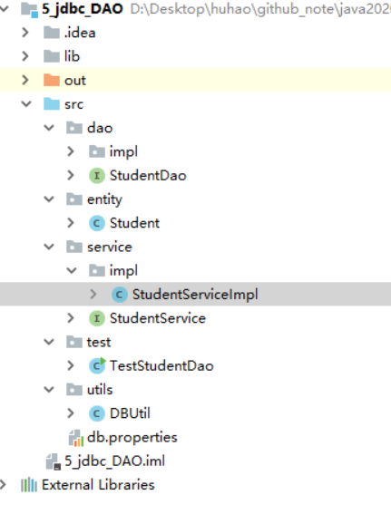

## JDBC 应用及优化

### 1. 封装工具类

DbUtils类功能：1 注册驱动  2 获取连接   3释放资源 

#### 1.1 重用性方案

```java
package utils;

import java.sql.*;

/**
 * @author: huhao
 * @time: 2020/3/20 16:52
 * @desc: 重用性工具类
 */
public class DBUtils {

    private static String driver = "com.mysql.cj.jdbc.Driver"; // 加上static是因为静态方法不能使用非静态变量
    private static String url = "jdbc:mysql://localhost:3306/mydb_test?serverTimezone=UTC";
    private static String user = "root";
    private static String pwd =  "hh123456";


    /**
     * 注册驱动
     */
    static {
        try {
            Class.forName(driver);
        } catch (ClassNotFoundException e) {
            e.printStackTrace();
        }
    }

    /**
     * 获取连接
     * @return
     */
    public static Connection getConnection(){
        try {
            Connection connection = DriverManager.getConnection(url, user, pwd);
            return connection;
        } catch (SQLException e) {
            e.printStackTrace();
        }

        return null;
    }

    /**
     * 释放资源
     * @param resultSet
     * @param statement
     * @param connection
     */
    public static void closeAll(ResultSet resultSet, Statement statement, Connection connection){
        try {
            if(resultSet != null){
                resultSet.close();
            }
        } catch (SQLException e) {
            e.printStackTrace();
        }

        try {
            if(statement != null){
                statement.close();
            }
        } catch (SQLException e) {
            e.printStackTrace();
        }

        try {
            if(connection != null){
                connection.close();
            }
        } catch (SQLException e) {
            e.printStackTrace();
        }
    }
}

```

#### 1.2 跨平台方案

db.properties

```properties
driver=com.mysql.cj.jdbc.Driver
url=jdbc:mysql://localhost:3306/mydb_test?serverTimezone=UTC
user=root
pwd=hh123456
```

```java
package utils;


import java.io.FileInputStream;
import java.io.InputStream;
import java.sql.*;
import java.util.Properties;

/**
 * @author: huhao
 * @time: 2020/3/21 14:49
 * @desc:
 */
public class DBUtilsPlatform {

    private static String driver;
    private static String url;
    private static String user;
    private static String pwd;
    private static Connection connection;

    /**
     * 注册驱动
     */
    static {

        // 通过流读取properties文件
        try {
//            InputStream inputStream = new FileInputStream("src\\db.properties");  不可以；应该找资源，相对路径
            InputStream resourceAsStream = DBUtilsPlatform.class.getClassLoader().getResourceAsStream("db.properties");
            Properties properties = new Properties();
            properties.load(resourceAsStream);

            driver = properties.getProperty("driver");
            url = properties.getProperty("url");
            user = properties.getProperty("user");
            pwd = properties.getProperty("pwd");

            Class.forName(driver);
        } catch (Exception e) {
            e.printStackTrace();
        }
    }

    /**
     * 获得连接
     * @return
     */
    public static Connection getConnection(){

        try {
            Connection connection = DriverManager.getConnection(url, user, pwd);
            return connection;
        } catch (Exception e) {
            e.printStackTrace();
        }

        return null;
    }

    /**
     * 释放资源
     * @param resultSet
     * @param statement
     * @param connection
     */
    public static void closeAll(ResultSet resultSet, Statement statement, Connection connection){

        try {
            if(connection != null){
                connection.close();
            }
        } catch (SQLException e) {
            e.printStackTrace();
        }

        try {
            if(statement != null){
                statement.close();
            }
        } catch (SQLException e) {
            e.printStackTrace();
        }

        try {
            if(connection != null){
                connection.close();
            }
        } catch (SQLException e) {
            e.printStackTrace();
        }
    }
}
```

### 2 ResultSet查询封装

#### 2.1 ORM（Object Relational Mapping）实体类（Entity）：零散数据的载体。

 在应用开发中，我们从数据库查询出的结果集（ResultSet）一般都需要取得（get）其中的数据然后存放到（set）实体对象（Entity）中，以便进一步的处理需要。常用也最容易理解的方式就是从ResultSet中get相应的字段值后调用实体对象的对应的属性的set方法，把值保存在实体对象中。

实体类：

```java
package com.qf.www.entity;

import java.util.Date;

public class Emp {
    private int empno;
    private String ename;
    private String job;
    private int mgr;
    private Date hiredate;
    private double sal;
    private double comm;
    private int deptno;

    public Emp() {
    }

    public Emp(int empno, String ename, String job, int mgr, Date hiredate, double sal, double comm, int deptno) {
        this.empno = empno;
        this.ename = ename;
        this.job = job;
        this.mgr = mgr;
        this.hiredate = hiredate;
        this.sal = sal;
        this.comm = comm;
        this.deptno = deptno;
    }

    @Override
    public String toString() {
        return "Emp{" +
                "empno=" + empno +
                ", ename='" + ename + '\'' +
                ", job='" + job + '\'' +
                ", mgr=" + mgr +
                ", hiredate=" + hiredate +
                ", sal=" + sal +
                ", comm=" + comm +
                ", deptno=" + deptno +
                '}';
    }

    public int getEmpno() {
        return empno;
    }

    public void setEmpno(int empno) {
        this.empno = empno;
    }

    public String getEname() {
        return ename;
    }

    public void setEname(String ename) {
        this.ename = ename;
    }

    public String getJob() {
        return job;
    }

    public void setJob(String job) {
        this.job = job;
    }

    public int getMgr() {
        return mgr;
    }

    public void setMgr(int mgr) {
        this.mgr = mgr;
    }

    public Date getHiredate() {
        return hiredate;
    }

    public void setHiredate(Date hiredate) {
        this.hiredate = hiredate;
    }

    public double getSal() {
        return sal;
    }

    public void setSal(double sal) {
        this.sal = sal;
    }

    public double getComm() {
        return comm;
    }

    public void setComm(double comm) {
        this.comm = comm;
    }

    public int getDeptno() {
        return deptno;
    }

    public void setDeptno(int deptno) {
        this.deptno = deptno;
    }
}

```

```java
//根据员工编号查询单个员工，查到就封装成对象，返回 
public Emp getEmpByEmpNo(int empno) { 		
		connection = DbUtils.getConnection();
        String sql = "select * from emp where empno = ?";
        try {
            preparedStatement = connection.prepareStatement(sql);
            preparedStatement.setInt(1, empno);
            resultSet = preparedStatement.executeQuery();
            while (resultSet.next()) {
                int empno = resultSet.getInt("empno");
                String ename = resultSet.getString("ename");
                String job = resultSet.getString("job");
                int mgr = resultSet.getInt("mgr");
                Date hiredate = resultSet.getDate("hiredate");
                double sal = resultSet.getDouble("sal");
                double comm = resultSet.getDouble("comm");
                int deptno = resultSet.getInt("deptno");
                Emp emp = new Emp();
                emp.setEmpno(empno);
                emp.setEname(ename);
                emp.setJob(job);
                emp.setMgr(mgr);
                emp.setHiredate(hiredate);
                emp.setSal(sal);
                emp.setComm(comm);
                emp.setDeptno(deptno);
                return emp;
            }
        } catch (SQLException e) {
            e.printStackTrace();
        } finally {
            DbUtils.closeAll(resultSet, preparedStatement, connection);
        }
        return null;
 }
```

总结：

> \1.  将一行中多个零散数据进行整理。
>
> \2.  通过Entity的规则将表中的数据进行对象的封装。
>
> \3.  表名=类名；列名=属性名；提供各属性的get、set方法。
>
> \4.  提供无参构造方法（视情况添加有参构造方法）。

### 3  DAO模式

#### 3.1 工具类封装

案例实现：实现emp表的查询、添加、删除、修改

##### 3.1.1 封装DbUtils

由于多个地方都需要使用数据库连接和释放，所以把功能封装到工具类中DbUtils

四个功能：1注册驱动   2 获取连接  3 释放资源 

```java
public class DbUtils {
	private static String driver;
	private static String url;
	private static String user;
	private static String password;

	static{
	
		try {			
			driver="com.mysql.jdbc.Driver";
          	 url="jdbc:mysql://localhost:3306/mydb1";
          	 user="root";
          	 password="1234";
			//加载驱动
			Class.forName(driver);
			
		} catch (Exception e) {
			// TODO Auto-generated catch block
			e.printStackTrace();
		}
		
		
	}
	/**
	 * 获取连接
	 * @return
	 * @throws SQLException
	 */
	public static Connection getConnection() throws SQLException{
		return DriverManager.getConnection(url,user,password);
	}
	
	/**
	 * 释放资源
	 * @param rs
	 * @param stat
	 * @param conn
	 */
	public static void release(ResultSet resultSet,Statement stat,Connection conn){
		try {
                if (resultSet != null) {
                    resultSet.close();
                }
                if (statement != null) {
                    statement.close();
                }
                if (connection != null) {
                    connection.close();
                }
            } catch (SQLException e) {
                e.printStackTrace();
            }
	}
}
```

**1.1.2 优化DbUtils工具类：把数据库连接信息封装到Properties文件中**

项目下创建的db.properties   error方式

src下创建db.properties      could not initialize class com.qf.www.dbutils

```java
			Properties properties=new Properties();
InputStream is=DbUtils.class.getClassLoader().getResourceAsStream("database.properties");
			properties.load(is);
			//初始化参数
			driver=properties.getProperty("driver");
			url=properties.getProperty("url");
			user=properties.getProperty("user");
			password=properties.getProperty("password");
```

#### 3.2 DAO设计模式

DAO(Database Access Object 数据库访问对象)

为了降低耦合性，提出了DAO封装数据库操作的设计模式。

它可以实现业务逻辑与数据库访问相分离。相对来说，数据库是比较稳定的，其中DAO组件依赖于数据库系统，提供数据库访问的接口，隔离了不同的数据库实现。

DAO模式的组成部分

​	1 DAO接口（主要包含 添加 修改 查询 删除方法）

​	2 DAO实现类

​	3 实体类  （domain、beans、entity、pojo、model）

​		--作用：用在数据访问代码和业务逻辑代码之间通过实体类来传输数据

​		--实体类特征：

​			◦属性一般使用private修饰

​			◦提供public修饰的getter/setter方法

​			◦实体类提供无参构造方法，根据业务提供有参构造

​			◦实现java.io.Serializable接口，支持序列化机制

​	4 数据库连接和关闭工具类

设计的包名 :  

  entity、存放实体类

   utils  存放工具类

   dao  存放接口

   dao.impl  存放实现类

使用DAO设计模式实现student表的查询、添加、删除、修改



Student类

```java
package entity;

import java.io.Serializable;
import java.util.Date;

/**
 * @author: huhao
 * @time: 2020/3/21 17:06
 * @desc:
 */
public class Student implements Serializable {
    
    private int sid;
    private String sname;
    private int sage;
    private String ssex;
    private Date birthday;
    private double score;

    public Student() {
    }

    public int getSid() {
        return sid;
    }

    public void setSid(int sid) {
        this.sid = sid;
    }

    public String getSname() {
        return sname;
    }

    public void setSname(String sname) {
        this.sname = sname;
    }

    public int getSage() {
        return sage;
    }

    public void setSage(int sage) {
        this.sage = sage;
    }

    public String getSsex() {
        return ssex;
    }

    public void setSsex(String ssex) {
        this.ssex = ssex;
    }

    public Date getBirthday() {
        return birthday;
    }

    public void setBirthday(Date birthday) {
        this.birthday = birthday;
    }

    public double getScore() {
        return score;
    }

    public void setScore(double score) {
        this.score = score;
    }

    public Student(int sid, String sname, int sage, String ssex, Date birthday, double score) {
        this.sid = sid;
        this.sname = sname;

        this.sage = sage;
        this.ssex = ssex;
        this.birthday = birthday;
        this.score = score;
    }

    @Override
    public String toString() {
        return "Student{" +
                "sid=" + sid +
                ", sname='" + sname + '\'' +
                ", sage=" + sage +
                ", ssex='" + ssex + '\'' +
                ", birthday=" + birthday +
                ", score=" + score +
                '}';
    }
}

```

接口：

```java
package dao;

import entity.Student;

import java.util.List;

/**
 * @author: huhao
 * @time: 2020/3/21 17:25
 * @desc: 数据访问层接口，定义了访问数据库的方法
 */
public interface StudentDao {

    /**
     * 查询所有
     * @return 返回查询到的数据列表
     */
    List<Student> getAllStudent();

    /**
     * 查询单个
     * @param sid
     * @return 返回查询到的数据
     */
    Student getStudent(int sid);

    /**
     * 增加
     * @param student
     * @return 影响的行数
     */
    int add(Student student);

    /**
     * 修改
     * @param student
     * @return 影响的行数
     */
    int update(Student student);

    /**
     * 删除
     * @param sid
     * @return 影响的行数
     */
    int delete(int sid);
}

```

```java
package service;

import entity.Student;

import java.util.List;

/**
 * @author: huhao
 * @time: 2020/3/21 17:52
 * @desc:
 */
public interface StudentService {

    /**
     * 查询所有
     * @return 返回查询到的数据列表
     */
    List<Student> getAllStudent();

    /**
     * 查询单个
     * @param sid
     * @return 返回查询到的数据
     */
    Student getStudent(int sid);

    /**
     * 增加
     * @param student
     * @return 影响的行数
     */
    int add(Student student);

    /**
     * 修改
     * @param student
     * @return 影响的行数
     */
    int update(Student student);

    /**
     * 删除
     * @param sid
     * @return 影响的行数
     */
    int delete(int sid);

}

```

实现类

```java
package dao.impl;

import dao.StudentDao;
import entity.Student;
import utils.DBUtil;

import java.sql.*;
import java.util.ArrayList;
import java.util.List;

/**
 * @author: huhao
 * @time: 2020/3/21 17:34
 * @desc:
 */
public class StudentDaoimpl implements StudentDao{

    private Connection connection;
    private PreparedStatement preparedStatement;
    private ResultSet resultSet;

    @Override
    public List<Student> getAllStudent() {

        Student student = null;
        List<Student> studentList = new ArrayList<Student>();

        try {
            connection = DBUtil.getConnection();
            String sql = "SELECT * FROM student;";
            preparedStatement = connection.prepareStatement(sql);
            resultSet = preparedStatement.executeQuery();

            while(resultSet.next()){
                int sid = resultSet.getInt("sid");
                String sname = resultSet.getString("sname");
                int sage = resultSet.getInt("sage");
                String ssex = resultSet.getString("ssex");
                Date birthday = resultSet.getDate("birthday");
                double sscore = resultSet.getDouble("sscore");

                student = new Student(sid, sname, sage, ssex, birthday, sscore);
                studentList.add(student);
            }
            return studentList;
        } catch (Exception e) {
            e.printStackTrace();
        } finally {
            DBUtil.closeAll(resultSet, preparedStatement, connection);
        }

        return null;
    }

    @Override
    public Student getStudent(int sid) {

        Student student = null;
        connection = DBUtil.getConnection();
        String sql = "SELECT * FROM student WHERE sid=?;";
        try {
            preparedStatement = connection.prepareStatement(sql);
            preparedStatement.setObject(1, sid);
            resultSet = preparedStatement.executeQuery();
            while(resultSet.next()){
                int sid1 = resultSet.getInt("sid");
                String sname = resultSet.getString("sname");
                int sage = resultSet.getInt("sage");
                String ssex = resultSet.getString("ssex");
                Date birthday = resultSet.getDate("birthday");
                double sscore = resultSet.getDouble("sscore");

                student = new Student(sid1, sname, sage, ssex, birthday, sscore);
            }
            return student;

        } catch (SQLException e) {
            e.printStackTrace();
        } finally {
            DBUtil.closeAll(resultSet, preparedStatement, connection);
        }
        return null;
    }

    @Override
    public int add(Student student) {

        connection = DBUtil.getConnection();
        String sql = "INSERT INTO student(sid, sname, sage, ssex, birthday, sscore) VALUES (?, ?, ?, ?, ?, ?);";

        try {
            preparedStatement = connection.prepareStatement(sql);
            preparedStatement.setObject(1, student.getSid());
            preparedStatement.setObject(2, student.getSname());
            preparedStatement.setObject(3, student.getSage());
            preparedStatement.setObject(4, student.getSsex());
            preparedStatement.setObject(5, student.getBirthday());
            preparedStatement.setObject(6, student.getScore());

            int i = preparedStatement.executeUpdate();

            return i;
        } catch (SQLException e) {
            e.printStackTrace();
        } finally {
            DBUtil.closeAll(null, preparedStatement, connection);
        }


        return 0;
    }

    @Override
    public int update(Student student) {
        // ...
        String sql = "UPDATE student SET sid=?, sname=?, ssex=?, birthday=?, sscore=? WHERE sid=?;";
        // ...
        return 0;
    }

    @Override
    public int delete(int sid) {

        // ...
        String sql = "DELETE FROM student WHERE sid=?";
        // ...
        return 0;
    }
}
```

```java
package service.impl;

import dao.StudentDao;
import dao.impl.StudentDaoimpl;
import entity.Student;
import service.StudentService;

import java.util.List;

/**
 * @author: huhao
 * @time: 2020/3/21 17:53
 * @desc: 业务层  避免用户直接访问DAO
 */
public class StudentServiceImpl implements StudentService {

    private StudentDao studentDao = new StudentDaoimpl();

    @Override
    public List<Student> getAllStudent() {
        return studentDao.getAllStudent();
    }

    @Override
    public Student getStudent(int sid) {
        return studentDao.getStudent(sid);
    }

    @Override
    public int add(Student student) {
        return studentDao.add(student);
    }

    @Override
    public int update(Student student) {
        return studentDao.update(student);
    }

    @Override
    public int delete(int sid) {
        return studentDao.delete(sid);
    }
}

```


