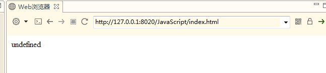
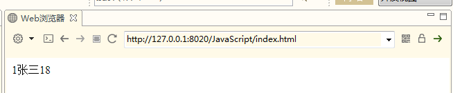
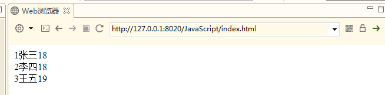

#### 	JavaScript基础

#### 今日内容

```
1、JavaScript概述
2、JavaScript数据类型
3、JavaScript运算符
4、JavaScript条件语句
5、JavaScript循环语句
6、JavaScript函数
7、Javascript事件
8、JavaScript字符串
9、JavaScript正则表达式
```

#### 教学目标

```
1、了解JavaScript概述
2、掌握JavaScript数据类型
3、掌握JavaScript运算符
4、掌握JavaScript条件语句
5、掌握JavaScript循环语句
6、掌握JavaScript函数
```

#### 第一节 JavaScript概述

##### 1.1 JavaScript简介

​	JavaScript(LiveScript)一种**解释性脚本语言（一行一行执行）**，是一种**动态类型、弱类型、基于原型继承**的语言，内置支持类型。**它的解释器被称为JavaScript引擎**，为浏览器的一部分，广泛用于客户端的脚本语言，最早是在HTML（标准通用标记语言下的一个应用）网页上使用，用来给HTML网页增加动态功能。

##### 1.2 JavaScript发展史

它最初由Netscape的Brendan Eich设计。JavaScript是甲骨文公司的注册商标。Ecma国际以JavaScript为基础制定了ECMAScript标准。JavaScript也可以用于其他场合，如服务器端编程。完整的JavaScript实现包含三个部分：ECMAScript，文档对象模型（DOM Document Object Model），浏览器对象模型(BOM Browser Object Model)。

​	Netscape在最初将其脚本语言命名为LiveScript，后来Netscape在与Sun合作之后将其改名为JavaScript。JavaScript最初受Java启发而开始设计的，目的之一就是“看上去像Java”，因此语法上有类似之处，一些名称和命名规范也借自Java。但JavaScript的主要设计原则源自Self和Scheme。JavaScript与Java名称上的近似，是当时Netscape为了营销考虑与Sun微系统达成协议的结果。为了取得技术优势，微软推出了JScript来迎战JavaScript的脚本语言。为了互用性，Ecma国际（前身为欧洲计算机制造商协会）创建了ECMA-262标准（ECMAScript）。两者都属于ECMAScript的实现。尽管JavaScript作为给非程序人员的脚本语言，而非作为给程序人员的脚本语言来推广和宣传，但是JavaScript具有非常丰富的特性。

发展初期，JavaScript的标准并未确定，同期有Netscape的JavaScript，微软的JScript和CEnvi的ScriptEase三足鼎立。1997年，在ECMA（欧洲计算机制造商协会）的协调下，由Netscape、Sun、微软、Borland组成的工作组确定统一标准：ECMA-262。


#### 第二节 JavaScript基本语法

入门程序

```html
<!DOCTYPE html>
<html>
	<head>
		<meta charset="utf-8" />
		<title>javascrit入门</title>
	</head>
	<body>
        <script type="text/javascript">
            //alert("hello world");//弹出窗口显示
            document.write("hello world");//页面中显示
        </script>
     </body>
</html>     
```

##### 2.1 变量声明

在JavaScript中，任何变量都用var关键字来声明，var是variable的缩写。

```javascript
var num; //声明变量
num=10;//赋值

var s="zhangsan";//声明的同时赋值
```

var是声明关键字，a是变量名，语句以分号结尾，分号可以省略。

这里值得注意的是，JavaScript中的关键字，不可以作为变量名。就像在Java中你不可以写"int int=1;"一样。

JavaScript的关键字和保留字：

```
abstract、else、instanceof、super、boolean、enum、int、switch、break、export、interface、synchronized、byte、extends、let、this、case、false、long、throw、catch、final、native、throws、char、finally、new、transient、class、float、null、true、const、for、package、try、continue、function、private、typeof、debugger、goto、protected、var、default、if、public、void、delete、implements、return、volatile、do、import、short、while、double、in、static、with。
```

之后的课程还会有文档对象相关的关键字等。

JavaScript中的注释有两种：

```
单行注释//
多行注释/* ... */
```


##### 2.2 数据类型

######  2.2.1 基本（原始）类型

变量的基本类型有number、string、boolean、undefined、null五种。 u n n  s  b

你可以使用:

```javascript
var a=1;
```

来声明一个数字Number类型。

你可以使用:

```javascript
var a="1";
```

来声明一个字符串String类型。

你可以使用

```javascript
var a=false;
```

来声明一个布尔Boolean类型。

在Java中，当一个变量未被初始化的时候，Java中是null或者基本数据类型的默认值。

在JavaScript中，当一个变量未被初始化的时候，它的值为undefined。

下面是演示undefined的情况：

```javascript
var a;
document.write(a);
```

运行结果为：



最后，当一个引用不存在时，它为Null。这个现象我们在之后的引用类型时再详细探讨。

###### 2.2.2 引用（对象）类型

在Java中需要类定义，然后在实例对象：

```java
public class Student{
  public int id;
  public String name;
  public int age;
}
public class Test{
    public static void main(String [] args){
        Student student=new Student();
      	student.id=1;
      	student.name="张三";
      	student.age=18;
    }
}
```

在JavaScript中对象创建

1 创建对象方式（不常用）

```html
<!DOCTYPE html>
<html>
	<head>
		<meta charset="UTF-8">
		<title>javascript引用(对象)类型</title>
		<script type="text/javascript">
			//1创建(类)对象定义
			function Person(){
				//属性
				this.age;
				this.name;
				this.address;
				//函数(匿名函数)
				this.show=function(){
					document.write(this.age+"...."+this.name+"....."+this.address);
				}
			}
			
			/*function Student(){
			
			}
			Student.prototype=new Person();*/
			//2创建对象
			var zhangsan=new Person();
			zhangsan.age=20;
			zhangsan.name="张三";
			zhangsan.address="北京";
			zhangsan.show();
			
			/*var lisi=new Student();
			lisi.age=30;
			lisi.name="李四";
			lisi.address="上海";
			lisi.show();*/
			
			
			
			
		</script>
	</head>
	<body>
	</body>
</html>
```


2 使用json对象直接写出来（常用）：

```javascript
var student={id:1,name:"张三",age:18};
document.write(student.id);
document.write(student.name);
document.write(student.age);
```

运行结果：



事实上，student被赋值为了一个JSON，JSON就是我们在Java基础阶段学过的，全称是JavaScript Object Notation，叫做JavaScript对象标记，也就是说，在JavaScript中，JSON是用于标记一个对象的。

**数组类型**

数组就是和我们之前理解的数组概念一致，而在JavaScript中成为Array类型。

```javascript
var cities=new Array(3);
document.write(cities.length);
//添加数据
cities[0]=10;
cities[1]=20;
cities[2]=30;
cities[3]=40;
cities[4]=50;
document.write("<br/>");
document.write(cities.length);
```


我们说JSON可以标记一个对象，那么它同样可以标记一个数组，就是Java基础时我们学过的JSONArray。

```javascript
var a=[1,2,3,4];
```

上述代码，我们说a是一个数组，在a中角标为0的元素是1。可以说这很简单。

接下来我们来尝试把之前的JSON放入数组中：

```javascript
	//我是注释
	/*我也是注释*/
	var students = [
	{id: 1,name: "张三",age: 18},
	{id: 2,name: "李四",age: 18},
	{id: 3,name: "王五",age: 19}
	];
	document.write(students[0].id);
	document.write(students[0].name);
	document.write(students[0].age);
	document.write("<br>");//这个是html的换行的意思
	document.write(students[1].id);
	document.write(students[1].name);
	document.write(students[1].age);
	document.write("<br>");
	document.write(students[2].id);
	document.write(students[2].name);
	document.write(students[2].age);
```

运行结果：



我们看到，访问students这个数组，第0个，第1个，第2个元素，都可以。


###### 2.2.3 JavaScript的三种使用方式

第一种方式：在<script>标签中，script可以放在网页中任何位置。

```javascript
<script type="text/javascript">
  	var num=10;
	var d=new Date();
	document.write(num);
</script>
```

第二种方式：使用外部JavaScript文件，把js代码放入单独的文件中  ，这个文件的扩展名.js

```javascript
<script type="text/javascript" src="js/myjs.js"></script>
```


第三种方式： 放在标签中的事件属性中,常见事件 ,onclick

```javascript
<input type="button" value="你点我啊" onclick="alert('你点我干嘛')" />
```


##### 2.3 运算符

###### 2.3.1 算术运算符

+、-、\*、/、%、++、--

```javascript
var a=1;
var b=2;
a+b;//相加
a-b;//相减
a*b;//相乘
a/b;//相除
a%b;//求余

a++;//自增
b--;//自减
//上述规则和Java一样。 整数除以整数，如果整除了得到的是整数，如果不整除，得到的是小数！
//与java不同的一点：1/0  得到的是Infinity   1.0 /0 得到的也是Infinity
```

###### 2.3.2 赋值运算符

=、+=、-=、/=、\*=、%=

```javascript
var a=10
var b=20;
a=b;//赋值
a+=b;//相加后赋值
a-=b;//相减后赋值
a/=b;//相除后赋值
a*=b;//相乘后赋值
a%=b;//求余后赋值
```

###### 2.3.3 逻辑运算符

与、或、非

&&、||、!

这个就是像我们Java一样，对于真假的boolean值可以进行三种逻辑命题的运算。

```javascript
var a=false;
var b=true;
//非的逻辑
//!a->true;
//!b->false;
//与的逻辑
//a&&a->false;
//a&&b->false;
//b&&a->false;
//b&&b->true;
//或的逻辑
//a||a->false;
//a||b->true;
//b||a->true;
//b||b->true;
```


###### 2.3.4 关系运算符

==相等

&lt;小于

&lt;=小于或等于

&gt;大于

&gt;=大于或等于

!=不等于

===全相等   类型不发生变化的比较

```javascript
var a=1;
var b=2;
//a==a->true
//a==b->false
//a<b->false
//a<=b->false
//a>b->true
//a>=b->true
//a!=b->true
//a===b->false
//这里三个等于“===”和两个等于“==”区别：
//前者相当于比较两个引用，后者相当于比较两个值。
//当比较两个值的时候，不考虑数据类型。
//也就是说1=="1"是true的。
```

###### 2.3.5 字符串连接运算符

+

和java一样

###### 2.3.6 三目运算符

条件?true的结果:false的结果

和java一样

##### 2.4 分支结构

###### 2.4.1 if-else

```javascript
var a=1;
var b=1;
if(a){
    document.write("相等");
}else{
    document.write("不相等");
}
//很明显，运行结果是相等
//这就是if-else的结构，和Java语言是一样的。

// 1 if(条件表达式) 关系运算符  逻辑运算符 
// 2 if(变量) 直接写变量，不用运算符，如果变量值为undefined,null 表示false，否则true
// 3 如果变量没有定义,则出现异常。zhangsan.name ,给zhangsan添加name属性，没有赋值
```

###### 2.4.2 switch

```javascript
var a=2;
switch(a){
  case 1:
    document.write("值为1");
    break;
  case 2:
    document.write("值为2");
    break;
  case 3:
    document.write("值为3");
    break;
  default:
     document.write("值不是3也不是2也不是1");
}
```

##### 2.5 循环结构

###### 2.5.1 for循环

```javascript{}
var a=0;
for(var i=1;i<=100;i++){
    a+=i;
}
document.write(a);
//上述代码是对1~100求和。
```

###### 2.5.2 while循环

```javascript
var a=0
var i=1;
while(i<=100){
   a+=i;
   i++;
}
document.write(a);
//上述代码是对1~100求和。
```

###### 2.5.3 do-while循环

```javascript
var a=0;
var i=1;
do{
    a+=i;
  	i++;
}while(i<=100);
document.write(a);
//上述代码是对1~100求和。
```


###### 2.5.4 break与continue

和Java一样，在JavaScript中，你也可以使用break结束循环，用continue来结束本次循环。

###### 2.5.5 增强for循环

for(var i in arr){	//i不是arr中的元素，而是下标

}

```javascript
var arr=[10,20,30,40];
for(var i in arr){
  document.write(arr[i]);
  document.write("<br/>")
}

document.write("<br/>------------1----for in-----------------<br/>")
var map=new Array();
map['cn']="中国";
map['us']="美国";
map['jp']="日本";
map['kor']="韩国";

for(var k in map){
  document.write(k+"...."+map[k]);
  document.write("<br/>")
}
```

##### 2.6 void

我们经常会使用到 javascript:void(0) 这样的代码

javascript:void(0) 中最关键的是 void 关键字， void 是 JavaScript 中非常重要的关键字，该操作符指定要计算一个表达式但是不返回值。

下面的代码创建了一个超级链接，当用户点击以后不会发生任何事。

示例:

```javascript
<a href="javascript:void(0)">单击后不发生任何事情</a>
```

void的其他用法:

```javascript
<a href="javascript:void(alert('Warning!!!'))">点我!</a>
```

补充:href="#"与href="javascript:void(0)"的区别

#包含了一个位置信息，默认的锚是#top 也就是网页的上端。而javascript:void(0), 仅仅表示一个死链接。

在页面很长的时候会使用 **#** 来定位页面的具体位置，格式为：**# + id**（也称为锚链接）。如果你要定义一个死链接请使用 javascript:void(0) 。


#### 第三节 JavaScript函数和事件

##### 3.1 函数

包含一段功能的代码。目的：重复使用

###### 3.1.1 函数定义

用function关键字来声明，后面是函数名字，参数列表里不写var。整个方法不写返回值类型。

```javascript
function functionName(parameters){
    //执行的代码
}
```

下面是一个方法的定义与调用：

```javascript
function add(a,b){
    return a+b;
}
var c=1;
var d=2;
var e=add(1,2);
document.write(e);
//上述代码运行结果是3
//这里定义了一个add方法，参数是两个，与Java不同，参数的数据类型并没有。
//因为就算是写，全都是var，为了保证语法的简洁性，全写var索性就设计成全都不用写了。
//返回值也是同样的道理，区别是，如果你写了返回值，那么有返回值，如果没写return，就没有返回值。
```


##### 3.2 匿名函数

```javascript
/*匿名函数*/
var method1=function(){
document.write("这是一个匿名函数");
}

method1();
/*匿名函数(自执行匿名函数)*/
(function(s){
document.write("这是一个自执行匿名函数"+s);
})("hahaha");
```

##### 3.3 闭包 （Closure）

JavaScript 变量属于本地或全局作用域,全局变量能够通过闭包实现局部（私有）

###### 3.3.1 全局/局部变量

函数可以访问内部定义的全部变量，也可以访问访问函数外部定义的变量

示例1:

```javascript
function myFunction() {
    var a = 4;
    return a * a;
} 
```

示例2:

```javascript
var a = 4;
function myFunction() {
    return a * a;
} 
```

示例1中变量a就是一个局部变量,局部变量只能用于其被定义的函数内部。示例2中变量a就是一个全局变量

###### 3.3.2 变量的生命周期

全局变量的作用域是全局性的，即在整个JavaScript程序中，全局变量处处都在。而在函数内部声明的变量，只在函数内部起作用。这些变量是局部变量，作用域是局部性的；函数的参数也是局部性的，只在函数内部起作用。

示例:

```javascript
var counter = 0;
function add() {
	return counter += 1;
}
add();
add();
add();
// 计数器现在为 3
```

计数器数值在执行 add() 函数时发生变化。

但问题来了，页面上的任何脚本都能改变计数器，即便没有调用 add() 函数。

如果我在函数内声明计数器，如果没有调用函数将无法修改计数器的值：

```javascript
function add() {
var counter = 0;
return counter += 1;
}
add();
add();
add();
// 本意是想输出 3, 但输出的都是 1 !
```

###### 3.3.3 内嵌函数

所有函数都能访问全局变量。  实际上，在 JavaScript 中，所有函数都能访问它们上一层的作用域。

JavaScript 支持嵌套函数。嵌套函数可以访问上一层的函数变量。该实例中，内嵌函数 **plus()** 可以访问父函数的 **counter** 变量：

示例:

```javascript
function add() {
	var counter = 0;
	function plus() {
    counter += 1;
  }
	plus();    
	return counter; 
}
```

如果我们能在外部访问 **plus()** 函数，这样就能解决计数器的困境。

我们同样需要确保 **counter = 0** 只执行一次。但实际上该场景下,每调用一次 add() 都会让 counter 初始化一次

###### 3.3.4 闭包 

闭包示例:

```javascript
<script>
var add = (function () {
  var counter = 0;
  return function () {
    counter += 1; 
    return counter;
  }
})();

	document.write(add());
	document.write(add());
	document.write(add());
//输出结果为  1  2   3 
</script>
```

变量 add 的赋值是自调用函数的返回值。

这个自调用函数只运行一次。它设置计数器为零（0），并返回函数表达式。

这样 add 成为了函数。最“精彩的”部分是它能够访问父作用域中的计数器。

这被称为 JavaScript *闭包*。它使函数拥有“*私有*”变量成为可能,换句话说就是改变了局部变量的生命周期。

计数器被这个匿名函数的作用域保护，并且只能使用 add 函数来修改。

闭包指的是有权访问父作用域的函数，即使在父函数关闭之后。

##### 3.4  回调

回调函数是一段可执行的代码段，它作为一个参数传递给其他的代码，其作用是在需要的时候方便调用这段（回调函数）代码。

示例代码:

```javascript
<script type="text/javascript">
			function a(num1,num2,callback){
				var sum=num1+num2;
				return callback(sum);
			}
			function b(num){
				return num*num;
			}
			var rs=a(10,20,b);
			document.write(rs);
</script>
```

匿名回调函数


```javascript
<script type="text/javascript">
			function a(num1,num2,callback){
				var sum=num1+num2;
				return callback(sum);
			}
		var rs=a(10,20,function(num){return num+20;});
		document.write(rs);
	</script>
```


##### 


##### 3.5 系统函数

###### 3.5.1 弹框函数

**提示框 alert();**

```javascript
alert("你好");
这是一个只能点击确定的弹窗
```

运行结果：


alert方法没有返回值，也就是说如果用一个变量去接受返回值，将会得到undefined。无论你点击“确定”还是右上角的那个“X“关闭。

**确认框 confirm();**

这是一个你可以点击确定或者取消的弹窗

```javascript
confirm("你好");
```

运行结果：


confirm方法与alert不同，他的返回值是boolean，当你点击“确定”时，返回true，无论你点击“取消”还是右上角的那个“X“关闭，都返回false。

**输入框 prompt()**

这是一个你可以输入文本内容的弹窗

```javascript
prompt("你爱学习吗？","爱");
```

第一个参数是提示信息，第二个参数是用户输入的默认值。

运行结果：


当你点击确定的时候，返回用户输入的内容。当你点击取消或者关闭的时候，返回null。


###### 3.5.2其他系统函数

​	parseInt(); 字符串转换整数

​	parseFloat(); 字符串转成小数

​	isNaN(); 判断数字是不是不是一个数字。

#### 第四节  事件

##### 4.1 事件

| 事件        | 描述                                 |
| ----------- | ------------------------------------ |
| onchange    | HTML 元素改变(离开光标触发)          |
| onclick     | 用户点击 HTML 元素                   |
| onmouseover | 光标移动到HTML元素                   |
| onmouseout  | 光标离开HTML元素                     |
| onkeydown   | 用户按下键盘按键                     |
| onload      | 浏览器已完成页面的加载               |
| onblur      | 元素失去焦点。                       |
| onfocus     | 元素获得焦点。                       |
| ondblclick  | 当用户双击某个对象时调用的事件句柄。 |
| onsubmit    | 确认按钮被点击。                     |
| onselect    | 文本被选中。                         |

语法:

```
  事件名=“函数名”
  或者
  事件名="行内js"
```

示例:

```javascript
<h1 onclick="alert('点击我啦！')">请点击此文本！</h1>
```

示例2:

```javascript

<h1 onclick="changeText(this)">点击此文本！</h1>

<script>
function changeText(id) { 
    document.write("Hello:)");
}
</script>
```

#### 第五节  字符串

##### 5.1 字符串

String 对象用于处理文本（字符串）。

###### 5.1.1 创建 String 对象的语法

```
new String(s);
String(s);
```

参数 *s* 是要存储在 String 对象中或转换成原始字符串的值。

返回值:

当 String() 和运算符 new 一起作为构造函数使用时，它返回一个新创建的 String 对象，存放的是字符串 *s* 或 *s* 的字符串表示。

当不用 new 运算符调用 String() 时，它只把 *s* 转换成原始的字符串，并返回转换后的值。

###### 5.1.2 String 对象属性

| 属性   | 描述         |
| :----- | :----------- |
| length | 字符串的长度 |

###### 5.1.3 String 对象方法

| 方法                | 描述                                                 |
| :------------------ | :--------------------------------------------------- |
| charAt()            | 返回在指定位置的字符。                               |
| concat()            | 连接字符串。                                         |
| indexOf()           | 检索字符串。                                         |
| lastIndexOf()       | 从后向前搜索字符串。                                 |
| match()             | 找到一个或多个正则表达式的匹配。                     |
| replace()           | 替换与正则表达式匹配的子串。                         |
| search()            | 检索与正则表达式相匹配的值。                         |
| slice()             | 提取字符串的片断，并在新的字符串中返回被提取的部分。 |
| split()             | 把字符串分割为字符串数组。                           |
| substring()         | 提取字符串中两个指定的索引号之间的字符。             |
| toLocaleUpperCase() | 把字符串转换为大写。                                 |
| toLowerCase()       | 把字符串转换为小写。                                 |
| toUpperCase()       | 把字符串转换为大写。                                 |
| toString()          | 返回字符串。                                         |
| valueOf()           | 返回某个字符串对象的原始值。                         |

##### 

#### 第六节 正则表达式

###### 6.1 RegExp 对象

正则表达式是描述字符模式的对象。

正则表达式用于对字符串模式匹配及检索替换，是对字符串执行模式匹配的强大工具。

语法：

var patt=new RegExp(pattern,modifiers);

或者更简单的方式:

var patt=/pattern/modifiers;

如：

```javascript
var re = new RegExp("\\w+");
var re = /\w+/;
```

**修饰符**

修饰符用于执行区分大小写和全局匹配:

| 修饰符                                            | 描述                                                     |
| ------------------------------------------------- | -------------------------------------------------------- |
| [i](http://www.runoob.com/js/jsref-regexp-i.html) | 执行对大小写不敏感的匹配。                               |
| [g](http://www.runoob.com/js/jsref-regexp-g.html) | 执行全局匹配（查找所有匹配而非在找到第一个匹配后停止）。 |
| m                                                 | 执行多行匹配。                                           |

示例:

```javascript
// 默认会区分大小写
  var reg = /hello/
  var flag = reg.test("Hello World")
  console.log(flag) // false
  // 添加i修饰符 不区分大小写
  var reg2 = /hello/i
  var flag2 = reg2.test("Hello World")
  console.log(flag2) // true
 
  var str = "I'm in a bad mood, really bad"
  // 默认非全局匹配
  var reg3 = /bad/
  var newStr = str.replace(reg3,"good")
  // 只替换了一个bad
  console.log(newStr) // I'm in a good mood, really bad
  // 全局匹配
  var reg4 = /bad/g
  var newStr2 = str.replace(reg4,"good")
  // 替换了全局的bad为good
  console.log(newStr2) // I'm in a good mood, really good
 
  // 同时使用
  var reg5 = /bad/gi
	var newStr3 = reg5.test("i am a BaD");
	console.log(newStr3);
```

**方括号**

方括号用于查找某个范围内的字符：

| 表达式             | 描述                               |
| ------------------ | ---------------------------------- |
| [abc]              | 查找方括号之间的任何字符。         |
| [^abc]             | 查找任何不在方括号之间的字符。     |
| [0-9]              | 查找任何从 0 至 9 的数字。         |
| [a-z]              | 查找任何从小写 a 到小写 z 的字符。 |
| [A-Z]              | 查找任何从大写 A 到大写 Z 的字符。 |
| [A-z]              | 查找任何从大写 A 到小写 z 的字符。 |
| [adgk]             | 查找给定集合内的任何字符。         |
| [^adgk]            | 查找给定集合外的任何字符。         |
| (red\|blue\|green) | 查找任何指定的选项。               |

**元字符**

元字符（Metacharacter）是拥有特殊含义的字符：

| 元字符 | 描述                               |
| ------ | ---------------------------------- |
| .      | 查找单个字符，除了换行和行结束符。 |
| \w     | 查找单词字符。                     |
| \W     | 查找非单词字符。                   |
| \d     | 查找数字。                         |
| \D     | 查找非数字字符。                   |
| \s     | 查找空白字符。                     |
| \S     | 查找非空白字符。                   |

**量词**

| 量词   | 描述                                                         |
| ------ | ------------------------------------------------------------ |
| n+     | 匹配任何包含至少一个 n 的字符串。例如，/a+/ 匹配 "candy" 中的 "a"，"caaaaaaandy" 中所有的 "a"。 |
| n*     | 匹配任何包含零个或多个 n 的字符串。例如，/bo*/ 匹配 "A ghost booooed" 中的 "boooo"，"A bird warbled" 中的 "b"，但是不匹配 "A goat grunted"。 |
| n?     | 匹配任何包含零个或一个 n 的字符串。例如，/e?le?/ 匹配 "angel" 中的 "el"，"angle" 中的 "le"。 |
| n{X}   | 匹配包含 X 个 n 的序列的字符串。例如，/a{2}/ 不匹配 "candy," 中的 "a"，但是匹配 "caandy," 中的两个 "a"，且匹配 "caaandy." 中的前两个 "a"。 |
| n{X,}  | X 是一个正整数。前面的模式 n 连续出现至少 X 次时匹配。例如，/a{2,}/ 不匹配 "candy" 中的 "a"，但是匹配 "caandy" 和 "caaaaaaandy." 中所有的 "a"。 |
| n{X,Y} | X 和 Y 为正整数。前面的模式 n 连续出现至少 X 次，至多 Y 次时匹配。例如，/a{1,3}/ 不匹配 "cndy"，匹配 "candy," 中的 "a"，"caandy," 中的两个 "a"，匹配 "caaaaaaandy" 中的前面三个 "a"。注意，当匹配 "caaaaaaandy" 时，即使原始字符串拥有更多的 "a"，匹配项也是 "aaa"。 |
|        |                                                              |
| n$     | 匹配任何结尾为 n 的字符串。                                  |
| ^n     | 匹配任何开头为 n 的字符串。                                  |
| ?=n    | 匹配任何其后紧接指定字符串 n 的字符串。                      |
| ?!n    | 匹配任何其后没有紧接指定字符串 n 的字符串。                  |

###### 6.1.2 RegExp 对象方法

| 方法 | 描述                                               | FF   | IE   |
| ---- | -------------------------------------------------- | ---- | ---- |
| exec | 检索字符串中指定的值。返回找到的值，并确定其位置。 | 1    | 4    |
| test | 检索字符串中指定的值。返回 true 或 false。         | 1    | 4    |

示例:

```javascript
<script>
  var str = "hi66morning77"
  // 匹配连续的3个数字	
  var reg = /\d{3}/
  console.log(reg.test(str)) // false
  // 匹配连续的7个小写字母
  var reg2 = /[a-z]{7}/
  console.log(reg2.test(str)) // true
console.log(reg2.exec(str))//"morning" index:4 
</script>
```

**支持正则表达式的 String 对象的方法**

| 方法    | 描述                             | FF   | IE   |
| ------- | -------------------------------- | ---- | ---- |
| search  | 检索与正则表达式相匹配的值。     | 1    | 4    |
| match   | 找到一个或多个正则表达式的匹配。 | 1    | 4    |
| replace | 替换与正则表达式匹配的子串。     | 1    | 4    |
| split   | 把字符串分割为字符串数组。       | 1    | 4    |

示例

```javascript
<script>
  var str = "hi66morning77"
  // 匹配连续的2个数字 非全局匹配
  var reg = /\d{2}/
  console.log(str.match(reg)[0]) // 66
  // 匹配连续的2个数字 全局匹配(推荐)
  var reg2 = /\d{2}/g
  console.log(str.match(reg2)) // ["66", "77"]  

var str = "hi66morning77"
  // 匹配连续的2个数字 非全局匹配
  var reg = /\d{2}/
  console.log(str.search(reg)) // 2
  // 匹配a,b,m中的一个
  var reg2 = /[abm]/
  console.log(str.search(reg2))  // 4 
</script>
```


###### 6.1.3 正则表达式的使用

test()方法：

test()方法搜索字符串指定的值，根据结果并返回真或假。

```javascript
var patt1=new RegExp("e");
document.write(patt1.test("The best things in life are free"));
```

由于该字符串中存在字母 "e"，以上代码的输出将是：

true

exec() 方法：

exec() 方法检索字符串中的指定值。返回值是被找到的值。如果没有发现匹配，则返回 null。

```javascript
var patt1=new RegExp("e");
document.write(patt1.exec("The best things in life are free"));
```

由于该字符串中存在字母 "e"，以上代码的输出将是：

e

实例:

```JavaScript
匹配手机号
var reg = /^1\d{10}$/;

匹配QQ号
var reg = /^[1-9]\d{4,10}$/;

匹配身份证号
var reg = /^[1-9]\d{16}[Xx\d]$/;

变量名检测(只能由字母，数字，下划线组成，且不能以数字开头，长度6-15)
var reg = /^[A-z_]\w{5,14}$/;

判断是否为邮箱email
验证规则： 电子邮箱的正确写法一般为: 用户名@邮箱网站.com(.cn) 

第一部分：由字母、数字、下划线、短线“-”组成

第二部分：为一个域名，域名由字母、数字、短线“-”、域名后缀组成（域名后缀一般为两位到三位。例如：com cn net现在域名有的也会大于四位）

 function isEmail(str){
        var reg =/^([a-zA-Z0-9_-])+@([a-zA-Z0-9_-])+((\.[a-zA-Z0-9_-]{2,3}){1,2})$/;
        return reg.test(str);
}

```


#### 总结


#### 作业题

```
1.对数组进行排序冒泡或者选择算法 
	var arr = {7,3,4,1,16,8};

2.打印99乘法表 要求 有格式 必须整齐工整-->把99乘法表嵌套到table中
			document.write();
3.文本框输入一个年份，判断是否是闰年（能被4整除却不能被100整除的年份。世纪年份能被400整除的是闰年）将结果在弹出窗口中显示


4.	
请输入性别：
请输入身高：
请输入体重：	
男性标准体重=（身高cm－80）×70﹪
女性标准体重=（身高cm－70）×60﹪
评估标准
	标准体重正负10%为正常体重
	标准体重正负10%-20%为体重过重或过轻 
	标准体重正负20%以上为肥胖或体重不足

		轻度肥胖:超过标准体重 20% -30%
		中度肥胖:超过标准体重 40%-50%
		重度肥胖:超过标准体重 50%以上
要求:
	1.判断文本框是否为空 如果为空 需要提示
	2.弹出窗口显示评估结果 输出 性别 身高 体重 标准体重 
	评估结果 
		轻:输出体重偏轻 多吃点 
		正常:继续保持
		重:轻度/中度/重度肥胖 体重过重 多运动
```

