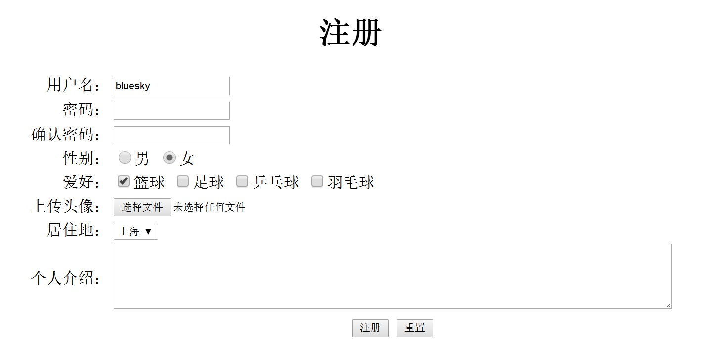

### HTML


#### 回顾

```
第一周:
	1 java基础：变量、常量、数据类型、运算符
	2 选择语句  if  switch、循环语句 while   do...while   for
	3 方法  方法的声明、调用、递归算法
第二周: 
	1 数组：一维数组、二维数组  属于引用类型  栈   堆  工具类 Arrays
	2 面向对象: 封装  继承  多态
	3 抽象类和接口
	4 内部类和设计模式
	5 常用类和异常
第三周:
	1 String类 
	2 集合 List  Set  Map
	3 IO   字节流 字符流  输入流  输出流、缓冲流、对象流
第四周:
	1多线程 、线程同步 synchronized  Lock接口 ReentrantReadWriteLock wait notify  notifyAll
	2网络编程  TCP  UDP  IP
	3反射
```

#### 今日内容

```
1、html简介
2、html基本标签
3、html基本标签的综合案例
4、html表单标签
5、html的框架标签
6、html的其它标签和特殊字符
```

#### 教学目标

```
1、掌握html的书写规范
2、掌握html的基本标签9个
3、掌握html的表单标签
4、了解html的框架标签
5、掌握html标签的综合使用
```

#### 课前简介

>    ```
>    网页，是网站中的一个页面，通常是网页是构成网站的基本元素，是承载各种网站应用的平台。通俗的说，网站就是由网页组成的。
>    通常我们看到的网页都是以htm或html后缀结尾的文件，俗称 HTML文件。
>    ```


#### 第一节 HTML简介

#####           1.1 HTML概述

```
 HTML全称：Hyper Text Markup Language(超文本标记语言)
	超文本标记语言是标准通用标记语言（SGML）下的一个应用，也是一种规范，一种标准，它通过标记符号来标记要显示的网页中的各个部分。
	HTML是一门用户创建网页文档的标记语言，网页文件本身是一种文本文件，通过在文本文件中添加标记符。
	HTML可以告诉浏览器如何显示其中的内容（如：文字如何处理，画面如何安排1，图片如何显示、包括音频、视频等等如何播放）。
	简单一句话：HTML是一门用来创建网页的标记语言。
```

#####          1.2  HTML特点

```
其主要特点如下：
1 简易性：超文本标记语言版本升级采用超集方式，从而更加灵活方便。
2 可扩展性：超文本标记语言采取子类元素的方式，为系统扩展带来保证。
3 平台无关性：超文本标记语言可以使用在广泛的平台上，这也是万维网（www）盛行的另一个原因。
4 通用性：HTML是网络的通用语言,一种简单、通用的标记语言。
```

##### 1.3 HTML的发展

```
超文本标记语言（第一版）——在1993年6月作为互联网工程工作小组（IETF）工作草案发布(并非标准)
HTML 2.0——1995年11月作为RFC 1866发布，在RFC 2854于2000年6月发布之后被宣布已经过时
HTML 3.2——1997年1月14日，W3C推荐标准
HTML 4.0——1997年12月18日，W3C推荐标准
HTML 4.01（微小改进）——1999年12月24日，W3C推荐标准  
		W3C : XHTML1.0 -> XHTML1.1 -> XHTML2.0
		WHATWG:HTML 5
HTML 5——2014年10月29日，W3C推荐标准
```

 

#####          1.3   HTML基本结构

```html
<!--文档声明：告诉浏览器使用HTML5版本 -->
<!DOCTYPE html>
<html>
  <!--网页的头部 -->
  <head>
    <!--设置页面的字符集编码 -->
    <meta charset="utf-8" />
    <!--设置页面的标题 -->
    <title>第一页面</title>
  </head>
   <!--网页的主体 -->
  <body>
    <!--需要展示的信息-->
    页面内容
  </body>
</html>
```

1.HTML页面包含头部head和主体body

2.HTML标签通常是成对出现的，有开始就有结束，这样的标签称为成对标签、没有结束标签称为空标签。

3.HTML通常都有属性，格式:属性名＝“属性值”(多个属性之间空格隔开)

4.HTML标签不区分大小写,建议小写

5.文件名后缀为.html或.htm

#### 第二节 HTML基本标签

#####  2.1 结构标签

```
    <html><html>:根标签		 
    <head>：头标签		 	
   	 <title></title>:页面的标题		 
    </head>		 
    <body></body>：主体标签：网页内容
```

```
属性：		
    color:文本的颜色   <font color="red">内容</font>
    bgcolor:背景色		<body bgcolor="bisque"> </body>
    background:背景图片			     
颜色的表示方式：                        
    第一种方式：使用颜色名称: red green blue	             
    第二种方式：RGB模式 #000000  #ffffff  #325687   #377405
```

#####  2.2 排版标签

```
    1.注释标签：<!--注释-->                
   	2.换行标签：<br/>           
    3.段落标签：<p>文本文字</p>   
    	  特点：段与段之间有行高（行间距）  自带换行。	                      
          属性：align对齐方式	(left：左对齐   center：居中  right：右对齐)          
    4.水平线标签:<hr/>                      
          属性:   
              width：水平线的长度(两种:第一种:像素表示；第二种，百分比表示)                                	  size: 水平线的粗细 (像素表示，例如：10px)                                 
              color:水平线的颜色                                  
              align:水平线的对齐方式(left：左对齐   center：居中  right：右对齐)    
```


#####  2.3 标题标签

```
 <h1></h1>—-<h6></h6>  
 随着数字增大文字逐渐变小，字体是加粗的，内置字号，默认占据一行； 
```

##### 2.4 容器标签

```
   <div></div>:块级标签，独占一行，换行
   <span></span>:行级标签，所有内容都在同一行
         作用：   <div></div>:主要是结合css页面分块布局
                  <span></span>:进行友好提示信息
```


#####  2.5 列表标签

######             2.5.1 无序列表

ul  （unorder list）

```html
   无序列表标签： <ul></ul>
             属性：type :三个值，分别为
                  circle(空心圆) ,disc(默认,实心圆),square(黑色方块)
         列表项：<li></li>
   
   示例如下：  
        <ul type="square">无序列表
			<li>苹果</li>
			<li>香蕉</li>
			<li>橘子</li>
		</ul>
```

######             2.5.2 有序列表

ol（order list）

```
      有序列表标签：<ol></ol>
             属性：type：1、A、a、I、i（数字、字母、罗马数字）
             列表项： <li></li>
      示例如下：
 		<ol type="I">有序列表
			<li>苹果</li>
			<li>香蕉</li>
			<li>橘子</li>
		</ol>
```

###### 2.5.3 定义列表

dl  (defination list)  定义列表

dt (defination title)  定义标题

dd (defination description)  定义描述

```
 定义列表   <dl>
 				<dt>苹果</dt>
 				<dd>苹果是一种水果，富含维生素C，美容养颜，吃了长寿....</dd>
           </dl>
```


######             2.5.4 列表嵌套

```html
<ul>
			<li>咖啡</li>
			<li>茶
				<ul>
					<li>红茶</li>
					<li>绿茶
						<ul>
							<li>中国茶</li>
							<li>非洲茶</li>
						</ul>
					</li>
				</ul>
			</li>
			<li>牛奶</li>
</ul>
```

#####  2.6 图片标签

```
 独立标签   
  属性: 
  	  src：图片地址： 相对路径 （同一个网站）  绝对路径 （不同网站）
      width:宽度
      height:高度
      border:边框
      align:对齐方式，代表图片与相邻的文本的相当位置（有三个属性值：top middle bottom）
      alt:图片的文字说明   当图片未能正确加载，才显示
      title:图片的悬停显示
      hspace 和 vspace 设定图片边沿上下左右空白，以免文字或其它图片过于贴近
```

#####  2.7 链接标签

​     超链接可以是文本，也可以是一幅图像，您可以点击这些内容来跳转到新的文档或者当前文档中的某个部分。

```
<a>文本或图片</a>
属性： 
 	href:跳转页面的地址(跳转到外网需要添加协议)     
    target:_self(自己)  _blank(新页面，之前页面还存在)  _parent  _top  默认_self
 		  _search相等于给页面起一个名字，如果再次打开时，如果页面存在，则不再打开新的页面。可以是任意名字。
 	name:名称，锚点(回到锚点: 顶部，底部，中间)，在访问锚点的书写格式:#name的值    
    每一个a标签有name属性，给定值    需要点击跳转的 href="#name"
```

#####  2.8 表格标签

表格由 <table> 标签来定义。每个表格均有若干行（由 <tr> 标签定义），每行被分割为若干单元格（由 <td> 标签定义）。数据单元格可以包含文本、图片、列表、段落、表单、水平线、表格等等。

###### 2.8.1 普通表格

(table,tr,td)

```html
	<!--border:边框的宽度 bordercolor:边框的颜色 cellspacing:单元格的边距 cellpadding:单元格与内容的间距 width:宽度 height:高度-->
	<!--table的 align属性控制表格的对齐方式  left  center right-->
	<!--td 的align属性控制内容对齐方式 left  center right -->
	<!--td 的valign属性控制垂直内容对齐方式 top  middle bottom -->
           <table border="1" bordercolor="red" cellspacing="0" align="center" width="200" height="100">
			<tr>
				<td>学号</td>
				<td>姓名</td>
			</tr>
			<tr>
				<td>1</td>
				<td>aa</td>
			</tr>
		</table>
```

###### 2.8.2 表格的表头

(th)

```html
		<table border="1" bordercolor="red" cellspacing="0" align="center">
			<caption>学生表</caption>
			<tr>
				<th>学号</th>
				<th>姓名</th>
			</tr>
			<tr>
				<td>1</td>
				<td>aa</td>
			</tr>
		</table>
```

###### 2.8.3 表格的列合并

colspan 属性

```html
	<table border="1" bordercolor="red" cellspacing="0" align="center">
			<tr>
				<td colspan="4" align="center">学生表</td>
			</tr>
			<tr>
				<td>学号</td>
				<td>姓名</td>
				<td colspan="2">各科成绩</td>
			</tr>
			<tr>
				<td>1</td>
				<td>aa</td>
				<td>80</td>
				<td>90</td>
			</tr>
	</table>
```

###### 2.8.4 表格的行合并

rowspan属性

```html
<table border="1" bordercolor="red" cellspacing="0" align="center">
			<tr>
			<td colspan="4" align="center">学生表</td>
			</tr>
			<tr>
				<td>学号</td>
				<td>姓名</td>
				<td>语文成绩</td>
				<td>数学成绩</td>
			</tr>
			<tr>
				<td rowspan="2">1</td>
				<td rowspan="2">aa</td>
				<td>80</td>
				<td>90</td>
			</tr>
			<tr>
				<td>80</td>
				<td>90</td>
			</tr>
</table>
```

#####  2.9 文本格式化标签

```
    <b> 	定义粗体文本。
    <big> 	定义大号字。
    <em> 	定义着重文字。
    <i> 	定义斜体字。
    <small> 	定义小号字。
    <strong> 	定义加重语气。
    <sub> 	定义下标字。
    <sup> 	定义上标字。
    <ins> 	定义插入字。
    <del> 	定义删除字。
```


#### 第三节 基本标签的综合案例

##### 3.1 综合案例效果图


##### 3.2 综合案例源代码

```html
<!DOCTYPE html>
<html>
	<head>
		<meta charset="utf-8" />
		<title>基本标签综合案例</title>
	</head>
	<body>
		<!--顶部视图：第一个div块-->
		<div>
			<table>
				<tr>
					<td align="center" width="22%">&nbsp;&nbsp;千锋教育-稀有的坚持全程面授品质的大型IT教育机构</td>
					<td width="1200px"></td>
					<td align="center" width="22%">
						<a>&nbsp;&nbsp;好程序员特训营&nbsp;&nbsp;</a>
						<a>&nbsp;&nbsp;扣丁学堂&nbsp;&nbsp;</a>
						<a>&nbsp;&nbsp;练习我们&nbsp;&nbsp;</a>
						<a>&nbsp;&nbsp;</a>
					</td>
				</tr>
			</table>
		</div>
		<br>
		<!--logo图标块-->
		<div>
			<table>
				<tr>
					<td align="center" width="15%">
                        </td>
					<td width="1000px"></td>
					<td align="center" width="15%">
                        &nbsp;&nbsp;&nbsp;&nbsp;</td>
				</tr>
			</table>
		</div>
		<!--菜单视图：第二个div块-->
		<div align="center">
			<hr>
			<span>&nbsp;&nbsp;首页&nbsp;&nbsp;</span><span>&nbsp;&nbsp;课程培训&nbsp;&nbsp;</span><span>&nbsp;&nbsp;教学保障&nbsp;&nbsp;</span>
			<span>&nbsp;&nbsp;免费视频&nbsp;&nbsp;</span><span>&nbsp;&nbsp;公开课&nbsp;&nbsp;</span><span>&nbsp;&nbsp;企业合作&nbsp;&nbsp;</span>
			<span>&nbsp;&nbsp;免就业喜报&nbsp;&nbsp;</span><span>&nbsp;&nbsp;学员天地&nbsp;&nbsp;</span><span>&nbsp;&nbsp;关于千锋&nbsp;&nbsp;</span>
			<span>&nbsp;&nbsp;学员论坛&nbsp;&nbsp;</span>
			<hr>
		</div>
		<!--导航视图：第四个div块-->
		<div align="right">首页&gt;课程培训&gt;JavaEE列表&nbsp;&nbsp;&nbsp;</div>
		<!--分类名称：第五个div块-->
		<div>
			<h2><strong>课程培训</strong></h2>
			<h4><strong>共XX种课程视频</strong></h4>
			<hr>
		</div>
		<!--分割图片-->
		<div>
			
		</div>
		<!--图书展示块-->
		<div>
			<table width="100%">
				<tr>
					<td width="20%" align="center">
						<div>
							
							<br>
							<div>书名：XX</div>
							<div>售价：XX</div>
						</div>
					</td>
					<td width="20%" align="center">
						<div>
							
							<br>
							<div>书名：XX</div>
							<div>售价：XX</div>
						</div>
					</td>
					<td width="20%" align="center">
						<div>
							
							<br>
							<div>书名：XX</div>
							<div>售价：XX</div>
						</div>
					</td>
					<td width="20%" align="center">
						<div>
							
							<br>
							<div>书名：XX</div>
							<div>售价：XX</div>
						</div>
					</td>
					<td width="20%" align="center">
						<div>
							
							<br>
							<div>书名：XX</div>
							<div>售价：XX</div>
						</div>
					</td>
				</tr>
				<tr>
					<td width="20%" align="center">
						<div>
							
							<br>
							<div>书名：XX</div>
							<div>售价：XX</div>
						</div>
					</td>
					<td width="20%" align="center">
						<div>
							
							<br>
							<div>书名：XX</div>
							<div>售价：XX</div>
						</div>
					</td>
					<td \width="20%" align="center">
						<div>
							
							<br>
							<div>书名：XX</div>
							<div>售价：XX</div>
						</div>
					</td>
					<td width="20%" align="center">
						<div>
							
							<br>
							<div>书名：XX</div>
							<div>售价：XX</div>
						</div>
					</td>
					<td width="20%" align="center">
						<div>
							
							<br>
							<div>书名：XX</div>
							<div>售价：XX</div>
						</div>
					</td>
				</tr>

			</table>
		</div>
		<!--底部栏的内容块-->
		<div>
			<table bgcolor="#efeedc" width="100%">
				<tr>
					<td align="center" width="15%">
                        </td>
					<td width="1800px"></td>
					<td align="center" width="15%">
						<div>联系我们</div>
						<div>&copy;2008&nbsp;&reg;千锋教育&nbsp;All Rights</div>
					</td>
				</tr>
			</table>
		</div>
	</body>

</html>
```


#### 第四节 HTML表单标签

HTML表单用于收集不同类型的用户输入

#####  4.1 form标签

```
常用属性：action：表示动作，值为服务器的地址，把表单的数据提交到该地址上处理
         method:请求方式：get 和post
         enctype:表示是表单提交的类型
			    默认值：application/x-www-form-urlencoded  普通表单
			           multipart/form-data  多部分表单(一般用于文件上传)
			           text/plain 普通文本
			           
	 get:
	   1.数据存在地址栏中,请求参数都在地址后拼接 path?name="张三"&password="123456"
	   2.不安全
	   3.效率高
	   4.get请求大小有限制，不同浏览器有不同，但是大约是2KB
使用情况：一般情况用于查询数据。
	 post：
	   1.地址栏没有数据：请求参数单独处理。
	   2.安全可靠
	   3.效率低
	   4.post请求大小理论上无限。
使用情况：一般用于插入修改等操作			           		           
```

###### 4.1.1 input标签

```
type: 以下为type可能要取的值： 
      1.1   text 文本框  输入内容
      1.2   password  密码框   密文或者掩码
      1.3   radio 表示是单选，name必须一致；value：提交给服务器的数据
                  表示同一组中只能选中一个( checked ="checked" 表示选中)
      1.4  checkbox  表示多选 ，name必须一致，
                 表示同一组中可以选多个，返回值是个数组( checked ="checked" 表示选中)
      1.5   file ：表示上传控件			    
      以上具有输入性质的必须要有name属性,初始开始写value表示是默认值(以后获取输入框的内容要根据name来取)	 
	 以下按钮不具有输入性质，不需要name属性，但是按钮上的文字提示使用value属性
      1.6 submit   提交
      1.7 reset   重置
      1.9 image   图片提交按钮
	  1.10 button 普通按钮
	  
      1.11 hidden  表示隐藏域，该框的内容服务器需要，但是不想让用户知道(不想清楚的显示在界面上)
      1.12 email  表示邮箱格式的数据
     
name属性：表单元素名字，只有name属性才能提交给服务器。   
value属性：提交给服务器的数据
placeholder：提示信息
```

###### 4.1.2  select 元素

(下拉列表)

```html
<select name="city">   <!--select标签添加该属性multiple="multiple"表示多选 、size表示显示的个数-->  
     <!--option表示下拉列表项-->
	<option value="北京">北京</option> 
     <!--selected="selected"表示选中该项-->
	<option value="上海" selected="selected">上海</option>
	<option value="广州">广州</option>
	<option value="杭州">杭州</option>
</select>
```

###### 4.1.3  textarea元素

(文本域)

需要指定输入的区域位置大小

```
 <textarea cols="100" rows="5">  表示5行100列的区域可以输入内容，该元素没有value属性
```

###### 4.1.4 示例及效果图如下




效果图代码如下：

```html
<form action="" method="get">
			<table align="center">
				<caption>
					<h1>注册</h1></caption>
				<tr>
					<td align="right">用户名：</td>
					<td><input type="text" name="username" value="bluesky" /></td>
				</tr>
				<tr>
					<td align="right">密码：</td>
					<td><input type="password" name="password" /></td>
				</tr>
				<tr>
					<td align="right">确认密码：</td>
					<td><input type="password" name="confirmpwd" /></td>
				</tr>
				<tr>
					<td align="right">性别：</td>
					<td>
						<input type="radio" name="sex" value="男" />男
						<input type="radio" name="sex" value="女" checked="checked" />女
					</td>
				</tr>
				<tr>
					<td align="right">爱好：</td>
					<td>
						<input type="checkbox" name="hobby" value="篮球" checked="checked" />篮球
						<input type="checkbox" name="hobby" value="足球 " />足球
						<input type="checkbox" name="hobby" value="乒乓球 " />乒乓球
						<input type="checkbox" name="hobby" value="羽毛球 " />羽毛球
					</td>
				</tr>
				</tr>
				<tr>
					<td align="right">上传头像：</td>
					<td>
						<input type="file" name="upload" />
					</td>
				</tr>
				</tr>
				<tr>
					<td align="right">居住地：</td>
					<td>
						<select name="city">
							<option value="北京">北京</option>
							<option value="上海" selected="selected">上海</option>
							<option value="广州">广州</option>
							<option value="杭州">杭州</option>
						</select>
					</td>
				</tr>
				</tr>
				<tr>
					<td align="right">个人介绍：</td>
					<td>
						<textarea cols="100" rows="5">
			     </textarea>
					</td>
				</tr>
				</tr>
				<tr>
					<td></td>
					<td align="center">
						<input type="submit" value="注册" />
						<input type="reset" value="重置" />
					</td>
				</tr>
			</table>
</form>
```


#### 第五节 HTML框架标签

```
通过使用框架，你可以在同一个浏览器窗口中显示不止一个页面。每份HTML文档称为一个框架，并且每个框架都独立于其他的框架。
使用框架的缺点：
    开发人员必须同时跟踪更多的HTML文档
    很难打印整张页面
```

##### 5.1 frameset

框架结构标签，把body删掉，使用framset代替body

```
框架结构标签（<frameset>）定义如何将窗口分割为框架
        每个 frameset 定义了一系列行或列
        rows/cols 的值规定了每行或每列占据屏幕的面积
        
       
```

实例1

````html
<!--上下分割  上面20%,下面剩余部分-->
	<frameset rows="20%,*">
		<frame name="frame1" src="top.html">
		<frame name="frame2" src="bottom.html" />
		
	</frameset>
````


实例2

````html
<!--左右分割-->
	
	<frameset cols="20%,*">
		<frame name="frame1" src="left.html" />
		<frame name="frame2" src="right.html" />
	</frameset>
````


##### 5.2 frame

框架标签

```
frame 标签定义了放置在每个框架中的 HTML 文档。
```

##### 5.3 基本的注意事项

```
1. 不能将 <body></body> 标签与 <frameset></frameset> 标签同时使用
2. 假如一个框架有可见边框，用户可以拖动边框来改变它的大小。为了避免这种情况发生，可以在   <frame> 标签中加入：noresize="noresize
3 frameset的属性 frameborder="1|0|yes|no" 表示是否有边框  border="1" 表示边框的粗细   bordercolor表示边框颜色
```

##### 5.4 效果图及源代码示例

##### 

源代码示例：

top.html

```
<!DOCTYPE html>
<html lang="en">
<head>
    <meta charset="UTF-8">

</head>
<body bgcolor="red">
<h1>HTML的框架标签</h1>
</body>
</html>
```

left.html

```
<!DOCTYPE html>
<html lang="en">
<head>
    <meta charset="UTF-8">
</head>
<body bgcolor="#FFA600">
<a href="http://www.qfedu.com">千锋官网</a><br/>
<a href="http://www.qfedu.com">JAVA官网</a><br/>
<a href="http://www.qfedu.com">JAVA在线</a><br/>
</body>
</html>
```

right.html

```
<!DOCTYPE html>
<html lang="en">
<head>
    <meta charset="UTF-8">
    <title>Title</title>
</head>
<body bgcolor="#00FFFF">
<h1>正文内容</h1>
</body>
</html>
```

content.html

```html
<!--1.框架标签不能和body同时出现
	2.frameset: border去除框架标签的框 ，示例：border="0"
			         border="10px" bordercolor="yellow"
	3.frame框大小不变：两种情况: 
		   第一种：border ="0"
		   第二种： noresize="noresize"  不改变大小
	 备注:scrolling是否显示滚动条
			    yes  显示
			    no   不显示
			    auto  如果内容高度超过屏幕高度直接显示滚动，  
	4. frame 是框，内容使用src来填充，
			 定位显示到指定位置：  使用name属性
		例如：
			点击left.html的标签跳转内容显示在right.html		    
			 1.给right.html的frame添加name属性，方便定位。
			 2.在left.html中使用target目标定位，根据name名查找
		-->
	<frameset rows="200,*" border="10px" bordercolor="yellow">
		<frame src="top.html" scrolling="yes" noresize="noresize" />
		<frameset cols="200,*">
			<frame src="left.html" scrolling="yes" noresize="noresize" />
			<frame src="right.html" name="content" scrolling="yes" />
		</frameset>
	</frameset>
```


#### 第六节 HTML的其它标签和特殊字符

##### 6.1 其它标签

```html
        <!--该网页的关键字-->
		<meta name="keywords" content="keyword1,keyword2,keyword3">
		<!--该网页的描述-->
		<meta name="description" content="this is my page">
		 <!--该网页的编码-->
		<meta http-equiv="content-type" content="text/html; charset=UTF-8">  html4.01
		 <!--页面自动跳转,2秒后跳转到百度-->
		<meta http-equiv="refresh"content="2;URL=https://www.baidu.com">
		 <!--该网页的编码-->
         <meta charset="UTF-8">  html5
        <!-- href：引入css文件的地址-->
		<link rel="stylesheet" type="text/css" href="./styles.css">
		<!--src：js的文件地址-->
		<script type="text/javascript" src=""></script>
```

##### 6.2 特殊字符

```
        &lt; 小于号  
        &gt; 大于号
        &amp; 与字符
        &quot; 引号 
        &reg; 己注册
        &copy; 版权
        &trade; 商标
        &nbsp; 空格	
```

   效果图如下：


#### 总结


#### 作业题

```
1、实现一个调查问卷,要求尽可能的使用上所学过的各种标签
```

#### 面试题

```
1、DOCTYPE声明的作用是什么？
2、锚点的作用是什么？如何创建锚点？
3、表单向服务器提交数据有几种方式？这些方式有什么区别？
```