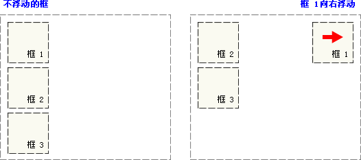

### CSS层叠样式表

#### 回顾

```
1、HTML概述
	Hyper Text Markup Language 超文本标记语言
	作用:创建网页文档，包含文字、图片、链接、音频、视频等。
2、HTML的常用基本标签
	结构标签: html   head  title  meta  body
	排版标签: <br/> <p></p> <hr/>  注释<!-- -->
	标题:h1--h6
	容器标签: div 块级元素   span 行级标签
	列表：ul 无序列表  ol 有序列表  dl定义列表
	图片：img 属性 src  width   height  border  alt 替换文字 title 标题
	链接: a 属性 href链接的地址 target:打开窗口的位置 _blank 新窗口 _self 自身窗口 _parent 父窗口 _top顶部窗口  _search 打开窗口的名称 自定义名称
		页面间跳转
		锚链接   <a name="mark">
	表格：
    	table 表格
    		tr 行
    		td 单元格
            th 表头
    格式化标签: b 加粗
    		  em 斜体
    		  i  斜体
    		  strong  加粗
    		  sup 上标
    		  sub 下标
    		  ins  插入
    		  del 删除
3、HTML的表单标签
	  form 表单  属性   action 提交服务器地址  method  get  post  enctype 控制编码类型
	  	表单元素：
	  	input标签：
	  		type: text 文本框
	  			  password 密码框
	  			  radio  单选按钮
	  			  checkbox 复选框  
	  			  submit 提交按钮
	  			  reset 重置按钮
	  			  imgage 图片按钮
	  			  button 普通按钮
	  			  file  文件
	  			  hidden 隐藏
	  		name 属性
             value 属性
             checked 属性
         select 下拉框
         selected  默认选中
         	option 选择项
         textarea 文本域	
         
4 框架标签
	frameset 框架集 
		rows 行分割
		cols 列分割
		frame 框架 src="显示的页面.html"
         
5、HTML的特殊字符
	&lt;
	&gt;
	&copy;
	&reg;
	&yen;
	&trade;
	&nbsp;
```

#### 今日内容

```
1、CSS简介
2、CSS使用方式
3、CSS选择器
4、CSS属性
5、CSS盒子模型
6、CSS扩展属性
```

#### 教学目标

```
1、了解CSS简介
2、掌握CSS使用方式
3、掌握CSS选择器
4、掌握CSS属性
5、掌握CSS盒子模型
6、熟悉CSS扩展属性
```

#### 第一节 CSS简介

##### 1.1 CSS概念

```
CSS :层叠样式表(英文全称：Cascading Style Sheets)是一种用来表现HTML（标准通用标记语言的一个应用）或XML（标准通用标记语言的一个子集）等文件样式的计算机语言。CSS不仅可以静态地修饰网页，还可以配合各种脚本语言动态地对网页各元素进行格式化。
多个样式可以层层覆盖叠加，如果不同的css样式对同一html标签进行修饰，样式有冲突的,应用优先级高的，不冲突的样式规则共同作用。
```

**CSS作用：**

```
1. 修饰美化html网页。
2. 外部样式表可以提高代码复用性从而提高工作效率。
3. html内容与样式表现分离，便于后期维护。
```

##### 1.2 CSS特点

```
1 丰富的样式定义
	CSS提供了丰富的文档样式外观，以及设置文本和背景属性的能力；允许为任何元素创建边框，以及元素边框与其他元素间的距离，以及元素边框与元素内容间的距离；允许随意改变文本的大小写方式、修饰方式以及其他页面效果。

2 易于使用和修改
	CSS可以将样式定义在HTML元素的style属性中，也可以将其定义在HTML文档的header部分，也可以将样式声明在一个专门的CSS文 件中，以供HTML页面引用。总之，CSS样式表可以将所有的样式声明统一存放，进行统一管理。
另外，可以将相同样式的元素进行归类，使用同一个样式进行定义，也可以将某个样式应用到所有同名的HTML标签中，也可以将一个CSS样式指定到某个页面元素中。如果要修改样式，我们只需要在样式列表中找到相应的样式声明进行修改。

3 多页面应用
	CSS样式表可以单独存放在一个CSS文件中，这样我们就可以在多个页面中使用同一个CSS样式表。CSS样式表理论上不属于任何页面文件，在任何页面文件中都可以将其引用。这样就可以实现多个页面风格的统一。

4 层叠
	简单的说，层叠就是对一个元素多次设置同一个样式，这将使用最后一次设置的属性值。例如对一个站点中的多个页面使用了同一套CSS样式表，而某些页面中的某些元素想使用其他样式，就可以针对这些样式单独定义一个样式表应用到页面中。这些后来定义的样式将对前面的样式设置进行重写，在浏览器中看到的将是最后面设置的样式效果。

5 页面压缩
	在使用HTML定义页面效果的网站中，往往需要大量或重复的表格和font元素形成各种规格的文字样式，这样做的后果就是会产生大量的HTML标签，从而使页面文件的大小增加。而将样式的声明单独放到CSS样式表中，可以大大的减小页面的体积，这样在加载页面时使用的时间也会大大的减少。另外，CSS样式表的复用更大程序的缩减了页面的体积，减少下载的时间
```

##### 1.3 CSS语法规则

​        CSS 规则由两个主要的部分构成：选择器，以及一条或多条声明.

​              1. 选择器通常是您需要改变样式的 HTML 元素。

​              2. 每条声明由一个属性和一个值组成。

​     **基础语法：选择器｛属性：值;属性:值….. ｝**

​     示例：

​          **提示：请使用花括号来包围声明。**

​	CSS书写方式有两种：

​	第一种：选择器、每个声明各占一行

​	第二种：选择器声明都在一行

```
 2.注意事项：
        a.如果值为若干单词，则要给值加双引号；font-family: "黑体","华文彩云","微软雅黑","arial";
        b.多个声明之间使用分号;分开；
        c.css对大小写不敏感，如果涉及到与html文档一起使用时，class与id名称对大小写敏感
        d.css注释/*...*/
```

#### 第二节 CSS使用方式

##### 2.1 内联方式

```
 把CSS样式嵌入到html标签当中，类似属性的用法，示例如下：
       <div style="color:blue;font-size:50px">This is my HTML page. </div>
 好处:可以单独设置某个元素样式，缺点：不利于样式重用      
```

##### 2.2 内部方式

```
在head标签中使用style标签引入css,示例如下:
       <style type=“text/css”> //告诉浏览器使用css解析器去解析
            div{color:red;font-size:50px}
       </style>
好处：可以控制页面中多个元素样式，缺点：只能一个页面使用       
```

##### 2.3 外部方式

```
 将css样式抽成一个单独文件，谁用谁就引用，好处：多个页面可以同时使用。
 示例如下：
       单独文件div.css:  内容示例：div{color:green;font-size:50px}
       引用语句写在head标签内部，
       
 链接式：      
<link rel="stylesheet" type="text/css" href=“div.css"></link>
      rel:代表当前页面与href所指定文档的关系
      type:文件类型，告诉浏览器使用css解析器去解析
      href:css文件地址
      
 导入式：
 
  <style type="text/css">
       @import url("div.css")
  </style>
 该内容放在head标签中
 
 备注:link和@import区别：
           1.link所有浏览器都支持，@import某些版本低的IE不支持
           2.@import是等待html加载完成才加载，link解析到这个语句，就加载
           3.@import不支持js动态修改
```

**优先级：内联样式>内部样式>外部样式，就近原则**。注意：内部样式和外部样式的位置

```
<link href="mycss.css" rel="stylesheets" type="text/css">
<style type="text/css">
	
</style>


<body>
	
</body>
```


#### 第三节 CSS选择器

 主要用于选择需要添加样式的html元素

##### 3.1 基本选择器

######         3.1.1 标签选择器

​         在head中使用style标签引入在其中声明标签选择器:

​		html标签{属性:属性值}，

 具体示例如下: 

```css
  <style type="text/css">
         span{color: red;font-size: 100px}
  </style>
```

######       3.1.2 id选择器

​        给需要修改样式的html元素添加id属性标识，在head中使用style标签引入在其中声明id选择器: **#id值{属性:属性值}**

```css
具体示例如下:
    创建id选择器：
        <div id="s1">hello,everyone!</div>
	    <div id="s2">hello,everyone!</div>
         <div id="s3">hello,everyone!</div>
	     根据id选择器进行html文件修饰 
        <style type="text/css">
		      #s1{color: red;font-size: 100px}
		      #s2{color: green;font-size: 100px}
		      #s3{color: blue;font-size: 100px}
	    </style>
```

######        3.1.3 class选择器

​          给需要修改样式的html元素添加class属性标识，在head中使用style标签引入在其中声明class选择器:  	**.class名{属性:属性值}**，具体示例如下:

```css
创建class选择器：
	       <div class="s1">hello,everyone!</div>
		   <div class="s2">hello,everyone!</div>
		   <div class="s3">hello,everyone!</div>
根据id选择器进行html文件修饰 
<style type="text/css">
		  .s1{color: purple;font-size: 100px}
		  .s2{color: pink;font-size: 100px}
		  .s3{color: yellow;font-size: 100px}
</style>
```

 **备注:以上基本选择器的优先级从高到低:id >class >标签**

##### 3.2 属性选择器

根据元素的属性及属性值来选择元素。在head中使用style标签引入其中声明, 

```css
格式为:html标签[属性='属性值']{css属性:css属性值;}
    或者html标签[属性]{css属性:css属性值;}， 
具体示例如下:
body内容：
     <form name="login" action="#" method="get">
		<font size="3">用户名：<font> 
         <input type=“text" name="username" value="zhangsan" /> </br>
      密码： <input type="password" name="password" value="123456" /> </br>
            <input   type="submit" value="登录"></input>
	</form>

 head中书写：
<style type="text/css">
        input[type='text'] {
            background-color: pink
        }
        input[type='password'] {
            background-color: yellow
        }
        font[size] {
            color: green
        }
        a[href] {
            color: blue;
        }
a[href^=‘www’]{
    a标签href属性的值是由www开头的
}
a[href$='com']{
    a标签href属性的值是由com结尾的
}
/* 包含指定内容的 不在乎顺序 */
a[href*="du"]{
	color: #008000;
}
</style>
```

##### 3.3 伪元素选择器

 主要是针对a标签

```css
语法：
              静止状态 a:link{css属性}
              悬浮状态 a:hover{css属性}
              触发状态 a:active{css属性}
              完成状态 a:visited{css属性}
具体示例如下：
   <a href="https://hao.360.cn/">点我吧</a>
        <style type="text/css">
			<!--静止状态 -->
			a:link {color: red;}
			<!--悬浮状态 -->
			a:hover {color: green;}
			<!--触发状态 -->
			a:active {color: yellow;}
			<!--完成状态 -->
			a:visited {color: blue;}
</style>
```

##### 3.4 层级选择器

 父级选择器，子级选择器….,具体示例如下：

后代选择器

​	div p{...}  表示div中的p标签，所有的p,后代

​	div span{....} 表示div中的span标签，包括所有的span，后代

子代选择器

​	div>span{....} 表示 div中有一个span， span是子代

相邻兄弟  div+ p    表示div同级别后边的相邻的p标签   

 通用兄弟 div~p     表示div同级别后边的所有的p标签

```html
  <div id="div1">
			<div class="div11">
				<span>span1-1</span>
			</div>
			<div class="div12">
				<span>span1-2</span>
			</div>
 </div>
		<div class="div2">
			<div id="div22">
				<span>span2-1</span>
			</div>
			<div id="div23">
				<span>span2-2</span>
			</div>
		</div>

		<style type="text/css">
			#div1 .div11{color:red;}
			#div1 .div12{color:purple;}
			.div2 #div22{color:green;}
			.div2 #div23{color:blue;}
		</style>
```


#### 第四节 CSS属性

##### 4.1 文字和文本属性

文字属性

```
1>.font-size:设置字体大小
2>.font-family:设置文字的字体,常见的值为 :黑体，宋体，楷体等
3>.font-style:规定斜体字,常见的值：
							   normal - 文本正常显示
					            italic - 文本斜体显示 字体斜体
					            oblique - 文本倾斜显示 变形斜体
4>.font-weight 属性设置文本的粗细。关键字 100 ~ 900 为字体指定了 9 级加粗度。
                                100 对应最细的字体变形，900 对应最粗的字体变形。
                                数字 400 等价于 normal，而 700 等价于 bold。
	  备注：
	  斜体（italic）是对每个字母的结构有一些小改动，来反映变化的外观。
	  倾斜（oblique）文本则是正常竖直文本的一个倾斜版本。
通常情况下，italic 和 oblique 文本在 web 浏览器中看上去完全一样

简写： 
font: italic  bold  30px "幼圆","黑体"; /*style  weight  size family  swsf*/
```

文本属性

```
1>.color:设置文本颜色
2>.text-indent:缩进元素中文本的首行,取值类型如下：
	         1》text-indent:5em;表示此段落第一行缩进5个字符的宽度
	         2》text-indent:20%:表示此段落第一行缩进父容器宽度的百分之二十
3>.text-decoration:
             none:会关闭原本应用到一个元素上的所有装饰
	   		underline: 添加下划线
             overline:在文本的顶端画一个上划线
	    	line-through:在文本中间画一个贯穿线
	   		blink:让文本闪烁(无效果)
4>.text-align:一个元素中的文本行互相之间的对齐方式,值有left(左对齐)、right(右对齐) 和 center(居中)
5>.word-spacing: 字符之间的间隔
6>.letter-spacing: 单词或者字母之间的间隔
7>.line-height:设置行高 line-height:25px;
```

##### 4.2 背景属性

```
1>.background-color：设置背景颜色，默认透明
2>.background-image:url("图片路径"):设置背景图片
3>.background-repeat:repeat-y:只在垂直方向都平铺
                 repeat-x:只在水平方向都平铺
                 repeat:在水平垂直方向都平铺
                 no-repeat:任何方向都不平铺
4>.background-position: 改变图像在背景中的位置。top、bottom、left、right 和 center 

/*简写 没有顺序*/
background: red  center no-repeat url(img/003.jpg);		
```

##### 4.3 列表属性

```
list-style-type:decimal;改变列表的标志类型
list-style-image: url("images/dog.gif");用图像表示标志
list-style-position: inside;确定标志出现在列表项内容之外还是内容内部 

简写
list-style: decimal url(img/001.png) inside;
去掉样式:
list-style:none;
list-style-type:none;
```

##### 4.4 尺寸显示轮廓属性

```
width:设置元素的宽度
height:设置元素的高度
显示属性(display)
display: none 不显示
		block:块级显示 默认
		inline:行级显示
		inline-block:行级块
轮廓（outline）
	绘制于元素周围的一条线，位于边框边缘的外围，可起到突出元素的作用。常用属性：
outline-style:solid(实线)/dotted(虚线)/dashed(虚线，虚线的每段较长)/double(框为空心);设置轮廓的样outline-color:red;设置轮廓的颜色
outline-width:10px设置轮廓的宽度
```

##### 4.5 浮动属性

​	浮动(float)的框可以向左或向右移动，直到它的外边缘碰到包含框或另一个浮动框的边框为止。由于浮动框不在标准文档流中，所以文档的普通流中的块框表现得就像浮动框不存在一样。

请看下图，当把框 1 向右浮动时，它脱离文档流并且向右移动，直到它的右边缘碰到包含框的右边缘：



再请看下图，当框 1 向左浮动时，它脱离文档流并且向左移动，直到它的左边缘碰到包含框的左边缘。因为它不再处于文档流中，所以它不占据空间，实际上覆盖住了框 2，使框 2 从视图中消失。

如果把所有三个框都向左移动，那么框 1 向左浮动直到碰到包含框，另外两个框向左浮动直到碰到前一个浮动框。


如下图所示，如果包含框太窄，无法容纳水平排列的三个浮动元素，那么其它浮动块向下移动，直到有足够的空间。如果浮动元素的高度不同，那么当它们向下移动时可能被其它浮动元素“卡住”：


**clear 属性**

规定元素的哪一侧不允许其他浮动元素。

**可能的值**

| 值       | 描述                     |
| ------- | ---------------------- |
| left    | 在左侧不允许浮动元素。            |
| right   | 在右侧不允许浮动元素。            |
| both    | 在左右两侧均不允许浮动元素。         |
| none    | 默认值。允许浮动元素出现在两侧。       |
| inherit | 规定应该从父元素继承 clear 属性的值。 |

##### 4.6 定位属性

position: static | relative| absolute| fixed

###### 4.6.1 静态定位（默认定位方式）static

###### 4.6.2 相对定位(relative)

相对于原来的位置偏移某个距离。元素仍保持其未定位前的形状，它原本所占的空间仍保留。

示例代码：

```html
<html>
	<head>
		<style type="text/css">
			h2.pos_left {
				position: relative;
				left: -20px
			}
			
			h2.pos_right {
				position: relative;
				left: 20px
			}
		</style>
	</head>
	<body>
		<h2>这是位于正常位置的标题</h2>
		<h2 class="pos_left">这个标题相对于其正常位置向左移动</h2>
		<h2 class="pos_right">这个标题相对于其正常位置向右移动</h2>
		<p>相对定位会按照元素的原始位置对该元素进行移动。</p>
		<p>样式 "left:-20px" 从元素的原始左侧位置减去 20 像素。</p>
		<p>样式 "left:20px" 向元素的原始左侧位置增加 20 像素。</p>
	</body>
</html>
```

###### 4.6.3 绝对定位(absolute)

​        元素框从文档流完全删除，并相对于其包含块定位。包含块可能是文档中的另一个元素或者是视窗本身。元素原先在正常文档流中所占的空间会关闭，就好像元素原来不存在一样。元素定位后生成一个块级框，而不论原来它在正常流中生成何种类型的框。

​	绝对定位的元素的位置相对于最近的已定位祖先元素，如果元素没有已定位的祖先元素，那么它的位置相对于视窗本身。

```html
<html>
	<head>
		<meta charset="utf-8" />
		<style type="text/css">
			h2.pos_abs {
				position: absolute;
				left: 100px;
				top: 150px
			}
		</style>
	</head>
	<body>
		<h2 class="pos_abs">这是带有绝对定位的标题</h2>
		<p>通过绝对定位，元素可以放置到页面上的任何位置。下面的标题距离页面左侧 100px，距离页面顶部 150px。</p>
	</body>
</html>
```

###### 4.6.4 固定定位(fixed)

​         元素框的表现类似于将 position 设置为 absolute，不过其位置相对于视窗本身。

示例如下(网站左下角和右下角广告)：

```html
<!DOCTYPE html>
<html>
	<head>
		<meta charset="UTF-8">
		<title></title>
		<style>
			#left {
				width: 200px;
				height: 200px;
				background-color: red;
				position: fixed;
				left: 0;
				bottom: 0;
			}
			
			#right {
				width: 200px;
				height: 200px;
				background-color: green;
				position: fixed;
				right: 0;
				bottom: 0;
			}
			#middle{
				width: 200px;
				height: 200px;
				background-color: blue;
				position: fixed;
				left: 0;
				bottom: 50%;
			}
			
		</style>
	</head>
	<body>
		<div id="left">
		</div>
		<div id="right">
		</div>
		<div id="middle">
		</div>
	</body>
</html>
```


####  第五节 CSS盒子模型


##### 5.1 边框属性  

```
border-style:边框样式，值有以下情况：
				solid:实线
				double:空心线
				dashed:虚线组成的边框
				dotted:圆点组成的边框
border-color:边框颜色
border-width:边框宽度
简写
border: 1px solid red;
```

#####  5.2 外边距属性

```
margin:外间距,边框和边框外层的元素的距离
margin:四个方向的距离(top right bottom left)
margin-top:
margin-bottom:
margin-left:
margin-right:
```

##### 5.3 内边距属性

```
padding:内间距,元素内容和边框之间的距离((top right bottom left)) 
padding-left:
padding-right:
padding-top:
padding-bottom:
```

盒子模型的实际的宽度：width+2*（padding+border+margin）

盒子模型的实际的高度：height+2*（padding+border+margin）


#### 第六节 CSS3扩展属性

##### 6.1 border-radius

圆角属性

​          示例：	border-radius: 25px;


##### 6.2 box-shadow  

用于向方框添加阴影

​        示例：box-shadow: 10px 10px 5px #888888;


##### 6.3 background-size

属性规定背景图片的尺寸

```html
	<body style="text-align: center;
		background:url(img/1.png);
		background-size: 200px 300px;
		background-repeat: no-repeat;">
	</body>
```

##### 6.4 background-image

为指定元素使用多个背景图像


##### 6.5 text-shadow 

可向文本应用阴影。

​      示例：text-shadow: 5px 5px 5px #ffff00;


#### 第七节 HTML结合CSS完成淘宝分类页

#####  7.1 案例效果图

##### 

##### 7.2 案例源代码

```html
<!DOCTYPE html>
<html>

	<head>
		<meta charset="UTF-8">
		<title>综合练习</title>

		<style type="text/css">
			body {
				font-size: 12px;
			}
			#main {
				width: 1000px;
				margin: 0 auto;
			}
			
			#top {
				width: 980px;
				height: 200px;
				padding-left: 10px;
				padding-right: 10px;
				margin: 0 auto;
			/*	background-color: #87CEEB;*/
			}
			
			a {
				color: black;
				text-decoration: none;
			}
			
			a:hover {
				color: #333;
				text-decoration: underline;
			}
			
			#a1 {
				color: #F65626;
			}
			#searchtext{
				width: 500px;
				border-radius: 10px;
				border: 1px solid #888888;
				height: 25px;
				vertical-align: top;
			}
			#searchbtn{
				background-color: #FF8C00;
				border-radius: 10px;
				height: 28px;
				width: 100px;
				display: inline-block;
				vertical-align: top;
				line-height: 28px;
				text-align: center;
				
			}
			.price{
				text-align: center;
				color: #F65626;
				
			}

		</style>
	</head>

	<body>
		<!--顶部-->
		<div id="top">
			<div style="background-color: #aaa; height: 35px; border-radius: 10px; line-height: 35px;">
				<div style="float: left; text-indent: 2em;">
					<a href="#" id="a1">亲，请登录</a>
					<a href="#">免费注册</a>
					<a href="#">手机逛淘宝</a>
				</div>
				<div style="float: right; margin-right: 10px;">
					<a href="#" id="a1">淘宝网首页</a>
					<a href="#">我的淘宝</a>
					<a href="#">购物车</a>
					<a href="#">收藏夹</a>
					<a href="#">商品分类</a>
					<a href="#">卖家中心</a>
					<a href="#">联系客服</a>
					<a href="#">网站导航</a>
				</div>
			</div>
			<div style="overflow: hidden;">
				<div style="float: left;">
					
				</div>
				<div style="float: left; padding-top: 30px;">
					&nbsp;&nbsp;&nbsp;&nbsp;&nbsp;&nbsp;&nbsp;&nbsp;&nbsp;&nbsp;&nbsp;&nbsp;<input id="searchtext" type="text" name="keyword" />&nbsp;&nbsp;<div id="searchbtn">搜索</div><br/>
				&nbsp;&nbsp;&nbsp;&nbsp;&nbsp;&nbsp;&nbsp;&nbsp;&nbsp;&nbsp;&nbsp;&nbsp;客厅灯 冲锋衣 床垫 沙发垫 电脑桌 鞋柜
				</div>
			</div>
			<div style="background-color: #aaa; height: 35px; border-radius: 10px; line-height: 35px; text-indent: 4em;">
				客厅灯 冲锋衣 床底 沙发垫 电脑桌 鞋柜
			</div>
			<div style="margin-top: 10px; overflow: hidden;">
				<div style="float: left;">
					<input type="text" name="price1" style="border-radius: 5px;" />---<input type="text" name="price2" style="border-radius: 5px;" />
				</div>
				<div style="float: right;">
					<input type="checkbox" name="" value="包邮" />包邮<input type="checkbox" name="" value="包邮" />包邮	<input type="checkbox" name="" value="包邮" />包邮
				</div>
			</div>

		</div>
		<!--主体-->
		<div id="main">
			
			<table width="100%" id="tab">
				<tr>
					<td>
						<div style="text-align: center;">
							
						</div>	
						<div class="price">
							&yen;40 包邮
						</div>
						<div style="text-align: center;">
							世界上最好的商品
						</div>
						<div style="color: #888888; text-align: center;">
							专营店
						</div>
						<div style="color: #888888; text-align: right;">
							如实描述
						</div>
						
					</td>
					<td>
						<div style="text-align: center;">
							
						</div>	
						<div class="price">
							&yen;40 包邮
						</div>
						<div style="text-align: center;">
							世界上最好的商品
						</div>
						<div style="color: #888888; text-align: center;">
							专营店
						</div>
						<div style="color: #888888; text-align: right;">
							如实描述
						</div>
					</td>
					<td>
						<div style="text-align: center;">
							
						</div>	
						<div class="price">
							&yen;40 包邮
						</div>
						<div style="text-align: center;">
							世界上最好的商品
						</div>
						<div style="color: #888888; text-align: center;">
							专营店
						</div>
						<div style="color: #888888; text-align: right;">
							如实描述
						</div>
					</td>
					<td>
						<div style="text-align: center;">
							
						</div>	
						<div class="price">
							&yen;40 包邮
						</div>
						<div style="text-align: center;">
							世界上最好的商品
						</div>
						<div style="color: #888888; text-align: center;">
							专营店
						</div>
						<div style="color: #888888; text-align: right;">
							如实描述
						</div>
					</td>
					<td>
						<div style="text-align: center;">
							
						</div>	
						<div class="price">
							&yen;40 包邮
						</div>
						<div style="text-align: center;">
							世界上最好的商品
						</div>
						<div style="color: #888888; text-align: center;">
							专营店
						</div>
						<div style="color: #888888; text-align: right;">
							如实描述
						</div>
					</td>
				</tr>
				<tr>
					<td>
						<div style="text-align: center;">
							
						</div>	
						<div class="price">
							&yen;40 包邮
						</div>
						<div style="text-align: center;">
							世界上最好的商品
						</div>
						<div style="color: #888888; text-align: center;">
							专营店
						</div>
						<div style="color: #888888; text-align: right;">
							如实描述
						</div>
						
					</td>
					<td>
						<div style="text-align: center;">
							
						</div>	
						<div class="price">
							&yen;40 包邮
						</div>
						<div style="text-align: center;">
							世界上最好的商品
						</div>
						<div style="color: #888888; text-align: center;">
							专营店
						</div>
						<div style="color: #888888; text-align: right;">
							如实描述
						</div>
					</td>
					<td>
						<div style="text-align: center;">
							
						</div>	
						<div class="price">
							&yen;40 包邮
						</div>
						<div style="text-align: center;">
							世界上最好的商品
						</div>
						<div style="color: #888888; text-align: center;">
							专营店
						</div>
						<div style="color: #888888; text-align: right;">
							如实描述
						</div>
					</td>
					<td>
						<div style="text-align: center;">
							
						</div>	
						<div class="price">
							&yen;40 包邮
						</div>
						<div style="text-align: center;">
							世界上最好的商品
						</div>
						<div style="color: #888888; text-align: center;">
							专营店
						</div>
						<div style="color: #888888; text-align: right;">
							如实描述
						</div>
					</td>
					<td>
						<div style="text-align: center;">
							
						</div>	
						<div class="price">
							&yen;40 包邮
						</div>
						<div style="text-align: center;">
							世界上最好的商品
						</div>
						<div style="color: #888888; text-align: center;">
							专营店
						</div>
						<div style="color: #888888; text-align: right;">
							如实描述
						</div>
					</td>
				</tr>
				
			</table>
		</div>
	</body>

</html>s
```


#### 总结

#### 作业题

```
1、实现京东页面的主页
```

#### 面试题

```
1、CSS 中类 (classes) 和 ID 的区别
对于CSS而言，id和class都是选择器，唯一不同的地方在于权重不同。
对于html而言，id和class都是dom元素的属性值。不同的地方在于id属性的值是唯一的，而class属性值可以重复。
id还一个老特性是锚点功能，当浏览器地址栏有一个#xxx，页面会自动滚动到id=xxx的元素上面。
```