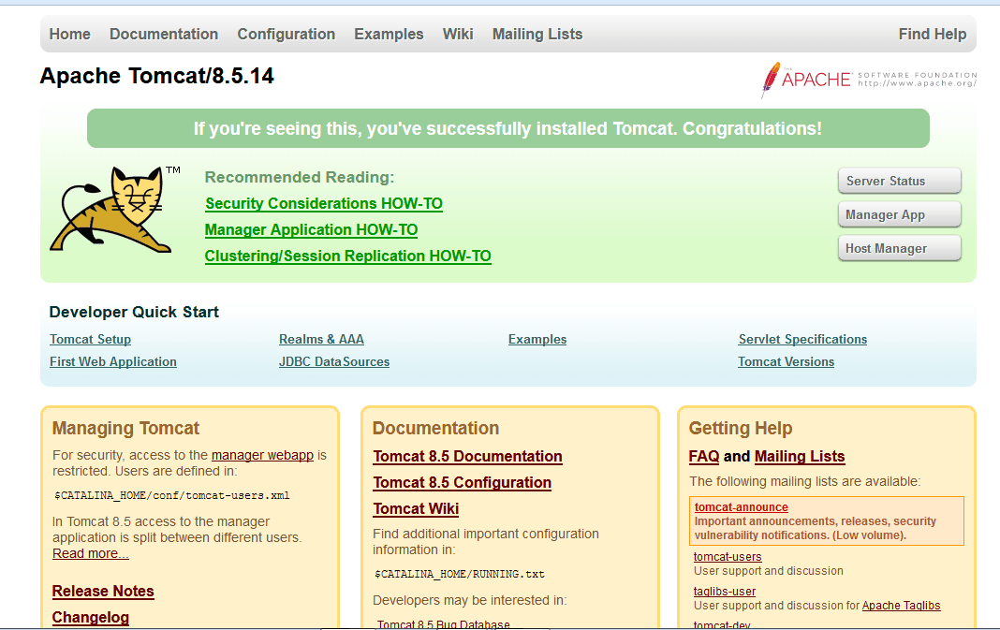
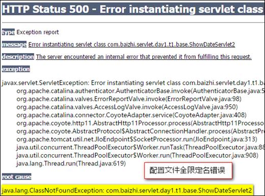

# Tomcat配置、Servlet、Web项目

#### 今日内容

```
1、C/S和B/S的区别
2、Web的服务器
3、第一个servlet Java Server Applet
4、Tomcat的搭建  --->开发工具
5、Web项目的结构
```

#### 教学目标

```
1、掌握C/S和B/S的区别
2、了解Web的服务器
3、掌握Tomcat的搭建
4、掌握Web项目的结构
```

## 第一章 Web应用的演变

### 1.1 C/S模式和B/S模式

```
C/S:Client/Server或客户端/服务器模式
C/S的优点是能充分发挥客户端PC的处理能力
缺点是对用户的电脑配置要求较高，更新升级比较麻烦
常见的CS程序：LOL、穿越火线、QQ
```


```
B/S:Browser/Server或浏览器/服务器模式
优点是用户使用简单，只要有浏览器和网络即可
常见的程序：淘宝网、京东网等
```


### 1.2 Web服务器简介

```
Web服务器是运行及发布Web应用的容器，只有将开发的Web项目放置到该容器中，才能使网络中的所有用户通过浏览器进行访问。开发Java Web应用所采用的服务器主要是与JSP/Servlet兼容的Web服务器，比较常用的有Tomcat、Resin、JBoss、WebSphere 和 WebLogic 等
```

```
Tomcat 服务器
　　目前最为流行的Tomcat服务器是Apache-Jarkarta开源项目中的一个子项目，是一个小型、轻量级的支持JSP和Servlet 技术的Web服务器，也是初学者学习开发JSP应用的首选
```

```
Resin 服务器
　　Resin是Caucho公司的产品，是一个非常流行的支持Servlet和JSP的服务器，速度非常快。Resin本身包含了一个支持HTML的Web服务器，这使它不仅可以显示动态内容，而且显示静态内容的能力也毫不逊色，因此许多网站都是使用Resin服务器构建
```

```
JBoss服务器
　　JBoss是一个种遵从JavaEE规范的、开放源代码的、纯Java的EJB服务器，对于J2EE有很好的支持。JBoss采用JML API实现软件模块的集成与管理，其核心服务又是提供EJB服务器，不包含Servlet和JSP的Web容器，不过它可以和Tomcat完美结合
```

```
WebSphere 服务器
　　WebSphere是IBM公司的产品，可进一步细分为 WebSphere Performance Pack、Cache Manager 和WebSphere Application Server等系列，其中WebSphere Application Server 是基于Java 的应用环境，可以运行于 Sun Solaris、Windows NT 等多种操作系统平台，用于建立、部署和管理Internet和Intranet Web应用程序。
```

```
WebLogic 服务器
　　WebLogic 是BEA公司的产品（现在已经被Oracle收购），可进一步细分为 WebLogic Server、WebLogic Enterprise 和 WebLogic Portal 等系列，其中 WebLogic Server 的功能特别强大。WebLogic 支持企业级的、多层次的和完全分布式的Web应用，并且服务器的配置简单、界面友好。对于那些正在寻求能够提供Java平台所拥有的一切应用服务器的用户来说，WebLogic是一个十分理想的选择
```

### 1.3自定义web服务器

```java
package com.qf.day10;

import java.io.FileInputStream;
import java.io.IOException;
import java.io.OutputStream;
import java.net.ServerSocket;
import java.net.Socket;

/**
 * 自定义服务器
 * @author wgy
 *
 */
public class MyServer {
	public static void main(String[] args) {
		try {
			//1创建侦听套接字
			ServerSocket listener=new ServerSocket(10086);
			//2接收客户端请求
			System.out.println("客户端已启动....");
			Socket socket=listener.accept();
			//3获取输出流
			OutputStream os=socket.getOutputStream();
			
			//4创建FileInputStream
			FileInputStream fis=new FileInputStream("d:\\mywork\\hello.html");
			
			byte[] buf=new byte[1024*4];
			int len=0;
			while((len=fis.read(buf))!=-1) {
				os.write(buf,0,len);
				os.flush();
			}
			//5关闭
			fis.close();
			os.close();
			socket.close();
			listener.close();
			
			System.out.println("服务器执行完毕...");
			
			
		} catch (IOException e) {
			// TODO Auto-generated catch block
			e.printStackTrace();
		}
	}
}
```


## 第二章 Tomcat服务器搭建

### 2.1 Tomcat服务器介绍

​	Tomcat是Apache 软件基金会（Apache Software Foundation）的Jakarta 项目中的一个核心项目，由Apache、Sun 和其他一些公司及个人共同开发而成。由于有了Sun 的参与和支持，最新的Servlet 和JSP 规范总是能在Tomcat 中得到体现。因为Tomcat 技术先进、性能稳定，而且免费，因而深受Java 爱好者的喜爱并得到了部分软件开发商的认可，成为目前比较流行的Web 应用服务器。

​	Tomcat 服务器是一个免费的开放源代码的Web 应用服务器，属于轻量级应用[服务器]，在中小型系统和并发访问用户不是很多的场合下被普遍使用，是开发和调试JSP 程序的首选，目前Tomcat最新版本为**9.0。**

### 2.2 Tomcat安装

Tomcat压缩版,安装特别方便,只需要右键解压即可!

Tomcat服务器的安装

1. 官网下载(http://tomcat.apache.org/)，Tomcat8.0|8.5解压缩版本
2. 解压到一个没有特殊符号的目录中（一般纯英文即可）
3. 进入到解压的目录下找到bin\startup.bat双击启动即可

**注意:**不建议将服务器软件放在磁盘层次很多的文件夹中!

​	 不建议放在中文路径下!

​	  tomcat安装需要配置JAVA_HOME环境变量（有JRE亦可）

​	  第一次启动服务器建议使用命名行打开,因为可以提示错误信息!

### 2.3 Tomcat目录的介绍

```
1、bin：该目录下存放的是二进制可执行文件，如果是安装版，那么这个目录下会有两个exe文件：tomcat9.exe、tomcat9w.exe，前者是在控制台下启动Tomcat，后者是弹出UGI窗口启动Tomcat；如果是解压版，那么会有startup.bat和shutdown.bat文件，startup.bat用来启动Tomcat，但需要JDK的配置，shutdawn.bat用来停止Tomcat；

2、conf：这是一个非常非常重要的目录，这个目录下有四个最为重要的文件：

server.xml：配置整个服务器信息。例如修改端口号，添加虚拟主机等；

tomcatusers.xml：存储tomcat用户的文件，这里保存的是tomcat的用户名及密码，以及用户的角色信息。可以按着该文件中的注释信息添加tomcat用户，然后就可以在Tomcat主页中进入Tomcat Manager页面了；

web.xml：部署描述符文件，这个文件中注册了很多MIME类型，即文档类型。这些MIME类型是客户端与服务器之间说明文档类型的，如用户请求一个html网页，那么服务器还会告诉客户端浏览器响应的文档是text/html类型的，这就是一个MIME类型。客户端浏览器通过这个MIME类型就知道如何处理它了。当然是在浏览器中显示这个html文件了。但如果服务器响应的是一个exe文件，那么浏览器就不可能显示它，而是应该弹出下载窗口才对。MIME就是用来说明文档的内容是什么类型的！

context.xml：对所有应用的统一配置，通常我们不会去配置它。

3、lib：Tomcat的类库，里面是一大堆jar文件。如果需要添加Tomcat依赖的jar文件，可以把它放到这个目录中，当然也可以把应用依赖的jar文件放到这个目录中，这个目录中的jar所有项目都可以共享之，但这样你的应用放到其他Tomcat下时就不能再共享这个目录下的Jar包了，所以建议只把Tomcat需要的Jar包放到这个目录下；

4、logs：这个目录中都是日志文件，记录了Tomcat启动和关闭的信息，如果启动Tomcat时有错误，那么异常也会记录在日志文件中。

5、temp：存放Tomcat的临时文件，这个目录下的东西可以在停止Tomcat后删除！

6、webapps：存放web项目的目录，其中每个文件夹都是一个项目；如果这个目录下已经存在了目录，那么都是tomcat自带的项目。其中ROOT是一个特殊的项目，在地址栏中没有给出项目目录时，对应的就是ROOT项目。http://localhost:8080/examples，进入示例项目。其中examples就是项目名，即文件夹的名字。

7、work：运行时生成的文件，最终运行的文件都在这里。通过webapps中的项目生成的！可以把这个目录下的内容删除，再次运行时会生再次生成work目录。当客户端用户访问一个JSP文件时，Tomcat会通过JSP生成Java文件，然后再编译Java文件生成class文件，生成的java和class文件都会存放到这个目录下。

8、LICENSE：许可证。

9、NOTICE：说明文件。
```

### 2.4 启动tomcat服务器

​          tomcat安装文件/bin/startup.bat 启动程序

java.util.logging.ConsoleHandler.encoding = UTF-8

 **测试**

C:\Program Files\Java\jdk1.8.0_151

​	 打开浏览器!输入 http://localhost:8080

 如果出现以下界面证明成功!



http://ip:port/test/资源（静态（html、css、Javascript）、动态(servlet、JSP)）

Tomcat其他配置：

1 修改端口号

```xml
  <Connector port="8080" protocol="HTTP/1.1"
               connectionTimeout="20000"
               redirectPort="8443" />
```

Tomcat的乱码：-Dfile.encoding=UTF-8

### 2.5 通过URL访问服务器静态资源

​	如何把资源放在tomcat中访问

```
(1)在webapps中建立文件夹:aaa。由于在webapps里创建该文件夹，所以aaa就是个项目资源
(2)把静态资源（图片、文本、网页）复制到aaa文件夹中。（hello.html）
(3)通过URL统一资源定位符，访问http://localhost:8080/aaa/hello.html
```


2.6常见错误

Tomcat闪退问题：JAVA_HOME配置问题（解决：startup.bat中最后增加pause，查看错误信息）

404：

​            

500：

​     

## 第三章 第一个Servlet(Java Server Applet)

### 3.1.概念

> I.  Servlet是服务器端的一段程序（代码、功能实现），可交互式的处理客户端发送到服务器的请求，并完成操作响应。
>
> II.  动态网页技术。
>
> III. JavaWeb程序开发的基础，JavaEE规范（一套接口）的一个组成部分。 //由服务器厂商实现

### 3.2Servlet的核心作用：

   I.  接收客户端请求，完成操作任务。

   II.  动态生成网页（页面数据可变）。

   III. 将包含操作结果的动态网页响应给客户端。

​           

### 3.3 Servlet开发步骤

import java.util.Scanner;=-----javac

> 1. 搭建开发环境：创建目录结构，将Servlet相关的jar包（ 完整路径\lib\servlet-api.jar）配置到CLASSPATH中。
>
> 2.  实现javax.servlet.Servlet接口，覆盖5个主要方法。
>
> ```java
> package com.qf.www.servlets;
> 
> //Servlet核心五个内容
> import javax.servlet.Servlet;
> import javax.servlet.ServletRequest;
> import javax.servlet.ServletResponse;
> import javax.servlet.ServletConfig;
> import javax.servlet.ServletException;
> 
> import javax.servlet.IOException;
> 
> public class MyServlet implements Servlet {
>     @Override
>     public void init(ServletConfig servletConfig) throws ServletException {
> 		//初始化servlet
>     }
> 
>     @Override
>     public ServletConfig getServletConfig() {
>         //获得servlet配置信息
>         return null;
>     }
> 
>     @Override
>     public void service(ServletRequest servletRequest, ServletResponse servletResponse) throws ServletException, IOException {
> 		//提供服务
>     }
> 
>     @Override
>     public String getServletInfo() {
>        //获得servlet基本信息
>         return null;
>     }
> 
>     @Override
>     public void destroy() {
> 		//销毁servlet
>     }
> }
> 
> ```
>
> \3.  在核心的service()方法中书写输出语句，验证访问结果。
>
> \4.  将编译后的.class文件放置在WEB-INF/classes中。
>
> \5.  web.xml文件中添加配置信息（在现有示例项目中复制）
>
> ​           
>
> 注意：如果配置了环境变量，还是出现包的引用问题，可以使用以下方式：
>
> 不带包:
>
>  **javac -classpath D:\apache-tomcat-7.0.42\lib\servlet-api.jar MyServlet.java。**
>
> 在编译的时候，引用一下servlet-api的路径
>
> 带包：
>
> **javac -d . -classpath F:\tomcat\apache-tomcat-8.5.45\lib\servlet-api.jar MyServlet.java**

##  第四章 开发工具集成Tomcat

### 4.1在Eclipse中集成Tomcat服务器（了解）

1.打开Eclipse的window-->Preferences—>Server


2.点击add—>选择对应的版本—>Finish即可


3.然后选择右边的server—>空白处右键new—>server—>Finish即可。


4.再右键新建的服务器点击open，按照图片进行修改保存即可


5.选中新建的服务器右键start即可启动

### 4.2 Idea中关联Tomcat

在setting配置中，找到 build-execution-deployment中，选择Application Servers ，添加tomcat即可


## 第五章 JavaWEB项目创建及结构

### 5.1在Eclipse中创建 javaWeb项目


输入项目名称点击Finsh即可

### 5.2 javaweb项目结构讲解


关于目录

Java web工程下的WebContent就是工程的发布文件夹，发布时会把该文件夹发布到tomcat的webapps里。

开发时classes文件存放路径：

buildpath：在eclipse中项目的右键build path-source中指定工程中class文件的编译路径，一般为：test/build/classes。（test是工程名）

发布时classes文件存放路径：

发布到tomcat时（在eclipse里启动tomcat），src文件夹里的java文件经过编译后，会把.class文件放在WEB-INF文件夹里的classes文件夹中。

有一些配置文件需要放到WEB-INF的classes文件夹下，所以，通常的做法是手动在工程的WEB-INF文件夹下建立classes文件夹。如果不在工程的WEB-INF下手动建立classes，发布到tomcat时tomcat里的WEB-INF中也会有classes文件夹。

### 5.3 Web项目应用jar包

【Web App Libraries】 一般是指向web工程的 WEB-INF/lib下的包，开发人员只需要把需要的jar包copy到WEB-INF/lib中即可。

web工程参照了很多文件，因此发布的时候要打成war包，使其变成单独的个体，放到web容器里。
开发环境中eclipse会将工程打包放到tomcat下，进行关联。

### 5.4 web项目打包成war文件

Javaweb项目开发后可以打成war包。	

### 5.5 web.xml

如果创建项目时没有web.xml，可以**右键项目，点击java EE Tools 其中点击Genertate Deployment Descriptor Stub** ,这样WEB-INF就会添加上web.xml了

```xml
<?xml version="1.0" encoding="UTF-8"?>
<web-app xmlns:xsi="http://www.w3.org/2001/XMLSchema-instance" xmlns="http://xmlns.jcp.org/xml/ns/javaee" xsi:schemaLocation="http://xmlns.jcp.org/xml/ns/javaee http://xmlns.jcp.org/xml/ns/javaee/web-app_3_1.xsd" version="3.1">
  <display-name>firstweb</display-name>
  <welcome-file-list>
    <welcome-file>index.html</welcome-file>
    <welcome-file>index.htm</welcome-file>
    <welcome-file>index.jsp</welcome-file>
    <welcome-file>default.html</welcome-file>
    <welcome-file>default.htm</welcome-file>
    <welcome-file>default.jsp</welcome-file>
  </welcome-file-list>
</web-app>
```


1.Web 应用名称

```xml
<display-name>firstweb</display-name>
```

2.Web 应用描述：给出于此相关的说明性文本

```xml
<desciption>Tomcat Example servlets and JSP pages.</desciption>
```

3.项目首页配置

```xml
 <welcome-file-list>
    <welcome-file>index.html</welcome-file>
    <welcome-file>index.htm</welcome-file>
    <welcome-file>index.jsp</welcome-file>
    <welcome-file>default.html</welcome-file>
    <welcome-file>default.htm</welcome-file>
    <welcome-file>default.jsp</welcome-file>
  </welcome-file-list>
```

4. 配置网站错误页面

```xml
 <error-page>
    <error-code>404</error-code>
    <location>/error/404.html</location>
  </error-page>
  <error-page>
    <error-code>500</error-code>
    <location>/error/500.html</location>
  </error-page>
  <error-page>
    <location>/error/error.html</location>
</error-page>
```


### 5.6 Idea中如何创建Web项目


### 5.7 idea中web项目结构


关于目录

Java web工程下的web就是工程的发布文件夹，发布时会把该文件夹发布到idea项目下的out文件夹里artifacts。

开发时classes文件存放路径：

out文件夹下production文件夹下，

有一些配置文件需要放到WEB-INF文件夹下


### 5.8 Web项目应用jar包

【Web App Libraries】 一般是指向web工程的 WEB-INF/lib下的包，开发人员只需要把需要的jar包copy到WEB-INF/lib中即可。

web工程参照了很多文件，因此发布的时候要打成war包，使其变成单独的个体，放到web容器里。
开发环境中eclipse会将工程打包放到tomcat下，进行关联。

### 5.9 Web项目打包成war包


### 注意：web.xml文件和eclipse里的一样。

####总结

tomcat配置

创建web项目


#### 作业题

```
1、自己创建一个web项目，完成一个新闻浏览的静态网站
要求：
	Servlet接收浏览器请求，向浏览器响应一个静态页面，携带着当前系统时间
```

#### 面试题

```
1、请写出使用TomCat，遇到过的问题
```