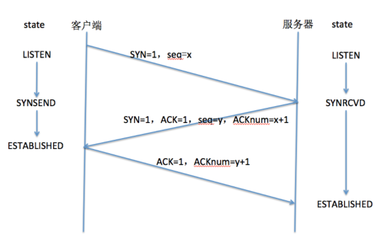
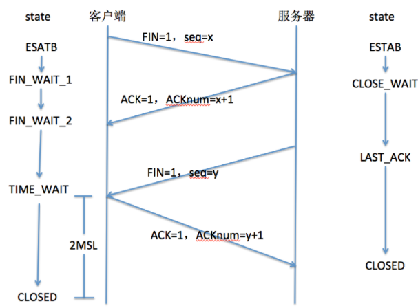

### Servlet应用

#### 回顾

```
1、Tomcat的配置
	1.1自定义服务器 socket
	1.2Tomcat配置
		修改端口号  <Connector port="8080">
		如何发布应用程序 （在webapps目录，创建文件夹(project)，把内容(静态、动态资源)复制过去）
 	1.3 开发工具关联tomcat 
 		eclipse 
 		idea
2、如何创建Web项目
	eclipse ---file---》new---》Dynamic Web Project 
			src:java类
			webContent:web资源
			build
	idea 创建  java Enterprise--->JavaEE 7 --->选择web application	-->输入项目名称
			src :java类
			web:web资源   WEB-INF--->lib   classes  web.xml
			out：编译的内容   如果修改了内容，out没有编译成功。删out，重新编译
3、Servlet   Java Server Applet   服务端小程序
	当前系统时间       html页面
```

#### 今日内容

```
1、Servlet概念和入门
2、Servlet获取请求参数
3、Servlet的乱码
4、Servlet的两种创建方式
5、Servlet的两种配置方式
6、Servlet结合JDBC   （三层  dao   service  servlet）
7、转发、重定向
```

#### 教学目标

```7
1、掌握Servlet的基本使用
2、了解Http协议
3、掌握Servlet获取请求参数
4、掌握Servlet的生命周期
5、掌握Servlet的两种创建方式
6、掌握Servlet的两种配置方式
7、掌握Servlet线程安全
```

#### 第一节 HTTP协议

###### 1.1 什么是HTTP协议

超文本传输协议（HTTP，HyperText Transfer Protocol)是互联网上应用最为广泛的一种网络协议,是一个基于请求与响应模式的、无状态的、应用层的协议，常基于TCP的连接方式。

HTTP协议的主要特点如下：

1. 支持客户端（浏览器）/服务器模式。B/S
2. 简单快速：客户向服务器请求服务时，只需传送请求方法和路径。请求方法常用的有GET、POST。每种方法规定了客户与服务器联系的类型不同。由于HTTP协议简单，使得HTTP服务器的程序规模小，因而通信速度很快。
3.  灵活：HTTP允许传输任意类型的数据对象。传输的类型由Content-Type加以标记。
4. 无连接：无连接的含义是限制每次连接只处理一个请求。服务器处理完客户的请求，并收到客户的应答后，即断开连接。采用这种方式可以节省传输时间。
5. 无状态：HTTP协议是无状态协议。无状态是指协议对于事务处理没有记忆能力。缺少状态意味着如果后续处理需要前面的信息，则它必须重传，这样可能导致每次连接传送的数据量增大。另一方面，在服务器不需要先前信息时它的应答就较快。


###### 1.2 Http协议的通信

HTTP通信机制是在一次完整的HTTP通信过程中，Web浏览器与Web服务器之间将完成下列7个步骤：

1. 建立TCP连接
   在HTTP工作开始之前，Web浏览器首先要通过网络与Web服务器建立连接，该连接是通过TCP来完成的，该协议与IP协议共同构建Internet，即著名的TCP/IP协议族，因此Inter net又被称作是TCP/IP网络。HTTP是比TCP更高层次的应用层协议，根据规则，只有低层协议建立之后才能进行更低层协议的连接。因此，首先要建立TCP连接，一般TCP连接的端口号是80
2.  浏览器向Web服务器发送请求命令
   一旦建立了TCP连接，Web浏览器就会向Web服务器发送请求命令
   例如：GET /sample/hello.html HTTP/1.1
3.  浏览器发送请求头信息
    浏览器发送其请求命令之后，还要以头信息的形式向Web服务器发送一些别的信息，之后浏览器发送了一空白行来通知服务器，它已经结束了该头信息的发送。
4.  Web服务器应答
   客户机向服务器发出请求后，服务器会客户机回送应答，
   HTTP/1.1 200 OK
   应答的第一部分是协议的版本号和应答状态码
5.  Web服务器发送应答头信息
   正如客户端会随同请求发送关于自身的信息一样，服务器也会随同应答向用户发送关于它自己的数据及被请求的文档。
6.  Web服务器向浏览器发送数据
   Web服务器向浏览器发送头信息后，它会发送一个空白行来表示头信息的发送到此为结束，接着，它就以Content-Type应答头信息所描述的格式发送用户所请求的实际数据  response.setContentType("text/html;charset=utf-8");
7.  Web服务器关闭TCP连接
   一般情况下，一旦Web服务器向浏览器发送了请求数据，它就要关闭TCP连接，然后如果浏览器或者服务器在其头信息加入了这行代码
   Connection:keep-alive
   TCP连接在发送后将仍然保持打开状态，于是，浏览器可以继续通过相同的连接发送请求。保持连接节省了为每个请求建立新连接所需的时间，还节约了网络带宽

------

**Tips：TCP 建立连接（三次握手）和释放连接（四次挥手）**

建立一个TCP连接时，需要客户端和服务器端总共发送3个包。

三次握手的目的是连接服务器指定端口，建立TCP连接，并同步连接双方的序列号和确认号，交换TCP窗口大小信息。在socket编程中，客户端执行connect()时将触发三次握手。

- 第一次握手（SYN=1，seq=x）：
  客户端发送一个TCP的SYN标志位置1的包，指明客户端打算连接的服务器的端口，以及初始序号X，保存在包头的序列号（Sequence Number）字段里。
- 第二次握手（SYN=1，ACK=1，seq=y，ACKnum=x+1）：
  服务器发回确认包（ACK）应答。即SYN标志位和ACK标志位均为1。服务器端选择自己的ISN序列号，放在seq域里，同时将确认序号（Acknowledgement Number）设置为客户的ISN加1，即X+1。发送完毕后，服务器端进入SYN_RCVD状态。
- 第三次握手（ACK=1，ACKnum=y+1）：
  客户端再次发送确认包（ACK），SYN标志位为0，ACK标志位为1，并且把服务器发来ACK的序号字段+1，放在确定字段中发送给对方，并且在数据段放写ISN的+1。
  发送完毕后，客户端进入ESTABLISHED状态，当服务器端收到这个包时，也进入ESTABLISHED状态，TCP握手结束，TCP连接建立完成。



释放一个TCP连接，需要客户端和服务器总共发送4个包。客户端和服务器端均可主动发起挥手动作。在socket编程中，任何一方执行close()操作即可产生挥手操作。

- 第一次挥手（FIN=1，seq=x）：
  假设客户端想要关闭连接，客户端发送一个FIN标志位置为1的包，表示自己已经没有数据可以发送了，但是仍然可以接收数据。
  发送完毕之后，客户端进入FIN_WAIT_1状态。
- 第二次挥手（ACK=1，ACKnum=x+1）：
  服务器端确认客户端的FIN包，发送一个确认包，表明自己接收到了客户端关闭连接的请求，但还没有准备好关闭连接。
  发送完毕后，服务器端进入CLOSE_WAIT状态，客户端接收到这个确认包之后进入FIN_WAIT_2状态，等待服务器端关闭连接。
- 第三次挥手（FIN=1，seq=y）：
  服务器端准备好关闭连接时，向客户端发送结束连接请求，FIN置为1。
  发送完毕后，服务器端进入LAST_ACK状态，等待来自客户端的最后一个ACK。
- 第四次挥手（ACK=1，ACKnum=y+1）：
  客户端接收到来自服务器的端的关闭请求，发送一个确认包，并进入TIME_WAIT状态，等待可能出现的要重传的ACK包。
  服务器端接收到这个确认包之后，关闭连接，进入CLOSED状态。
  客户端等待了某个固定时间（两个最大段生命周期，2MSL，2Maximum Segment Lifetime）之后，没有收到服务器端的ACK，认为服务器端已经正常关闭连接，于是自己也关闭连接，进入CLOSED状态。



参考：[【HTTP原理】TCP/IP三次握手和四次挥手](https://developer.aliyun.com/article/615323)、[面试官，不要再问我三次握手和四次挥手](https://yuanrengu.com/2020/77eef79f.html)

###### 1.3 请求和响应数据格式

**HTTP请求报文**

~~~
当浏览器向Web服务器发出请求时，它向服务器传递了一个数据块，也就是请求信息（请求报文），HTTP请求信息由4部分组成：
1 请求行 请求方法/地址 URI协议/版本
2 请求头(Request Headers)
3 空行
4 请求正文

下面是一个HTTP请求的例子：
POST/hello HTTP/1.1
Accept:text/html,application/xhtml+xml,application/xml;q=0.9,image/webp,image/apng,*/*;q=0.8
Accept-Language:zh-CN,zh;q=0.8,en-GB;q=0.6,en;q=0.4
Connection:Keep-Alive
Host:localhost:8080
User-Agent:Mozilla/5.0 (Windows NT 6.1; Win64; x64) AppleWebKit/537.36 (KHTML, like Gecko) Chrome/59.0.3071.115 Safari/537.36
Accept-Encoding:gzip, deflate, br

username=zhangsan&age=20&add=beijing
~~~

**HTTP响应报文**

```
HTTP应答与HTTP请求相似，HTTP响应也由4个部分构成，分别是：

1、状态行  HTTP/1.1  200  OK

2、响应头(Response Headers)

3、空行

4、响应正文
```

```
HTTP/1.1 200 OK   //状态行
Server: nginx
Date: Tue, 31 May 2016 02:09:24 GMT
Content-Type: text/html;charset=UTF-8
Connection: keep-alive
Vary: Accept-Encoding
Access-Control-Allow-Origin: *
Access-Control-Allow-Headers: X-Requested-With,access_token,access-token,content-type,multipart/form-data,application/x-www-form-urlencoded
Access-Control-Allow-Methods: GET,POST,OPTIONS
Content-Length: 49

<!DOCTYPE html>   //正文
<html>  
	<head>
		<title>网页标题</title>
		<meta charset="utf-8">
	</head>
	<body>
		网页内容
	</body>
</html>
```

```
（1）状态行
由协议版本、数字形式的状态代码、及相应的状态描述，各元素之间以空格分隔。

状态代码：

状态代码由3位数字组成，表示请求是否被理解或被满足。

状态描述：

状态描述给出了关于状态代码的简短的文字描述。

状态代码的第一个数字定义了响应的类别，后面两位没有具体的分类。

第一个数字有五种可能的取值：

- 1xx:   指示信息—表示请求已接收，继续处理。

- 2xx:   成功—表示请求已经被成功接收、理解、接受。

- 3xx:   重定向—要完成请求必须进行更进一步的操作。

- 4xx:   客户端错误—请求有语法错误或请求无法实现。

- 5xx:   服务器端错误—服务器未能实现合法的请求。

状态代码 状态描述    说明

   200  OK    客户端请求成功

   400  Bad Request   由于客户端请求有语法错误，不能被服务器所理解。

   401  Unauthonzed   请求未经授权。这个状态代码必须和WWW-Authenticate报头域一起使用

   403   Forbidden   服务器收到请求，但是拒绝提供服务。服务器通常会在响应正文中给出不提供服务的原因

   404   Not Found   请求的资源不存在，例如，输入了错误的URL。

   500  Internal Server Error 服务器发生不可预期的错误，导致无法完成客户端的请求。

   503  Service Unavailable   服务器当前不能够处理客户端的请求，在一段时间之后，服务器可能会恢复正常

```


#### 第二节 Servlet使用

##### 2.1 Servlet核心接口和类

```
Servlet接口
在ServletAPI中最重要的是Servlet接口，所有Servlet都会直接或间接的与该接口发生联系，或是直接实现该接口，或间接继承自实现了该接口的类。
该接口包括以下五个方法：

init(ServletConfig config)
ServletConfig getServletConfig()
service(ServletRequest req,ServletResponse res)
String getServletInfo()
destroy()

处理方式：

（1）第一次访问Servlet时，服务器会创建Servlet对象，并调用init方法，再调用service方法
（2）第二次再访问时，Servlet对象已经存在，不再创建,也不再初始化，执行service方法
（3）当服务器停止，会释放Servlet（而不是释放 Servlet 对象），调用destroy方法。

```

案例：使用Servlet接口

```java
package com.qf.web.servlet;

import javax.servlet.*;
import javax.servlet.annotation.WebServlet;
import java.io.IOException;

/**
 * @author wgy 2018/11/19 11:53
 * @version 1.0
 * 使用Servlete接口
 */
@WebServlet(name = "MyServler4",value = "/myservlet4")
public class MyServlet4 implements Servlet {
    //初始化servlet
    @Override
    public void init(ServletConfig servletConfig) throws ServletException {
        System.out.println("初始化servlet-----------init------"+this.hashCode());
    }

    //获取Servlet配置
    @Override
    public ServletConfig getServletConfig() {
        System.out.println("获取Servlet配置------------getServletConfig----"+this.hashCode());
        return null;
    }

    //服务
    @Override
    public void service(ServletRequest servletRequest, ServletResponse servletResponse) throws ServletException, IOException {
        System.out.println("服务方法---------------service--------"+this.hashCode());
    }

    //获取servlet基本信息
    @Override
    public String getServletInfo() {
        System.out.println("获取servlet基本信息----------------getServletInfo");
        return null;
    }

    //销毁
    @Override
    public void destroy() {
        System.out.println("------销毁----------destroy---------"+this.hashCode());
    }
}

```


```
GenericServlet抽象类
	GenericServlet 使编写 servlet 变得更容易。它提供生命周期方法 init 和 destroy 的简单实现，要编写一般的 servlet，只需重写抽象 service 方法即可。 
```

```
HttpServlet类
	是继承GenericServlet的基础上进一步的扩展。
	提供将要被子类化以创建适用于 Web 站点的 HTTP servlet 的抽象类。HttpServlet 的子类至少必须重写一个方法，该方法通常是以下这些方法之一： 
	doGet，如果 servlet 支持 HTTP GET 请求 
	doPost，用于 HTTP POST 请求 
	doPut，用于 HTTP PUT 请求 
	doDelete，用于 HTTP DELETE 请求 
	init 和 destroy，用于管理 servlet 的生命周期内保存的 资源 
	getServletInfo，servlet 使用它提供有关其自身的信息 
```

##### 2.2 Servlet的两种创建方式

Servlet的第一种创建方式：继承HttpServlet

```Java
/**
 * Servlet implementation class HelloServlet
 * 演示Servlet的第一种创建方式，继承HttpServlet.也是开发中推荐的
 * 
 */
@WebServlet("/hs1")
public class HelloServlet extends HttpServlet {
	private static final long serialVersionUID = 1L;
    

	/**
	 * @see HttpServlet#doGet(HttpServletRequest request, HttpServletResponse response)
	 */
	protected void doGet(HttpServletRequest request, HttpServletResponse response) throws ServletException, IOException {
		
		response.getWriter().print("我是Servlet创建的第一种方式");
	}
	/**
	 * @see HttpServlet#doPost(HttpServletRequest request, HttpServletResponse response)
	 */
	protected void doPost(HttpServletRequest request, HttpServletResponse response) throws ServletException, IOException {
		// TODO Auto-generated method stub
		doGet(request, response);
	}
}
```

Servlet创建的第二种方式：实现接口Servlet

```Java
/**
 * Servlet创建的第二种方式：实现接口Servlet
 **/
@WebServlet("/hs2")
public class HelloServlet2 implements Servlet{

	@Override
	public void destroy() {
		// TODO Auto-generated method stub
	}

	@Override
	public ServletConfig getServletConfig() {
		// TODO Auto-generated method stub
		return null;
	}

	@Override
	public String getServletInfo() {
		// TODO Auto-generated method stub
		return null;
	}

	@Override
	public void init(ServletConfig arg0) throws ServletException {
		// TODO Auto-generated method stub	
	}
	@Override
	public void service(ServletRequest request, ServletResponse response) throws ServletException, IOException {
		// TODO Auto-generated method stub
		System.out.println("OK");
		response.setContentType("text/html;charset=UTF-8");
		response.getWriter().println("我是第二种创建方式");
	}
}
```


##### 2.3 Servlet的两种配置方式

第一种注解式配置 Servlet3.0及以后 ：

```Java
/**
 * Servlet implementation class HelloServlet
 * 演示Servlet注解式配置
 */
@WebServlet("/hello")
public class HelloServlet extends HttpServlet {
	private static final long serialVersionUID = 1L;
	/**
	 * @see HttpServlet#doGet(HttpServletRequest request, HttpServletResponse response)
	 */
	protected void doGet(HttpServletRequest request, HttpServletResponse response) throws ServletException, IOException {
		
		response.getWriter().print("OK");
	}
	/**
	 * @see HttpServlet#doPost(HttpServletRequest request, HttpServletResponse response)
	 */
	protected void doPost(HttpServletRequest request, HttpServletResponse response) throws ServletException, IOException {
		// TODO Auto-generated method stub
		doGet(request, response);
	}
}


```

使用注解方式：

注解类 WebServlet

value: 配置url路径

urlPatterns：配置url路径 ，和value作用一样，不能同时使用

loadOnStartup:配置Servlet的创建的时机， 如果是0或者正数 启动程序时，则创建，如果是负数，则访问时创建。

第二种web.xml配置 Servlet所有版本都支持：

```java
/**
 * Servlet implementation class HelloServlet
 * 演示Servlet的web.xml配置
 */
public class HelloServlet extends HttpServlet {
	private static final long serialVersionUID = 1L;

	/**
	 * @see HttpServlet#doGet(HttpServletRequest request, HttpServletResponse response)
	 */
	protected void doGet(HttpServletRequest request, HttpServletResponse response) throws ServletException, IOException {
		
		response.getWriter().print("OK");
	}
	/**
	 * @see HttpServlet#doPost(HttpServletRequest request, HttpServletResponse response)
	 */
	protected void doPost(HttpServletRequest request, HttpServletResponse response) throws ServletException, IOException {
		// TODO Auto-generated method stub
		doGet(request, response);
	}
}
```

web.xml

```xml
<?xml version="1.0" encoding="UTF-8"?>
<web-app xmlns:xsi="http://www.w3.org/2001/XMLSchema-instance" xmlns="http://xmlns.jcp.org/xml/ns/javaee" xsi:schemaLocation="http://xmlns.jcp.org/xml/ns/javaee http://xmlns.jcp.org/xml/ns/javaee/web-app_3_1.xsd" version="3.1">
  <display-name>Web_Day11</display-name>
  <!--Servlet的第二种配置  -->
  <!--Servlet配置  -->
  <servlet>
  <!--名称  -->
    <servlet-name>hello2</servlet-name>
    <!--Servlet的全称类名  -->
    <servlet-class>com.qf.web.servlet.HelloServlet</servlet-class>
    <!--启动的优先级，数字越小越先起作用  -->
    <load-on-startup>1</load-on-startup>
  </servlet>
  <!--映射配置  -->
  <servlet-mapping>
  <!--名称  -->
    <servlet-name>hello2</servlet-name>
    <!--资源的匹配规则：精确匹配  -->
    <url-pattern>/hello2</url-pattern>
  </servlet-mapping>
  <welcome-file-list>
    <welcome-file>login.html</welcome-file>
  </welcome-file-list>
</web-app>
```

```
容器在进行url-pattern配置的时候是遵循一定的匹配原则的
url-pattern定义匹配规则，取值说明：
精确匹配     /具体的名称		只有url路径是具体的名称的时候才会触发Servlet
后缀匹配     *.xxx			只要是以xxx结尾的就匹配触发Servlet
通配符匹配   /* 			    匹配所有请求，包含服务器的所有资源
通配符匹配   /                匹配所有请求，包含服务器的所有资源，不包括.jsp

load-on-startup ----有什么用？（hh 2020.04.02）
1元素标记容器是否应该在web应用程序启动的时候就加载这个servlet。
2它的值必须是一个整数，表示servlet被加载的先后顺序。
3如果该元素的值为负数或者没有设置，则容器会当Servlet被请求时再加载。
4如果值为正整数或者0时，表示容器在应用启动时就加载并初始化这个servlet，值越小，servlet的优先级越高，就越先被加载。值相同时，容器就会自己选择顺序来加载。
```

欢迎页面和发生错误返回页面

```xml
<?xml version="1.0" encoding="UTF-8"?>
<web-app xmlns="http://xmlns.jcp.org/xml/ns/javaee"
         xmlns:xsi="http://www.w3.org/2001/XMLSchema-instance"
         xsi:schemaLocation="http://xmlns.jcp.org/xml/ns/javaee http://xmlns.jcp.org/xml/ns/javaee/web-app_3_1.xsd"
         version="3.1">
<!--欢迎页面，服务器一启动就加载的页面-->
    <welcome-file-list>
        <welcome-file>欢迎.html</welcome-file>
        <welcome-file>indexs.jsp</welcome-file>
        <welcome-file>你好.html</welcome-file>
    </welcome-file-list>
<!--如果出现指定的错误代码号， 显示给用户的是其他页面-->
    <error-page>
        <error-code>404</error-code>
        <location>/error/404.html</location>
    </error-page>
</web-app>
```


##### 	2.5 获取请求参数

html页面：

~~~html
<!DOCTYPE html>
<html>
<head>
<meta charset="UTF-8">
<title>欢迎页面</title>
</head>
<body>
<h1>欢迎你</h1>
<div>
<form action="HelloServlet">
<label>姓名：</label><input name="name"><br/>
<label>年龄：</label><input  name="age"><br/>
<input type="submit" value="提交">
</form>
</div>
</body>
</html>
~~~

Servlet代码：

~~~java

/**
 * Servlet implementation class HelloServlet
 * 演示Servlet的获取请求参数
 * 
 */
@WebServlet("/HelloServlet")
public class HelloServlet extends HttpServlet {
	private static final long serialVersionUID = 1L;
	/**
	 * @see HttpServlet#doGet(HttpServletRequest request, HttpServletResponse response)
	 */
	protected void doGet(HttpServletRequest request, HttpServletResponse response) throws ServletException, IOException {
		//获取表单提交的姓名
		String name=request.getParameter("name");
		//获取年龄
		String age=request.getParameter("age");
		//服务端输出打印
		System.out.println(request.getRemoteAddr()+"发来信息：姓名："+name+"---->年龄："+age);
	}

	/**
	 * @see HttpServlet#doPost(HttpServletRequest request, HttpServletResponse response)
	 */
	protected void doPost(HttpServletRequest request, HttpServletResponse response) throws ServletException, IOException {
		// TODO Auto-generated method stub
		doGet(request, response);
	}
}
~~~

##### 	2.6 请求方式

默认的请求方式是GET请求

###### 2.6.1 GET请求

~~~
GET提交的数据会放在URL之后，以?分割URL和传输数据，参数之间以&相连
GET提交的数据大小有限制（因为浏览器对URL的长度有限制）
GET方式提交数据，会带来安全问题
效率高
~~~

对应的Servlet的方法是doGet

###### 2.6.2 POST请求

~~~
POST方法是把提交的数据放在HTTP包的Body中
POST方法提交的数据没有限制
POST提交的数据相对安全
效率相对没有GET高
~~~

对应的Servlet的方法是doPost

##### 	2.7 如何处理中文参数

###### 2.7.1 为什么表单中会产生中文乱码

~~~
产生乱码，就是因为服务器和客户端沟通的编码不一致造成的，因此解决的办法是：在客户端和服务器之间设置一个统一的编码，之后就按照此编码进行数据的传输和接收
~~~

###### 2.7.2 GET中文乱码

~~~
在Tomcat7及以下
客户端以UTF-8的编码传输数据到服务器端，而服务器端的request对象使用的是ISO-8859-1这个字符编码来接收数据，服务器和客户端沟通的编码不一致因此才会产生中文乱码的。解决办法：在接收到数据后，先获取request对象以ISO8859-1字符编码接收到的原始数据的字节数组，然后通过字节数组以指定的编码构建字符串，解决乱码问题。

Tomcat8的版本中GET基本就不会乱码了，因为服务器对url的编码格式可以进行自动转换
~~~

解决get中文乱码的代码：

~~~java
/**
 * Servlet implementation class HelloServlet
 * 演示Servlet的GET请求,中文乱码的问题
 * 
 */
@WebServlet("/GETServlet")
public class GetServlet extends HttpServlet {
	private static final long serialVersionUID = 1L;

	/**
	 * @see HttpServlet#doGet(HttpServletRequest request, HttpServletResponse response)
	 */
	protected void doGet(HttpServletRequest request, HttpServletResponse response) throws ServletException, IOException {
		//获取表单提交的姓名
		String name=request.getParameter("name");
		name=new String(name.getBytes("ISO8859-1"),"UTF-8");
		//获取年龄
		String age=request.getParameter("age");
		//服务端输出打印
		System.out.println(request.getRemoteAddr()+"发来信息：姓名："+name+"---->年龄："+age);
	}
	/**
	 * @see HttpServlet#doPost(HttpServletRequest request, HttpServletResponse response)
	 */
	protected void doPost(HttpServletRequest request, HttpServletResponse response) throws ServletException, IOException {
		// TODO Auto-generated method stub
		doGet(request, response);
	}
}
~~~

###### 2.7.3 POST乱码

~~~
由于客户端是以UTF-8字符编码将表单数据传输到服务器端的，因此服务器也需要设置以UTF-8字符编码进行接收，要想完成此操作，服务器可以直接使用从ServletRequest接口继承而来的"setCharacterEncoding(charset)"方法进行统一的编码设置。
~~~

解决POST中文乱码代码如下：

~~~Java
/**
 * Servlet implementation class HelloServlet
 * 演示Servlet的GET请求,中文乱码的问题
 * 
 */
@WebServlet("/GETServlet")
public class GetServlet extends HttpServlet {
	private static final long serialVersionUID = 1L;

	/**
	 * @see HttpServlet#doGet(HttpServletRequest request, HttpServletResponse response)
	 */
	protected void doGet(HttpServletRequest request, HttpServletResponse response) throws ServletException, IOException {
		}

	/**
	 * @see HttpServlet#doPost(HttpServletRequest request, HttpServletResponse response)
	 */
	protected void doPost(HttpServletRequest request, HttpServletResponse response) throws ServletException, IOException {
		//设置请求参数的编码格式--对GET无效
        request.setCharacterEncoding("UTF-8");
		//获取表单提交的信息
		String name=request.getParameter("msg");
		//服务端输出打印
		System.out.println(request.getRemoteAddr()+"发来信息："+msg);
	}
}
~~~

##### 	2.8 Servlet输出中文

###### 2.8.1 页面返回乱码原因

~~~
浏览器识别不到返回的中文是什么编码格式，就会默认使用GB2312,如果返回的是UTF-8格式的那么在浏览器上就会显示乱码的问题
~~~

###### 2.8.2 如何解决内容中的乱码

~~~
response.setContentType("text/html;charset=UTF-8");
response.setCharacterEncoding("UTF-8");//输出一个完整的网页
~~~

#### 第三章 Servlet与JDBC集成

#####  综合案例

实现注册信息的提交

页面：register.html

~~~Html
<!DOCTYPE html>
<html>
<head>
<meta charset="UTF-8">
<title>用户注册</title>
</head>
<body>
	<h1>用户注册</h1>
	<form action="/myxiaomi/registerservlet" method="post">
	<table>
		<tr>
			<td>用户名:</td>
			<td>
				<input type="text" name="username">
			</td>
		
		</tr>
		<tr>
			<td>密码:</td>
			<td>
				<input type="password" name="pwd">
			</td>
		
		</tr>
		<tr>
			<td>确认密码:</td>
			<td>
				<input type="password" name="repwd">
			</td>
		
		</tr>
		<tr>
			<td>邮箱:</td>
			<td>
				<input type="email" name="email">
			</td>
		
		</tr>
		<tr>
			<td>性别</td>
			<td>
				<input type="radio" name="gender" value="男" checked="checked">男
				<input type="radio" name="gender" value="女">女
			</td>
		
		</tr>
		<tr>
			
			<td colspan="2">
				<input type="submit" value="提交">
				<input type="reset" value="重置">
			</td>
		
		</tr>
	</table>
	
	</form>
</body>
</html>
~~~

Servlet:

RegisterServlet.java

~~~Java
package com.qf.servlet;

import java.io.IOException;
import java.io.PrintWriter;
import java.sql.Connection;
import java.sql.DriverManager;
import java.sql.PreparedStatement;
import java.sql.SQLException;

import javax.servlet.ServletException;
import javax.servlet.annotation.WebServlet;
import javax.servlet.http.HttpServlet;
import javax.servlet.http.HttpServletRequest;
import javax.servlet.http.HttpServletResponse;

import org.apache.tomcat.util.codec.binary.StringUtils;

import com.qf.utils.ActiveCodeUtils;


@WebServlet("/registerservlet")
public class RegisterServlet extends HttpServlet {
	private static final long serialVersionUID = 1L;
       
 
    public RegisterServlet() {
        super();
        // TODO Auto-generated constructor stub
    }


	protected void doGet(HttpServletRequest request, HttpServletResponse response) throws ServletException, IOException {
		//注册
		//1编码
		request.setCharacterEncoding("utf-8");
		response.setContentType("text/html;charset=utf-8");
		//2获取数据
		String username=request.getParameter("username");
		String pwd=request.getParameter("pwd");
		String repwd=request.getParameter("repwd");
		String email=request.getParameter("email");
		String gender=request.getParameter("gender");
		//3验证数据
		PrintWriter out = response.getWriter();
		if(username==null||username.trim().equals("")) {
			out.write("用户不能为空");
			return;
		}
		if(pwd==null||pwd.trim().equals("")) {
			out.write("密码不能为空");
			return;
		}
		if(!pwd.equals(repwd)) {
			out.write("两次密码不一样");
			return;
		}
		//4保存数据库
		Connection connection=null;
		PreparedStatement pstat=null;
		try {
			//4.1注册驱动
			Class.forName("com.mysql.jdbc.Driver");
			//4.2获取连接
			connection=DriverManager.getConnection("jdbc:mysql://localhost:3306/db_shopping", "root", "root");
			//4.3创建命令
			pstat=connection.prepareStatement("insert into tb_user(username,password,email,gender,flag,role,code) values(?,?,?,?,?,?,?)");
			//4.4设置参数
			pstat.setString(1, username);
			pstat.setString(2, pwd);
			pstat.setString(3, email);
			pstat.setString(4, gender);
			pstat.setInt(5, 0);
			pstat.setInt(6, 1);
			pstat.setString(7, ActiveCodeUtils.createActiveCode());
			//5执行
			int result=pstat.executeUpdate();
			if(result>0) {
				out.write("注册成功");
			}else {
				out.write("注册失败");
			}
		} catch (Exception e) {
			// TODO Auto-generated catch block
			e.printStackTrace();
			out.write("注册失败");
		}finally {
			if(connection!=null) {
				try {
					connection.close();
				} catch (SQLException e) {
					// TODO Auto-generated catch block
					e.printStackTrace();
				}
			}
			if(pstat!=null) {
				try {
					pstat.close();
				} catch (SQLException e) {
					// TODO Auto-generated catch block
					e.printStackTrace();
				}
			}
		}
		
	}

	
	protected void doPost(HttpServletRequest request, HttpServletResponse response) throws ServletException, IOException {
		
		doGet(request, response);
	}

}
~~~


ActiveCodeUtils.java

```JAVA
package com.qf.utils;

import java.text.SimpleDateFormat;
import java.util.Date;
import java.util.Random;

/**
 * 激活码工具类
 * @author wgy
 *
 */
public class ActiveCodeUtils {
	public static String createActiveCode() {
		Date date=new Date();
		SimpleDateFormat sdf=new SimpleDateFormat("yyyyMMddHHmmssSSS");
		String s1=sdf.format(date);
		String s2=Integer.toHexString(new Random().nextInt(900)+100);
		return s1+s2;
	}
}
```


#### 第四章 页面跳转

作为后台开发人员,我们大多时候都在接收处理用户请求,给予用户响应,为了方便操作,服务器软件将请求和响应封装成了request和response,我们今天就讲解两个对象的操作!

Java Web服务端控制页面跳转主要有两种：重定向和转发

##### 4.1 重定向

重定向就是通过各种方法将网络请求重新定个方向转到其它位置。

**实现原理：**	

```
客户浏览器发送http请求----》web服务器接受后发送302状态码响应及对应新的location给客户浏览器--》客户浏览器发现是302响应，则自动再发送一个新的http请求，请求url是新的location地址----》服务器根据此请求寻找资源并发送给客户。在这里location可以重定向到任意URL，既然是浏览器重新发出了请求，则就没有什么request传递的概念了。在客户浏览器路径栏显示的是其重定向的路径，客户可以观察到地址的变化的。
```

**特点：**

```
特点：
1，重定向是客户端行为。
2，重定向是浏览器做了至少两次的访问请求。
3，重定向浏览器地址改变。
4，重定向两次跳转之间传输的信息会丢失（request范围）。
5，重定向可以指向任何的资源，包括当前应用程序中的其他资源，同一个站点上的其他应用程序中的资源，其他站点的资源。注意：传递给HttpServletResponse.sendRedirect 方法的相对URL以“/”开头，它是相对于整个WEB站点的根目录
```

##### 4.2 实现重定向

html页面：

```html
<!DOCTYPE html>
<html>
<head>
<meta charset="UTF-8">
<title>登录页面</title>
</head>
<body>
	<div>
		<form action="/day12web1/login" method="post">
			<label>账号：</label><input name="un"/><br/>
			<label>密码：</label><input type="password" name="pw"/><br/>
			<input type="submit" value="登录"/>
		</form>
	</div>
	<h5><a href="register.html">还没账号请注册</a></h5>
</body>
</html>
```

```html
<!DOCTYPE html>
<html>
<head>
<meta charset="UTF-8">
<title>网站首页</title>
</head>
<body>
	欢迎进入xxx管理系统............
</body>
</html>
```


Servlet代码：

```java
/**
 * Servlet implementation class LoginServlet
 * 实现登录信息操作
 */
@WebServlet(value="/login",initParams={@WebInitParam(name="version",value="v10")})
public class LoginServlet extends HttpServlet {
	private static final long serialVersionUID = 1L;
    /**
     * @see HttpServlet#HttpServlet()
     */
    public LoginServlet() {
        super();
        // TODO Auto-generated constructor stub
    }

    @Override
    public void init(ServletConfig config) throws ServletException {
    	// TODO Auto-generated method stub
    	super.init(config);
    }
	/**
	 * @see HttpServlet#doGet(HttpServletRequest request, HttpServletResponse response)
	 */
	protected void doGet(HttpServletRequest request, HttpServletResponse response) throws ServletException, IOException {
		// TODO Auto-generated method stub
		//response.getWriter().append("Served at: ").append(request.getContextPath());
	}

	/**
	 * @see HttpServlet#doPost(HttpServletRequest request, HttpServletResponse response)
	 */
	protected void doPost(HttpServletRequest request, HttpServletResponse response) throws ServletException, IOException {
		// TODO Auto-generated method stub
		//doGet(request, response);
		//获取表单提交的用户名
		String username=request.getParameter("un");
		//获取密码
		String password=request.getParameter("pw");
		//服务端输出打印
		System.out.println("POST:用户名："+username+"---->密码："+password);
		//重定向.可以跳转到指定的页面
		response.sendRedirect("/index.html");	
	}
}
```


##### 4.3 请求转发

Servlet除了支持重定向之外还支持请求转发

**转发的原理:**

```
原理：
客户浏览器发送http请求----》web服务器接受此请求--》调用内部的一个方法在容器内部完成请求处理和转发动作----》将目标资源发送给客户。在这里，转发的路径必须是同一个web容器下的url，其不能转向到其他的web路径上去，中间传递的是自己的容器内的request。在客户浏览器路径栏显示的仍然是其第一次访问的路径，也就是说客户是感觉不到服务器做了转发的。
```

**特点：**

```
1，转发是服务器行为
2，转发是浏览器只做了一次访问请求
3，转发浏览器地址不变
4，转发两次跳转之间传输的信息不会丢失，所以可以通过request进行数据的传递
5，转发只能将请求转发给同一个WEB应用中的组件
注意：如果创建RequestDispatcher 对象时指定的相对URL以“/”开头，它是相对于当前WEB应用程序的根目录。
```

##### 4.4 实现请求转发

```java
package com.qf.web.servlet;

import java.io.IOException;
import javax.servlet.ServletException;
import javax.servlet.annotation.WebServlet;
import javax.servlet.http.HttpServlet;
import javax.servlet.http.HttpServletRequest;
import javax.servlet.http.HttpServletResponse;

/**
 * Servlet implementation class RegisterServlet 
 请求转发
 */
@WebServlet("/register")
public class RegisterServlet extends HttpServlet {
	private static final long serialVersionUID = 1L;

	/**
	 * @see HttpServlet#HttpServlet()
	 */
	public RegisterServlet() {
		super();
		// TODO Auto-generated constructor stub
	}

	/**
	 * @see HttpServlet#doGet(HttpServletRequest request, HttpServletResponse
	 *      response)
	 */
	protected void doGet(HttpServletRequest request, HttpServletResponse response)
			throws ServletException, IOException {
		// TODO Auto-generated method stub
		response.getWriter().append("Served at: ").append(request.getContextPath());
	}

	/**
	 * @see HttpServlet#doPost(HttpServletRequest request, HttpServletResponse
	 *      response)
	 */
	protected void doPost(HttpServletRequest request, HttpServletResponse response)
			throws ServletException, IOException {
		// 获取表单提交的用户名
		String username = request.getParameter("un");
		// 获取密码
		String password = request.getParameter("pw");
		// 服务端输出打印
		System.out.println("POST:注册：用户名：" + username + "---->密码：" + password);
		//请求转发
		request.getRequestDispatcher("/login.html").forward(request, response);
	}
}
```


##### 4.5 网络路径问题

​	路径分类 ：

​		**绝对路径:** 用在不同网站之间的跳转,比如：http://www.baidu.com/aaa/1.jpg

​		**相对路径:**用在同一个网站中,  aaa/1.jpg，仅限静态资源，如果页面比较多，并且使用框架，会出现混乱。

​		**根路径**：根指定就是主机名（服务器）   /day12web1/loginservlet     （/ 表示  http://localhost:8080/）

​					 /day12web1/loginservlet   如果在浏览器中使用   / 表示  http://localhost:8080/

​					/listservlet                              如果是在服务器中使用  / 表示   /day12web1


#### 

#### 总结

1 什么是Servlet：小服务器程序，用Java编写的服务器端程序，主要功能在于交互式地浏览和修改数据，生成动态Web内容。

2 创建Servlet

​	2.1 继承HttpServlet

​	2.2 实现Servlet接口 

3 配置Servlet

​	3.1注解 WebServlet

​	3.2web.xml文件.配置

4 接受请求参数

​	request.setCharacterEncoding("utf-8");

​	requset.getParameter("username");

5 响应数据

​	response.setContentType("text/html;charset=utf-8");

​	PrintWriter out=response.getWriter();

​	out.println("xxxxx");

6综合案例

#### 作业题

```
1、请结合之前学习的前端技术，实现一个页面输入内容存储到数据库的功能
要求页面尽可能的包含自己会的标签，使用Servlet接收页面数据，通过JDBC存储到数据库
```

#### 面试题

```
1、说一说Servlet生命周期
```