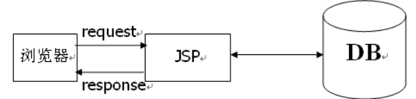
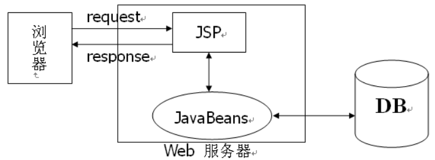
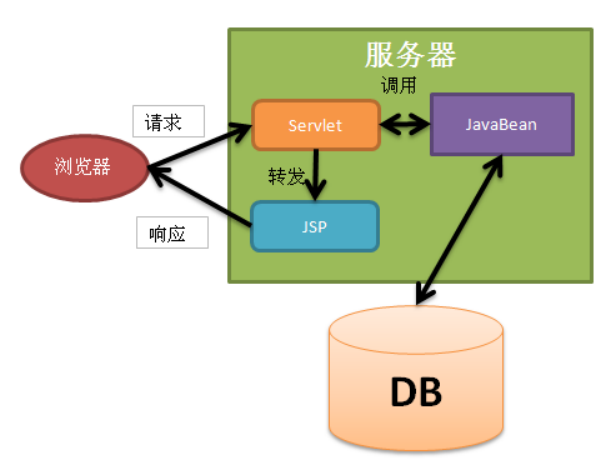
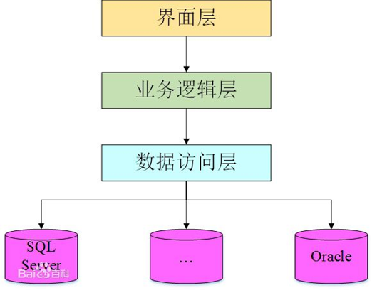
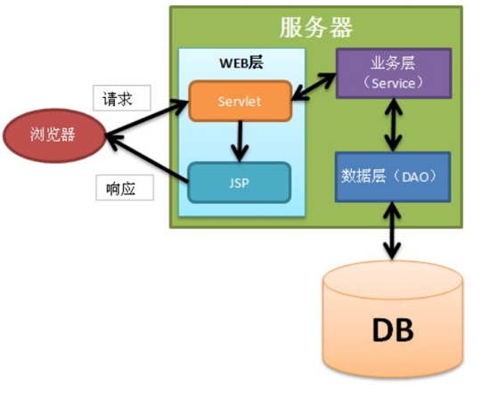
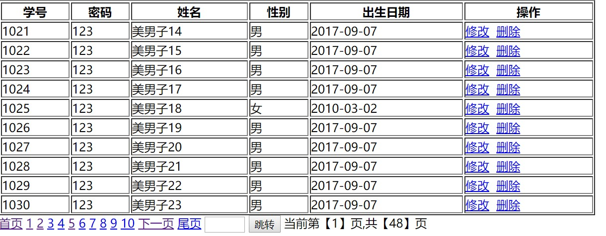
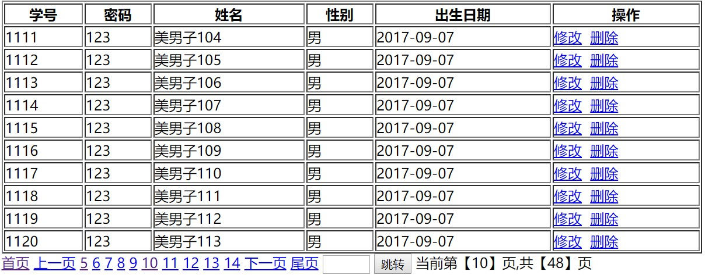

# JSP应用

回顾

```
一、JSP  Java Server  pages  服务端的页面   本质和Servlet一样。 都是动态网页技术
	手敲页面、创建内置对象。
二、JSP的构成
	脚本元素、
		<% java代码%> ----局部变量
		<%! %> -----定义方法、全局变量
		<%=%> -----页面输出   out.print();
	指令元素、
		<%@ page %>---session、isErrorPage、pageEncoding、contentType、isELIgnored、buffer、import、errorPage
		<%@ include%>  动态包含 <jsp:include page=""></jsp:include >、
		静态包含 <%@ include file="" %>
	注释元素、
	<%--JSP注释--%>JSP文件中看到    <!--网页注释 -->
	动作元素
	<jsp:include>
	<jsp:forward>
	<jsp:param>
	<jsp:useBean id="对象名" class="全限定名">
	//自己封装
	<jsp:setProperty name="对象" property="属性名" value="值"></jsp:setProperty>
	<jsp:getProperty name="对象" property="属性名" ></jsp:getProperty>
	//与表单精确匹配的,注意：提交过来的表单name和实体类的属性要完全一致
	<jsp:setProperty name="对象" property="*"></jsp:setProperty>
三、内置对象
	request.response.session.application.page.pageContext.config.out.exception
	四个作用域：pageContext\request\session\application
	out:JspWriter.和response.getWriter()-->PrintWriter类型区别：
	out是直接写到缓冲区。PrintWriter写到了response里。二者均是autoFlush();
四、pageContext对象
	操作其他作用域
	pageContext.setAttribute(String s,Object o,int i);
	---1PageContext.PAGE.SCOPE 2PageContext.REQUEST_SCOPE 
	3PageContext.SESSION_SCOPE 4 PageContext.APPLICATION_SCOPE
	pageContext.getAttribute(String s,int i);指定作用域
	pageContext.findAttribute(String s);从小到大作用域依次查找
	
	获取其他八个内置对象。
	pageContext.forward();
	pageContext.include();
```


## 今日内容

```
1、EL表达式的使用
2、4个域对象
3、什么是JSTL
4、JSTL的使用
5、什么mvc设计模式
6、三层架构的搭建
7、分页的实现
```


## 第一节 EL表达式

##### 1.1 EL概述和基本语法

​        EL表达式:Expression Language表达式语言
​        目的:简化jsp中java代码开发，代替脚本表达式<%=username%>
​        它不是一种开发语言，是jsp中获取数据的一种规范
​        格式如： ${EL表达式} 等价于pageContext.fi ndAttribute(name)

​	

##### 1.2 EL的具体功能

​       案例1：获取简单数据

```java
<br />=====================案例一：获取简单数据===================
	<br />
	<%
		pageContext.setAttribute("username", "张三");
		request.setAttribute("age", "25");
		//request.setAttribute("username", "李四");
		session.setAttribute("phone", "13838383838");
		application.setAttribute("address", "北京昌平沙河");

		User user = new User();
		user.setUsername("学智");
		user.setPassword("8888");
		user.setPhone("1899999999");
		user.setGender("妖");
		user.setAdd(new Address("泰国","曼谷","xxx区"));
		pageContext.setAttribute("u", user);
	%>
	<br />-----------------findAttribute()获取数据-------------------
	<br />
	<%=pageContext.findAttribute("username")%><br />
	<%=pageContext.findAttribute("age")%><br />
	<%=pageContext.findAttribute("phone")%><br />
	<%=pageContext.findAttribute("address")%><br />
	<br />-----------------el表达式获取数据-------------------
	<br /> ${username }
	<br /> ${age }
	<br /> ${phone }
	<br /> ${address }
	<br /> ${"username" }
	<br />
```


​       案例2：获取实体类对象中的属性值

>    ```jsp
>    <%
>    User user= new User();
>    user.setName("gggg");
>    
>    Address  address = new Address();
>    address.setAddr("北京市海淀区");
>    user.setAddress(address);
>    
>    session.setAttribute("user", user);
>    /* request.getRequestDispatcher("testEl.jsp").forward(request, response); */
>    response.sendRedirect("testEl.jsp");
>    %>
>    <!--  EL表达式中的.表示调用该属性的get方法 -->
>    <%-- 我是：$住在{user.name }  , 住在  ${user.address.addr } --%>
>    ```

​	

​	案例3：使用List和Map集合

>    ```jsp
>    <%
>    List<String> list =new ArrayList<String>();
>    list.add("aa");
>    list.add("bb");
>    list.add("cc");
>    pageContext.setAttribute("list", list);
>    
>    Map<String,String> map =new HashMap<String,String>();
>    map.put("aa", "11");
>    map.put("bb", "22");
>    map.put("cc", "33");
>    
>    pageContext.setAttribute("map", map);
>    
>    %>
>    
>    <h1>1.以数组的下标形式获取list值</h1>
>    ${list[0]}<br>
>    ${list[1]}<br>
>    ${list[2]}<br>
>    <h1>2.以提供的方法get(index)</h1>
>    ${list.get(0)}
>    
>    <h1>3.使用El表达式获取map中的值(以key的形式获取)</h1>
>    ${map.aa}<br>
>    ${map.bb}<br>
>    ${map.cc}<br>
>    <h1>4.使用El表达式获取map中的值</h1>
>    ${map['aa']}
>    ```

##### 1.3 使用EL表达式执行运算、empty关键字

执行运算

```java
	算术运算
	${10+20 }<br/>
	${10-20 }<br/>
	${10*20 }<br/>
	${3%5}<br/>
	关系运算
	${10==9 }<br/>
	${"abc"=="abc" }<br/>
	${s1==s2 } equals<br/>
	${s1 eq s2 }<br/>
	${10>20}<br/>
	${10 gt 20}<br/>
	${5 < 10}<br/>
	${5 lt 10}<br/>
	${5 != 10}<br/>
	${5 ne 10}<br/>
	

	三目运算
	${score>80?"优秀":"一般" }<br/>  
	${flag==0?"没有激活":flag==1?"激活":"删除" }<br/>  
	${sex==0?"男":"女" }<br/>  
	
     逻辑运算
	${true &&  false}<br/> 
	${true || false}<br/> 
	${!true}<br/> 
	${true and  false}<br/> 
	${true or false}<br/> 
	${not true}<br/> 
```

>    ```jsp
>    <% String s1="";
>    pageContext.setAttribute("s1", s1);
>    String s2=null;
>    pageContext.setAttribute("s2", s2);
>    String s3="122222";
>    pageContext.setAttribute("s3", s3);
>    List list1 =new ArrayList();
>    pageContext.setAttribute("list1", list1);
>    %>
>    
>    <!-- empty关键只要内容是空true -->
>    ${empty s1}<br>
>    ${empty s2}<br>
>    ${empty  s3}<br>
>    ${empty  list1}<br>
>    ```

##### 1.4 隐式对象（11个）

JSP 表达式语言定义了一组隐式对象，其中许多对象在 JSP scriplet 和表达式中可用：

**pageContext：**页面上下文，可以获取jsp中其他八个内置对象

**pageScope、requestScope、sessionScope、applicationScope**表示四个域对象中集合

param  表示request.getParameter("username"); ${param.username} 

paramvalues 表示request.getPrameterValues("hobby");  ${paramValues.hobby}

header  表示 request.getHeader("accept");  ${header.accept};

headerValues 表示 request.getHeaderValues("accept-encoding"); ${headerValues["accept-encoding"][0]}

cookie  表示 request.getCookies();    ${cookie.JSESSIONID}

initParam 表示 ServletContext(application)初始化参数


## 第二节 JSTL

##### 2.1 什么是JSTL

 JSTL:全称Java Server Pages Standard Tag Library,JSP标准标签库,代替jsp页面的脚本，实现逻辑控制。

##### 2.2 JSTL的作用

实现JSP页面中逻辑处理。如判断， 循环等；

下载JSTL库，http://archive.apache.org/dist/jakarta/taglibs/standard/binaries/

把jstl.jar、standard.jar放入WEB-INF/lib目录下

##### 2.3 使用JSTL

必须在JSP页面添加tablib指令库

```
<% @taglib uri="http://java.sun.com/jsp/jstl/core" prefix="c">
```

##### 2.4 常用标签介绍

######             2.4.1 通用标签set,out,remove

```
<!-- 基础标签:声明变量，输出变量，移除变量，变量默认值 -->
	<h3>基础标签:声明变量，输出变量，移除变量，变量默认值</h3>
<!--1.声明变量k   var：是变量名  value:变量的值-->
	<c:set var="k" value="${1+1}"></c:set>
<!--2.输出变量k   value:使用EL表示表示变量-->
	输出的内容：<c:out value="${k}"></c:out><br>
<!--3.移除指定变量  -->	
	<c:remove var="k"/>
	移除后输出的内容：<c:out value="${k}"></c:out><br>
<!--4.给指定变量赋默认值  -->
	默认值：<c:out value="${m}" default="123456"></c:out>
```

###### 2.4.2 条件标签if,choose

&lt;c:if&gt;

```jsp
<!-- 条件标签：if  choose -->
	<!-- test属性中是条件，但是条件需要使用EL表达式来书写 -->
	<h3>条件标签：if</h3>
	<c:if test="${8>2 }">
    8大于2是成立的
     </c:if>
	<c:if test="${8<2 }">
    8小于2是成立的
    </c:if>
	<br>
	<%--  如果只是一个基本数据类型直接书写不需要${} --%>
	<c:set var="m" value="5"></c:set>
	<c:if test="${m>3}">
     5大于3是成立的
  </c:if>
```

&lt;c:choose&gt;


```jsp
<h3>条件标签：choose(等价于java中switch)</h3>
<%-- 测试成绩等级 >90 优秀   >80  良好    >70 中等   >60及格--%>
<c:set var="score" value="80"></c:set>
<c:choose>
	<c:when test="${score>=90 }">优秀</c:when>
	<c:when test="${score>=80 }">良好</c:when>
	<c:when test="${score>=70 }">中等</c:when>
	<c:when test="${score>=60 }">及格</c:when>
	<c:otherwise>不及格</c:otherwise>
</c:choose>
```

######            2.4.3 迭代标签foreach

for基础遍历

```jsp
<!-- 遍历for:输出1到10 的值 -->
	<!--var: 变量，把遍历的每一个值都存储在变量中进行输出
    begin：开始   如果是变量使用EL表达式表示
    end:结束    如果是变量使用EL表达式表示
    step:间隔的长度
    
    for( int i=0;i<10;i++){
     System.out.println(i);
    }
     -->
示例代码：
<c:forEach var="i" begin="1" end="10" step="2">
 ${i}<br>
</c:forEach>
```

foreach遍历

```jsp
  <h3>测试list集合遍历获取学生列表</h3>
      <table border="1" width="80%" bordercolor="red" cellspacing="0"
          align="center">
          <tr>
              <th>学号</th>
              <th>姓名</th>
              <th>成绩</th>
              <th>班级</th>
              <th>是否是第一个</th>
              <th>是否是最后一个</th>
              <th>计数count</th>
              <th>索引index</th>
          </tr>
   <!-- varStatus:变量状态：遍历出的每一项内容的状态：
      isFirst()      first
      isLast()       last
      getCount()     count  计数  重要的
      getIndex()     index
       -->
       <!-- var :遍历出的每一项使用变量先存储
            items：集合(使用El表达式)
            -->
          <c:forEach var="stu" items="${students}" varStatus="vs">
              <tr>
                  <td>${stu.id}</td>
                  <td>${stu.name}</td>
                  <td>${stu.score}</td>
                  <td>${stu.classes}</td>
                  <td>${vs.first}</td>
                  <td>${vs.last}</td>
                  <td>${vs.count}</td>
                  <td>${vs.index}</td>
              </tr>
          </c:forEach>
   </table>
```

###### 2.4.4 url标签

```
<c:url var="" value="">

 <c:url var="loc" value="/stu.jsp">
        <c:param name="username" value="张三"></c:param>
    </c:url>

  <a href="${loc}">学生列表</a>
```

## 第三节 MVC模式简介

### 3.1 MVC概念

​     首先我们需要知道MVC模式并不是javaweb项目中独有的，MVC是一种软件工程中的一种设计模式，把软件系统分为三个基本部分：模型（Model）、视图（View）和控制器（Controller），即为MVC。它是一种软件设计的典范，最早为Trygve Reenskaug提出，为施乐帕罗奥多研究中心（Xerox PARC）的Smalltalk语言发明的一种软件设计模式。

### 3.2 MVC模式详解

   虽然MVC并不是Java当中独有的，但是现在几乎所有的B/S的架构都采用了MVC框架模式。

* 控制器Controller：控制器即是控制请求的处理逻辑，对请求进行处理，负责请 求转发和重定向； 
* 视图View：视图即是用户看到并与之交互的界面，比如HTML（静态资源），JSP（动态资源）等等。 
* 模型Model：模型代表着一种企业规范，就是业务流程/状态的处理以及业务规则的规定。业务流程的处理过程对其他层来说是不透明的，模型接受的请求，并返回最终的处理结果。业务模型的设计可以说是MVC的核心。

### 3.3 MVC高级框架应用

​    MVC模式被广泛用于Java的各种框架中，比如Struts2、[spring](http://lib.csdn.net/base/javaee) MVC等等都用到了这种思想。

Struts2是基于MVC的轻量级的web应用框架。基于MVC，说明基于Struts2开发的Web应用自然就能实现MVC，也说明Struts2着力于在MVC的各个部分为我们的开发提供相应帮助。

### 3.4MVC和三层架构的区别

同样是架构级别的，相同的地方在于他们都有一个表现层，但是他们不同的地方在于其他的两个层。

在三层架构中没有定义Controller的概念。这是最不同的地方。而MVC也没有把业务的逻辑访问看成两个层，这是采用三层架构或MVC搭建程序最主要的区别。当然了。在三层中也提到了Model，但是三层架构中Model的概念与MVC中Model的概念是不一样的，“三层”中典型的Model层是由业务逻辑与访问数据组成的。而MVC里，则是以实体类构成的。

MVC和三层架构的区别：
       M 即Model(模型层),主要负责处理业务逻辑以及数据库的交互
       V 即View(视图层),主要负责显示数据和提交数据
       C 即Controller(控制层),主要是用作辅助捕获请求并控制请求转发

​       三层
​       UI界面层
​       BLL业务逻辑层
​       DAL数据访问层

​       三层是基于业务逻辑来分的，而mvc是基于页面来分的
​       MVC模式是一种复合设计模式，一种解决方案
​       三层是种软件架构，通过接口实现编程
​       三层模式是体系结构模式，MVC是设计模式
​       三层模式又可归于部署模式，MVC可归于表示模式

## 第四节 JSP开发模型

### 4.1 JavaWeb经历两个时期

#### 4.1.1 JSP Model1

JSP Model1是JavaWeb早期的模型，它适合小型Web项目，开发成本低！Model1第一代时期，服务器端只有JSP页面，所有的操作都在JSP页面中，连访问数据库的API也在JSP页面中完成。也就是说，所有的东西都耦合在一起，对后期的维护和扩展极为不利。




JSP Model1的优化（Model1第二代）

JSP Model1优化后有所改进，把业务逻辑和数据访问的内容放到了JavaBean（狭义JavaBean:实体类，广义JavaBean:实体类,dao,service,工具类）中，而JSP页面负责显示以及请求调度的工作。虽然第二代比第一代好了些，但还让JSP做了过多的工作，JSP中把视图工作和请求调度（控制器）的工作耦合在一起了。




#### 4.1.2 JSP Model2

JSP Model2模式已经可以清晰的看到MVC完整的结构了。 

JSP：视图层，用来与用户打交道。负责接收数据，以及显示数据给用户； 

Servlet：控制层，负责找到合适的模型对象来处理业务逻辑，转发到合适的视图； 

JavaBean：模型层，完成具体的业务工作，例如：开启、转账等。





**小结**:这就是javaweb经历的两个时期，JSP Model2适合多人合作开发大型的Web项目，各司其职，互不干涉，有利于开发中的分工，有利于组件的重用。但是，Web项目的开发难度加大，同时对开发人员的技术要求也提高了。

### 4.2基于MVC的三层架构的实现

虽然MVC把程序分成三部分，每个部分负责不同的功能，但是这只是逻辑的分离，实际代码并没有真正分离，特别是Model（包括业务、数据访问和实体类、工具类等）部分的代码，为了增强代码的维护性和降低代码耦合性，需要把代码分层管理，于是就有了三层架构：

分别是:web层（表示|界面层）、service层（业务逻辑层）、dao层(数据访问层)




web层对应MVC中的Servlet和JSP

其他层都属于MVC中的Model



案例演示：

```
web层
    com.qf.web.servlet
    jsp页面放在 WebContent 或  WEB-INF
    
Service层
    com.qf.service  放服务层接口
    com.qf.service.impl  放服务层实现
    
Dao  层
    com.qf.dao   方法 dao接口
    com.qf.dao.impl  放dao实现
    

实体类  
    com.qf.domain   | com.qf.beans  | com.qf.entity | com.qf.pojo

工具类 
    com.qf.commons  | com.qf.utils
    
    
    
```

## 第五节 分页

​	分页是web应用程序非常重要的一个技术。数据库中的数据可能是成千上万的，不可能把这么多的数据一次显示在浏览器上面。一般根据每行数据在页面上所占的空间每页显示若干行，比如一般20行是一个比较理想的显示状态。

### 5.1 分页实现思路

分页的思路

对于海量的数据查询，需要多少就取多少，显然是最佳的解决方法，假如某个表中有200万条记录，第一页取前20条，第二页取21~40条记录。

select  * from 表名 order by id limit  0,20  ;    1    读20条

select  * from 表名 order by id limit  21,20;    21   读20 条

select  * from 表名 order by id limit  40,20;    40    读20条


### 5.2 分页代码实现

步骤：

1.确定每页显示的数据数量

2.确定分页显示所需的总页数

3.编写SQL查询语句，实现数据查询

4.在JSP页面中进行分页显示设置

代码实现如下:

#### 5.2.1 数据库表语句如下

 create database day16;

```sql
   use day16;
   create table student(
	 studentNo int(4) NOT NULL,
	 loginPwd varchar(20) NOT NULL,
	 studentName varchar(50) NOT NULL,
	 sex char(2) NOT NULL,
	 bornDate datetime
   );
   -- 向数据库中添加100条添加记录
```

#### 5.4.2创建工程和程序包


#### 5.4.3 数据库配置文件db.properties

```properties
#连接设置
driverClassName=com.mysql.jdbc.Driver
url=jdbc:mysql://localhost:3306/myschool
username=root
password=root
#<!-- 初始化连接 -->
initialSize=10
#最大连接数量
maxActive=50
#<!-- 最小空闲连接 -->
minIdle=5
#<!-- 超时等待时间以毫秒为单位 6000毫秒/1000等于60秒 -->
maxWait=5000<?xml version="1.0" encoding="UTF-8"?>
```

#### 5.4.4 创建实体类和工具类

Student类

```java
package com.qf.myschool.domain;

import java.util.Date;

/**
 * 学生类
 * @author wgy
 */
public class Student {
		private int studentNo;
		private String loginPwd;
		private String studentName;
		private String sex;
		private Date bornDate;
		public Student() {
			// TODO Auto-generated constructor stub
		}
		public Student(int studentNo, String loginPwd, String studentName, String sex, Date bornDate) {
			super();
			this.studentNo = studentNo;
			this.loginPwd = loginPwd;
			this.studentName = studentName;
			this.sex = sex;
			this.bornDate = bornDate;
		}
		public int getStudentNo() {
			return studentNo;
		}
		public void setStudentNo(int studentNo) {
			this.studentNo = studentNo;
		}
		public String getLoginPwd() {
			return loginPwd;
		}
		public void setLoginPwd(String loginPwd) {
			this.loginPwd = loginPwd;
		}
		public String getStudentName() {
			return studentName;
		}
		public void setStudentName(String studentName) {
			this.studentName = studentName;
		}
		public String getSex() {
			return sex;
		}
		public void setSex(String sex) {
			this.sex = sex;
		}
		public Date getBornDate() {
			return bornDate;
		}
		public void setBornDate(Date bornDate) {
			this.bornDate = bornDate;
		}
		@Override
		public String toString() {
			return "Student [studentNo=" + studentNo + ", loginPwd=" + loginPwd + ", studentName=" + studentName
					+ ", sex=" + sex + ", bornDate=" + bornDate + "]";
		}
		
}
```


DruidUtils类

```java
package com.qf.myschool.utils;

import java.sql.Connection;
import java.sql.PreparedStatement;
import java.sql.ResultSet;
import java.sql.SQLException;
import java.sql.Statement;

import com.alibaba.druid.pool.DruidDataSource;
import com.mysql.jdbc.SQLError;

/**
 * 1加载驱动
 * 2建立连接
 * 3释放资源
 * 4更新操作
 * @author wgy
 *
 */
public class DruidUtils {
	private static DruidDataSource dataSource=null;
	 
    static {
        InputStream is = DruidUtils.class.getClassLoader().getResourceAsStream("db.properties");
        Properties properties=new Properties();
        try {
            properties.load(is);
            dataSource= (DruidDataSource) DruidDataSourceFactory.createDataSource(properties);
        } catch (Exception e) {
            e.printStackTrace();
        }

    }
	
	public static DataSource getDataSource(){
        return  dataSource;
    }
	
	
```

#### 5.4.5 创建Dao和实现类

StudentDao接口

```
package com.qf.myschool.dao;

import java.util.List;

import com.qf.myschool.domain.Student;

public interface StudentDao {
	/**
	 * 
	 * @param pageIndex 当前页码  1 
	 * @param pagesize  页大小  10
	 * @return
	 * 
	 */
	public List<Student> findByPage(int pageIndex,int pagesize);
	
	//获取总的数据个数
	public int getTotalCount();
	
}	
```

StudentDaoImpl类

```java
package com.qf.myschool.dao.impl;

import java.sql.Connection;
import java.sql.PreparedStatement;
import java.sql.ResultSet;
import java.util.ArrayList;
import java.util.Date;
import java.util.List;

import com.qf.myschool.dao.StudentDao;
import com.qf.myschool.domain.Student;
import com.qf.myschool.utils.DbUtils;

public class StudentDaoImpl implements StudentDao {
	@Override
	public List<Student> findByPage(int pageIndex, int pagesize) {
		// TODO Auto-generated method stub
		Connection conn=null;
		PreparedStatement pstat=null;
		ResultSet rs=null;
		List<Student> students=new ArrayList<Student>();
		try {
			conn=DbUtils.getConnection();
			pstat=conn.prepareStatement("select * from student limit ?,?");
			pstat.setInt(1, (pageIndex-1)*pagesize);
			pstat.setInt(2, pagesize);
			rs=pstat.executeQuery();
			while(rs.next()){
				int studentNo=rs.getInt("studentNo");
				String loginPwd=rs.getString("loginPwd");
				String studentName=rs.getString("studentName");
				String sex=rs.getString("sex");
				Date bornDate=rs.getDate("bornDate");
				students.add(new Student(studentNo, loginPwd, studentName, sex, bornDate));
			}
			return students;
		} catch (Exception e) {
			e.printStackTrace();
			throw new RuntimeException(e);
		}finally {
			DbUtils.release(rs, pstat, conn);
		}
	
	}

	@Override
	public int getTotalCount() {
		Connection conn=null;
		PreparedStatement pstat=null;
		ResultSet rs=null;
		List<Student> students=new ArrayList<Student>();
		try {
			conn=DbUtils.getConnection();
			pstat=conn.prepareStatement("select count(*) from student");
			rs=pstat.executeQuery();
			int count=0;
			if(rs.next()){
				count=rs.getInt(1);
			}
			return count; 
		} catch (Exception e) {
			e.printStackTrace();
			throw new RuntimeException(e);
		}finally {
			DbUtils.release(rs, pstat, conn);
		}
	}

}
```


#### 5.4.6 创建Servie和实现类

StudentService接口

```java
package com.qf.myschool.service;

import java.util.List;

import com.qf.myschool.domain.PageBean;
import com.qf.myschool.domain.Student;

public interface StudentService {	
	public List<Student> findByPage(int pageIndex, int pagesize);
    public int getTotalCount();
}
```

StudentServiceImpl实现类

```java
package com.qf.myschool.service.impl;

import java.util.List;

import com.qf.myschool.dao.StudentDao;
import com.qf.myschool.dao.impl.StudentDaoImpl;
import com.qf.myschool.domain.PageBean;
import com.qf.myschool.domain.Student;
import com.qf.myschool.service.StudentService;

public class StudentServiceImpl implements StudentService {

	private StudentDao studentDao=new StudentDaoImpl();
	public List<Student> findByPage(int pageIndex, int pagesize){
        studentDao.findByPage(pageIndex,pageSize);
    }
    public int getTotalCount(){
        studentDao.getTotalCount();
    }

}
```

4.4.7创建Servlet

```java
@WebServlet(name = "StuPageListServlet",value="/stupagelist")
public class StuPageListServlet extends HttpServlet {
    protected void doPost(HttpServletRequest request, HttpServletResponse response) throws ServletException, IOException {
        doGet(request, response);
    }

    protected void doGet(HttpServletRequest request, HttpServletResponse response) throws ServletException, IOException {
         request.setCharacterEncoding("utf-8");
         response.setContentType("text/html;charset=utf-8");

         //1获取页大小和页码
        String ps = request.getParameter("pageSize");
        String pi = request.getParameter("pageIndex");
        //2判断
        int pageSize=0;
        int pageIndex=0;
        //2.1是否有ps
        if(StringText.isEmpty(ps)){
            pageSize=10;//默认值
        }else{
            pageSize=Integer.parseInt(ps);
            if(pageSize<=0){
                pageSize=10;
            }
        }
        //2.2是否有pi
        if(StringText.isEmpty(pi)){
            pageIndex=1;//第一页
        }else{
            pageIndex=Integer.parseInt(pi);
            if(pageIndex<=0){
                pageIndex=1;
            }
        }

        //3执行
        StudentService studentService=new StudentServiceImpl();
        int total = (int) deptService.getCount() % pageSize == 0 ? (int) deptService.getCount() / pageSize 			: (int) deptService.getCount() / pageSize + 1;
		if(pageIndex >= total){
            pageIndex = total;
        }	
        List<Student> pageBean=studentService.findByPage(pageSize, pageIndex);
        if(pageBean!=null){
            request.setAttribute("pageBean", pageBean);//查询结果存放
            request.setAttribute("pageIndex", pageIndex);//当前页
            request.setAttribute("total", total);//总页数
            request.getRequestDispatcher("stupagelist.jsp").forward(request, response);

        }else{
            response.getWriter().write("查询失败");
        }


    }
}
```


#### 5.4.7 listStudent.jsp页面

```jsp
<%@page import="com.qf.myschool.domain.PageBean"%>
<%@page import="com.qf.myschool.domain.Student"%>
<%@page import="com.qf.myschool.service.impl.StudentServiceImpl"%>
<%@page import="com.qf.myschool.service.StudentService"%>
<%@ page language="java" import="java.util.*" pageEncoding="UTF-8"%>
<%
String path = request.getContextPath();
String basePath = request.getScheme()+"://"+request.getServerName()+":"+request.getServerPort()+path+"/";
%>

<!DOCTYPE html>
<html>
  <head>
    <base href="<%=basePath%>">
    <meta charset="UTF-8">
    <title>学生列表</title>
    <style type="text/css">
    	#mainbox{ width: 850px;margin: 0 auto;}
    </style>
  </head>
  
  <body>
  <div id="mainbox">
	 <table border="1" width="800">
	   <tr>
            <th>
                学号
            </th>
            <th>
                密码
            </th>
            <th>
                姓名
            </th>
            <th>
                性别
            </th>
            <th>
                出生日期
            </th>
        </tr>
       <c:forEach var="stu" items="${pageBean}">
            <tr>
                <td>${stu.studentNo}</td>
                <td>${stu.loginPwd}</td>
                <td>${stu.studentName}</td>
                <td>${stu.sex}</td>
                <td>${stu.bornDate}</td>
            </tr>

        </c:forEach>
    </c:forEach>

	 </table>	 
	<a href="${pageContext.request.contextPath}/stupagelist?pageSize=2&pageIndex=1">首页</a>

<a href="${pageContext.request.contextPath}/stupagelist?pageSize=2&pageIndex=${pageIndex-1}">上一页</a>

<c:forEach var="i" begin="1" end="${total}" step="1">
  <a href="${pageContext.request.contextPath}/stupagelist?pageSize=2&pageIndex=${i}">${i}</a>

</c:forEach>
<a href="${pageContext.request.contextPath}/stupagelist?pageSize=2&pageIndex=${pageIndex+1}">下一页</a>

<a href="${pageContext.request.contextPath}/stupagelist?pageSize=2&pageIndex=${total}">尾页</a>

第【${pageIndex}/${total}】页

	   </div>
  </body>
</html>
```

界面效果如图：






#### 

## 总结：

1、EL表达式   代替脚本

2、JSTL

3、MVC   MVC和三层的区别

4、JSP的开发模型

5、分页。

#### 