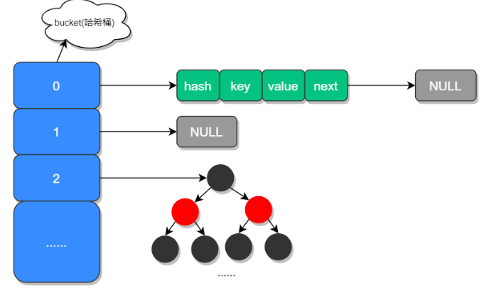
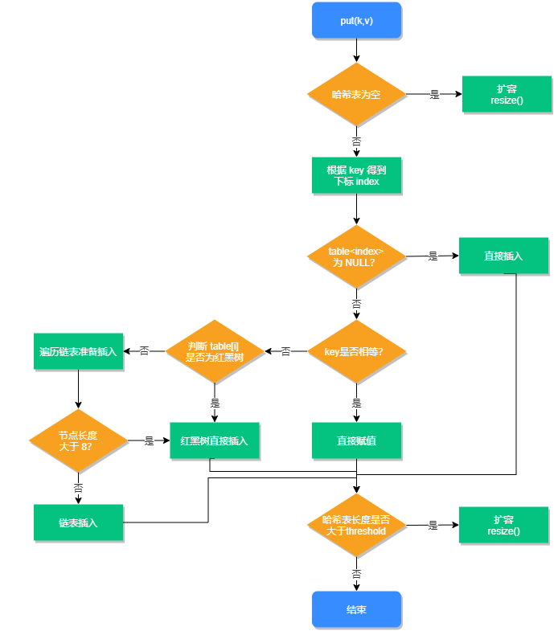
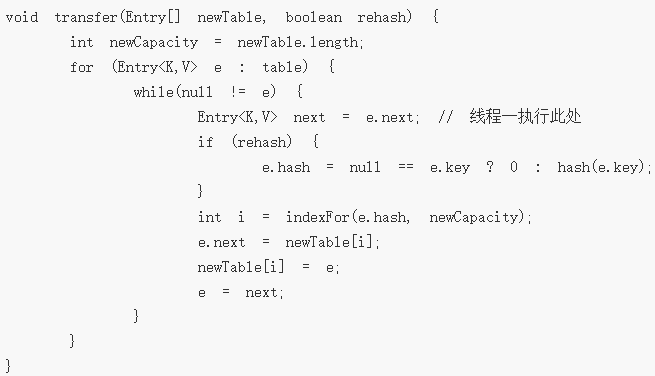
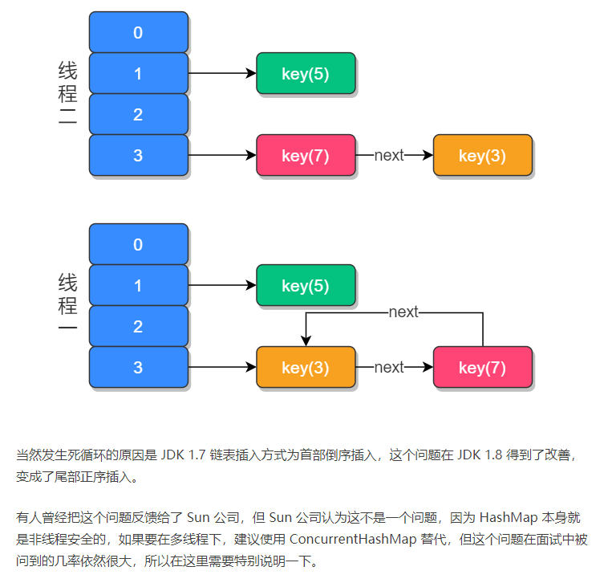

## HashMap底层原理及JDK8做的优化

### 典型回答

在JDK1.7中HashMap是以数组加链表的形式组成的，JDK1.8之后新增了红黑树的组成结构，当链表大于8并且容量大于64时，链表结构会转换成红黑树结构，它的组成结构如下图所示：



数组中的元素我们称之为哈希桶，它的定义如下：

```java
static class Node<K,V> implements Map.Entry<K,V> {
        final int hash;
        final K key;
        V value;
        Node<K,V> next;

        Node(int hash, K key, V value, Node<K,V> next) {
            this.hash = hash;
            this.key = key;
            this.value = value;
            this.next = next;
        }

        public final K getKey()        { return key; }
        public final V getValue()      { return value; }
        public final String toString() { return key + "=" + value; }

        public final int hashCode() {
            return Objects.hashCode(key) ^ Objects.hashCode(value);
        }

        public final V setValue(V newValue) {
            V oldValue = value;
            value = newValue;
            return oldValue;
        }

        public final boolean equals(Object o) {
            if (o == this)
                return true;
            if (o instanceof Map.Entry) {
                Map.Entry<?,?> e = (Map.Entry<?,?>)o;
                if (Objects.equals(key, e.getKey()) &&
                    Objects.equals(value, e.getValue()))
                    return true;
            }
            return false;
        }
    }
```

可以看出每个哈希桶中包含了四个字段：hash、key、value、next，其中next表示链表的下一个节点。JDK1.8之所以添加红黑树是因为一旦链表过长，会严重影响 HashMap 的性能，而红黑树具有快速增删改查的特点，这样就可以有效的解决链表过长时操作比较慢的问题。

### 考点分析

```
JDK1.8HashMap扩容时做了哪些优化？
加载因子为什么是0.75？
当有哈希冲突时，HashMap是如何查找并确认元素的？
HashMap源码中有哪些重要的方法？
HashMap 是如何导致死循环的？
```

#### 1.HashMap 源码分析

HashMap 源码中包含了以下几个属性：

```java
// HashMap 初始化长度
static final int DEFAULT_INITIAL_CAPACITY = 1 << 4; // aka 16

// HashMap 最大长度
static final int MAXIMUM_CAPACITY = 1 << 30;

// 默认的加载因子 (扩容因子)
static final float DEFAULT_LOAD_FACTOR = 0.75f;

// 当链表长度大于此值且容量大于 64 时
static final int TREEIFY_THRESHOLD = 8;

// 转换链表的临界值，当元素小于此值时，会将红黑树结构转换成链表结构
static final int UNTREEIFY_THRESHOLD = 6;

// 最小树容量
static final int MIN_TREEIFY_CAPACITY = 64;
```

**什么是加载因子？加载因子为什么是 0.75？**

加载因子也叫扩容因子或负载因子，用来判断什么时候进行扩容的，假如加载因子是0.5，HashMap的初始化容量是16，那么当HashMap中有16\*0.5=8个元素时，HashMap 就会进行扩容。

那加载因子为什么是 0.75 而不是 0.5 或者 1.0 呢？

这其实是出于容量和性能之间平衡的结果：

> 当加载因子设置比较大的时候，扩容的门槛就被提高了，扩容发生的频率比较低，占用的空间会比较小，但此时发生 Hash 冲突的几率就会提升，因此需要更复杂的数据结构来存储元素，这样对元素的操作时间就会增加，运行效率也会因此降低；
> 
> 而当加载因子值比较小的时候，扩容的门槛会比较低，因此会占用更多的空间，此时元素的存储就比较稀疏，发生哈希冲突的可能性就比较小，因此操作性能会比较高。
> 
> 为了提升扩容效率，HashMap的容量（capacity）有一个固定的要求，那就是一定是2的幂。所以，如果负载因子是3/4的话，那么和capacity的乘积结果就可以是一个整数。
> 

#### 2. HashMap 中重要方法

查询

```java
public V get(Object key) {
        Node<K,V> e;
        // 对 key 进行哈希操作
        return (e = getNode(hash(key), key)) == null ? null : e.value;
    }

final Node<K,V> getNode(int hash, Object key) {
        Node<K,V>[] tab; Node<K,V> first, e; int n; K k;
        if ((tab = table) != null && (n = tab.length) > 0 &&
            (first = tab[(n - 1) & hash]) != null) {
            if (first.hash == hash && // always check first node
                ((k = first.key) == key || (key != null && key.equals(k))))
                return first;
            if ((e = first.next) != null) {
                if (first instanceof TreeNode)
                    return ((TreeNode<K,V>)first).getTreeNode(hash, key);
                do {
                    if (e.hash == hash &&
                        ((k = e.key) == key || (key != null && key.equals(k))))
                        return e;
                } while ((e = e.next) != null);
            }
        }
        return null;
    }
    
```

HashMap 第二个重要方法：新增方法，源码如下：

```java
public V put(K key, V value) {
        return putVal(hash(key), key, value, false, true);
    }
    
final V putVal(int hash, K key, V value, boolean onlyIfAbsent,
                   boolean evict) {
        Node<K,V>[] tab; Node<K,V> p; int n, i;
        // 哈希表为空则创建表 
        if ((tab = table) == null || (n = tab.length) == 0)
            n = (tab = resize()).length;
            // 根据 key 的哈希值计算出要插入的数组索引 i
        if ((p = tab[i = (n - 1) & hash]) == null)
        // 如果 table[i] 等于 null，则直接插入
            tab[i] = newNode(hash, key, value, null);
        else {
            Node<K,V> e; K k;
            // 如果 key 已经存在了，直接覆盖 value
            if (p.hash == hash &&
                ((k = p.key) == key || (key != null && key.equals(k))))
                e = p;
            // 如果 key 不存在，判断是否为红黑树
            else if (p instanceof TreeNode)
                // 红黑树直接插入键值对
                e = ((TreeNode<K,V>)p).putTreeVal(this, tab, hash, key, value);
            else {
                // 为链表结构，循环准备插入
                for (int binCount = 0; ; ++binCount) {
                    if ((e = p.next) == null) {
                        p.next = newNode(hash, key, value, null);
                        // 转换为红黑树进行处理
                        if (binCount >= TREEIFY_THRESHOLD - 1) // -1 for 1st
                            treeifyBin(tab, hash);
                        break;
                    }
                    //  key 已经存在直接覆盖 value
                    if (e.hash == hash &&
                        ((k = e.key) == key || (key != null && key.equals(k))))
                        break;
                    p = e;
                }
            }
            if (e != null) { // existing mapping for key
                V oldValue = e.value;
                if (!onlyIfAbsent || oldValue == null)
                    e.value = value;
                afterNodeAccess(e);
                return oldValue;
            }
        }
        ++modCount;
        // 超过最大容量，扩容
        if (++size > threshold)
            resize();
        afterNodeInsertion(evict);
        return null;
    }
```

插入流程图如下所示：



HashMap 第三个重要的方法是扩容方法，源码如下：

```java
final Node<K,V>[] resize() {
        // 扩容前数组
        Node<K,V>[] oldTab = table;
        // 扩容前的数组大小和阈值
        int oldCap = (oldTab == null) ? 0 : oldTab.length;
        int oldThr = threshold;
        // 预定义新数组的大小和阈值
        int newCap, newThr = 0;
        if (oldCap > 0) {
            // 超过最大值就不扩容了
            if (oldCap >= MAXIMUM_CAPACITY) {
                threshold = Integer.MAX_VALUE;
                return oldTab;
            }
            // 扩容为当前容量的两倍，但不超过最大值
            else if ((newCap = oldCap << 1) < MAXIMUM_CAPACITY &&
                     oldCap >= DEFAULT_INITIAL_CAPACITY)
                newThr = oldThr << 1; // double threshold
        }
        // 当前数组没有数据，使用初始化的值
        else if (oldThr > 0) // initial capacity was placed in threshold
            newCap = oldThr;
        else {               // zero initial threshold signifies using defaults
            // 如果初始化的值为 0，则使用默认的初始化容量
            newCap = DEFAULT_INITIAL_CAPACITY;
            newThr = (int)(DEFAULT_LOAD_FACTOR * DEFAULT_INITIAL_CAPACITY);
        }
        // 如果新的容量等于 0
        if (newThr == 0) {
            float ft = (float)newCap * loadFactor;
            newThr = (newCap < MAXIMUM_CAPACITY && ft < (float)MAXIMUM_CAPACITY ?
                      (int)ft : Integer.MAX_VALUE);
        }
        threshold = newThr;
        @SuppressWarnings({"rawtypes","unchecked"})
        Node<K,V>[] newTab = (Node<K,V>[])new Node[newCap];
        // 开始扩容，将新的容量赋值给 table
        table = newTab;
        if (oldTab != null) {
        // 根据容量循环数组，复制非空元素到新 table
            for (int j = 0; j < oldCap; ++j) {
                Node<K,V> e;
                if ((e = oldTab[j]) != null) {
                    oldTab[j] = null;
                    // 如果链表只有一个，则进行直接赋值
                    if (e.next == null)
                        newTab[e.hash & (newCap - 1)] = e;
                    else if (e instanceof TreeNode)
                        // 红黑树相关的操作
                        ((TreeNode<K,V>)e).split(this, newTab, j, oldCap);
                    else { // preserve order
                        // 链表复制，JDK 1.8 扩容优化部分
                        Node<K,V> loHead = null, loTail = null;
                        Node<K,V> hiHead = null, hiTail = null;
                        Node<K,V> next;
                        do {
                            next = e.next;
                            if ((e.hash & oldCap) == 0) {
                                // 原索引
                                if (loTail == null)
                                    loHead = e;
                                else
                                    loTail.next = e;
                                loTail = e;
                            }
                            // 原索引 + oldCap
                            else {
                                if (hiTail == null)
                                    hiHead = e;
                                else
                                    hiTail.next = e;
                                hiTail = e;
                            }
                        } while ((e = next) != null);
                        // 将原索引放到哈希桶中
                        if (loTail != null) {
                            loTail.next = null;
                            newTab[j] = loHead;
                        }
                        // 将原索引 + oldCap 放到哈希桶中
                        if (hiTail != null) {
                            hiTail.next = null;
                            newTab[j + oldCap] = hiHead;
                        }
                    }
                }
            }
        }
        return newTab;
    }
```

#### 3. HashMap 死循环

以JDK1.7为例，假设HashMap默认大小为2，原本HashMap中有一个元素key(5)，我们再使用两个线程：t1添加元素key(3)，t2添加元素key(7)，当元素 key(3) 和 key(7) 都添加到 HashMap 中之后，线程 t1 在执行到 Entry<K,V> next = e.next; 时，交出了 CPU 的使用权，源码如下：



那么此时线程t1中的e指向了key(3)，而next指向了key(7)；之后线程t2重新rehash之后链表的顺序被反转，链表的位置变成了key(5)→key(7)→ key(3)，其中 “→” 用来表示下一个元素。

当t1重新获得执行权之后，先执行newTalbe[i]=e把key(3)的next设置为key(7)，而下次循环时查询到key(7)的next元素为key(3)，于是就形成了 key(3) 和 key(7) 的循环引用，因此就导致了死循环的发生，如下图所示：



### 小结
本课时介绍了HashMap的底层数据结构，在JDK1.7时HashMap是由数组和链表组成的，而JDK1.8则新增了红黑树结构，当链表的长度大于8并且容量大于64时会转换为红黑树存储，以提升元素的操作性能。同时还介绍了 HashMap 的三个重要方法，查询、添加和扩容，以及 JDK 1.7 resize()  在并发环境下导致死循环的原因。

### 参考
https://www.jianshu.com/p/1e9cf0ac07f4 